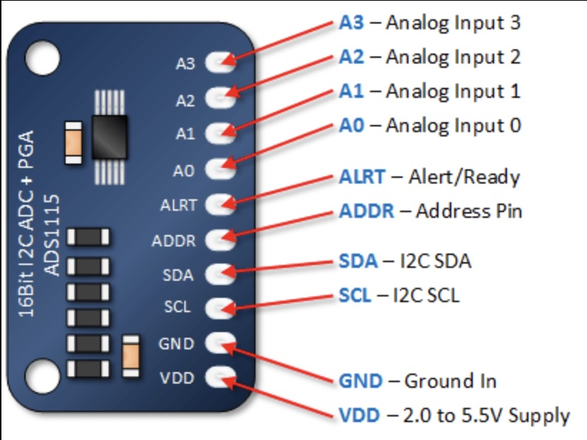

## ADC + pga + i2c (ADS1115)




## Description
The **ADS1115** is a 16-bit analog-to-digital converter (ADC) from Texas Instruments. It features a programmable gain amplifier (PGA) and communicates via an I²C interface, making it ideal for precision measurement applications requiring small package size and low power consumption.

### Key Features:
- **16-bit resolution**: Provides highly accurate digital conversions from analog signals.
- **4 input channels**: Can be used as four single-ended inputs or two differential inputs.
- **Programmable Gain Amplifier (PGA)**: Adjustable gain settings allow amplification of smaller signals, with gain options ranging from ±0.256V to ±6.144V.
- **I²C interface**: Enables easy communication with microcontrollers or other I²C devices. It supports standard (100 kHz), fast (400 kHz), and high-speed (3.4 MHz) modes.
- **Data rates**: Selectable data rates from 8 to 860 samples per second (SPS), allowing a trade-off between speed and precision.
- **Low power consumption**: Ideal for battery-operated devices, with a current consumption of just 150 µA during conversions and 0.5 µA in power-down mode.
- **Internal voltage reference** and **clock**: No need for external components for precision timing or reference voltage.
- **Operating voltage**: Typically operates at 2.0V to 5.5V, making it compatible with a wide range of systems.
- **Size**: Available in small packages like the MSOP-10 and VSSOP-10.

### Common Applications:
- Sensor measurements (temperature, light, pressure)
- Data acquisition systems
- Portable instrumentation
- Industrial monitoring

Its high resolution, versatility in input channels, and ease of integration make the ADS1115 a popular choice for projects that require accurate analog-to-digital conversion with low power demands.

## specs

## Order
<a href="https://nl.aliexpress.com/item/1005006143923238.html?spm=a2g0o.productlist.main.17.30524e80HHnUPP&algo_pvid=6444441e-3ccd-48ef-85c6-f7bdc70c11a1&algo_exp_id=6444441e-3ccd-48ef-85c6-f7bdc70c11a1-8&pdp_npi=4%40dis%21EUR%215.29%210.93%21%21%2140.00%216.98%21%40211b617b17286425006982103e3b98%2112000035958222685%21sea%21NL%210%21ABX&curPageLogUid=J7oHnu2JSj1V&utparam-url=scene%3Asearch%7Cquery_from%3A&_gl=1*hj0tn4*_ga*ODc3MDYwNzUzLjE3Mjg2NDI1MDI.*_ga_VED1YSGNC7*MTcyODY0MjUwMS4xLjAuMTcyODY0MjUwMy42MC4wLjA.*_gcl_au*MTA4ODE1MzMzNS4xNzI4NjQyNTA0">
https://nl.aliexpress.com/item/1005006143923238.html?spm=a2g0o.productlist.main.17.30524e80HHnUPP&algo_pvid=6444441e-3ccd-48ef-85c6-f7bdc70c11a1&algo_exp_id=6444441e-3ccd-48ef-85c6-f7bdc70c11a1-8&pdp_npi=4%40dis%21EUR%215.29%210.93%21%21%2140.00%216.98%21%40211b617b17286425006982103e3b98%2112000035958222685%21sea%21NL%210%21ABX&curPageLogUid=J7oHnu2JSj1V&utparam-url=scene%3Asearch%7Cquery_from%3A&_gl=1*hj0tn4*_ga*ODc3MDYwNzUzLjE3Mjg2NDI1MDI.*_ga_VED1YSGNC7*MTcyODY0MjUwMS4xLjAuMTcyODY0MjUwMy42MC4wLjA.*_gcl_au*MTA4ODE1MzMzNS4xNzI4NjQyNTA0</a>


## Wiring to Raspberry Pi Pico


## Installation libraries
Copy next files to the Raspberry Pi Pico

```bash
ADS1115.py
```

## Example code
```python
from ADS1115 import ADC
from machine import I2C, Pin

i2c = I2C(1, scl=Pin(15), sda=Pin(14))
ADDRESS = i2c.scan()[0]

adc = ADC(i2c, ADDRESS)


print(f"Voltage : {adc.readVolts(ADC.A0)} Volt")
print(f"decimal : {adc.readValue(ADC.A0)}")
```


