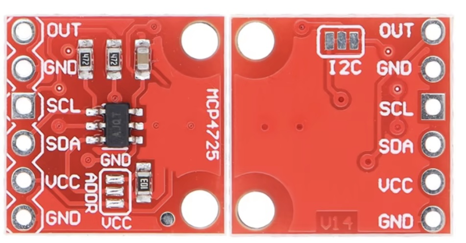
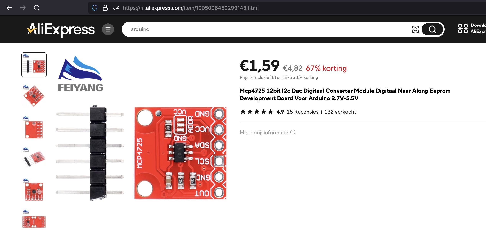

## DAC (MCP4725)




## Description
The MCP4725 is a 12-bit Digital-to-Analog Converter (DAC) with non-volatile memory (EEPROM), manufactured by Microchip Technology. It is commonly used in microcontroller-based projects and systems to generate an analog output from a digital signal. Here’s a detailed description:

Key Features

	•	12-bit Resolution DAC: Provides a 12-bit resolution, meaning the digital input can range from 0 to 4095, resulting in fine granularity for the output voltage.
	•	Output Voltage Range: The analog output voltage ranges from 0V to VDD (usually 3.3V or 5V, depending on the supply voltage).
	•	EEPROM (Non-Volatile Memory): Allows the DAC output to retain its value even after power is removed and restored.
	•	I2C Interface: Communicates via the I2C protocol, making it easy to interface with microcontrollers like Arduino, Raspberry Pi, and others.
	•	Two I2C Addresses: You can select between two I2C addresses, allowing for two devices on the same I2C bus (using the A0 address pin).
	•	Fast Update Rate: Can update the analog output quickly (up to 3.4 MHz I2C speed).
	•	Low Power Consumption: Typical active current is about 0.33 mA, and standby current is as low as 0.06 µA.

Package Types

	•	Available in small, surface-mount packages such as SOT-23-6.

Pin Description

	1.	VDD: Power supply pin (typically 3.3V or 5V).
	2.	GND: Ground pin.
	3.	SCL: I2C clock line (connects to the SCL line of the microcontroller or host).
	4.	SDA: I2C data line (connects to the SDA line of the microcontroller or host).
	5.	VOUT: The DAC analog output pin (produces an analog voltage based on the digital input).
	6.	A0: I2C address selection pin. It allows you to configure the I2C address by connecting it to GND (address 0x60) or VDD (address 0x61).

Block Diagram Overview

The MCP4725 consists of three main sections:

	1.	12-bit DAC Core: Converts the digital input from the I2C bus into an analog voltage.
	2.	Reference and Power Supply: Provides the voltage reference for the DAC output, which can be the VDD supply voltage.
	3.	EEPROM Memory: Stores the DAC value for non-volatile operation. This ensures that even if the device loses power, the output voltage will return to the saved value upon restart.

Communication Protocol

The MCP4725 uses the I2C (Inter-Integrated Circuit) protocol, which allows multiple devices to communicate with a microcontroller using only two lines (SCL and SDA). It supports the following features:

	•	I2C Speed: Up to 3.4 MHz (high-speed mode), though commonly used at 100 kHz or 400 kHz.
	•	7-bit Address: The default I2C address is 0x60 when A0 is connected to GND, or 0x61 when A0 is connected to VDD.
	•	I2C Commands: The microcontroller writes to the DAC register by sending I2C commands with a 12-bit digital value, which sets the output voltage.

Operating Modes

	1.	Normal Mode: The DAC continuously converts the digital input to analog output.
	2.	Power-Down Modes: The DAC can enter low-power states to save energy, reducing current consumption to microamps when the DAC output is not needed.

Using MCP4725 in a Project

	•	Input Range: The 12-bit DAC input takes values between 0 and 4095. This input determines the output voltage as a fraction of the reference voltage (usually the supply voltage VDD). For example:

Where:
	•	 is the analog output voltage.
	•	 is the 12-bit digital value (0-4095).
	•	 is the supply voltage (typically 3.3V or 5V).
	•	EEPROM Programming: You can store a DAC output value in EEPROM using I2C commands, allowing the MCP4725 to retain this value after a power cycle.

Applications

	•	Analog Signal Generation: Useful in audio signal processing, waveform generation, and other systems that require converting digital data into an analog signal.
	•	Control Systems: Often used to control actuators, such as motors and valves, where an analog signal is needed.
	•	Sensor Calibration: Can provide precise analog voltages for sensor calibration.
	•	Function Generators: Combined with microcontroller programming, it can create various waveforms (sine, triangle, square) for testing and signal processing.
	•	Voltage Reference: In precision applications where an adjustable reference voltage is needed.

Advantages

	•	High Accuracy: 12-bit resolution means fine control over the output voltage.
	•	Non-Volatile Memory: The integrated EEPROM allows the DAC output to be restored after power loss, which is particularly useful for systems that need to maintain state after a reboot.
	•	I2C Simplicity: The I2C protocol requires only two pins, reducing the number of microcontroller I/O pins needed for communication.
	•	Low Power: Suitable for battery-powered and low-power applications.

Typical Circuit Connection

To use the MCP4725 with a microcontroller like an Arduino or Raspberry Pi:

	•	VDD → 3.3V or 5V
	•	GND → Ground
	•	SCL → I2C Clock (Arduino pin A5 for I2C)
	•	SDA → I2C Data (Arduino pin A4 for I2C)
	•	A0 → Either GND or VDD (to select the I2C address)
	•	VOUT → The generated analog output

Example Code (Arduino)

```C
#include <Wire.h>
#include <Adafruit_MCP4725.h>
Adafruit_MCP4725 dac;

void setup()
{
  Serial.begin(9600);
  dac.begin(0x60);  // Initialize DAC at I2C address 0x60
}

void loop()
{
  for (uint16_t i = 0; i < 4096; i++)
  {
    dac.setVoltage(i, false);  // Set the DAC output voltage
    delay(1);  // Small delay to see the output change
  }
}
```

Limitations

	•	Fixed Output Reference: The DAC uses the supply voltage (VDD) as the reference voltage, so its output precision depends on the stability of the power supply.
	•	Single Channel: Only one output channel, which limits its use in multi-channel applications.

Conclusion

The MCP4725 is a versatile and easy-to-use 12-bit DAC with built-in EEPROM and I2C interface. It is ideal for applications requiring analog signal generation, precision voltage control, and systems that need to retain DAC output values after power cycles. Its small size, low power consumption, and high resolution make it popular in both hobbyist projects and professional designs.

## Order
<a href="https://nl.aliexpress.com/item/1005006459299143.html">https://nl.aliexpress.com/item/1005006459299143.htm</a>



## Wiring to Raspberry Pi Pico


## Installation libraries
Copy next files to the Raspberry Pi Pico

```bash
	mcp4725.py
```

## Example code

The MCP4725 is a digital to analog converter chip with a 12-Bit resolution on
the output. The MCP4725 works with a supply voltage from 3.3V to 5V. The output range runs from 0V up to the supply voltage. 

The MCP4725 can be configured to use one of two different addresses (0x62,0x63) on the I²C bus.
That way it is possible to use 2 MCP4725 on any I²C bus. The device supports
standard (100kbps) and fast (400kbps) and hi-speed (3.4Mbps) bus speeds. But
hi-speed seems not to be supported by any of the micropython hardware boards.
The fast baudrate of 400kbps works fine with the 
[WiPy](https://www.pycom.io/solutions/py-boards/wipy/) but compared with DACs
that are connected to a SPI-bus updates to the output voltage on a MCP4725 are still pretty slow.

The MCP4725 supports 3 different power-down modes where the output voltage
driver shuts down and the device goes to sleep to save energy. The cips wakes up
from power-down mode whenever a output voltage update is send to the device.

The MCP4725 also has a small eeprom where the power-down mode and the initial
output voltage can be configured that are to be used when the MCP4725 is powered
up.

##Using the MCP4725 in your micropython project
You need only a few lines of code to add a MCP4725 to your project. (see [Issue 1](https://github.com/wayoda/micropython-mcp4725/issues/1) if you don't like
libraries)

###Create and initialze the device on the I²C bus of your micropython board
A micropython driver for an I²C device expects you to create and initialze a
``machine.I2C`` instance and pass that to the constructor of the driver code.

The arguments used in the code example below work for a [WiPy](https://www.pycom.io/solutions/py-boards/wipy/) board. If you try this with a
different board please check the pins to use for the I²C bus. 

```python

from machine import I2C
import mcp4725

#create a I2C bus
i2c=I2C(0,I2C.MASTER,baudrate=400000,pins=('GP15','GP14')) 

#create the MCP4725 driver
dac=mcp4725.MCP4725(i2c,mcp4725.BUS_ADDRESS[0])
```

###Update the output on the MCP4725
The simple way to update the output on the DAC is to write a new value to the
device
```python
dac.write(1200)
```
The actual voltage on the output depends on the supply voltage the powers the
MCP4725. If it runs on 3.3V the above command would drive the output to
``(3300/4096)*1200 = 996mV`` if the DAC is powered with 5V the output will be
``1464mV``. If the argument to the ``write(value)`` is negative the output will
be set to ``0V``. If the value argument is bigger than 4095 the output 
will be set to the maximum output voltage of the DAC. 

On power-up the MCP4725 will be initialized with the value read from the
internal eeprom of the device.

###Configure the MCP4725
The power-down mode (see
[Datasheet](http://www.microchip.com/wwwproducts/en/en532229)) and the output
value of the DAC can be configured for the active session and for future
sessions by saving the settings in an internal eeprom of the DAC.

Power-down modes are selected by the keys in the POWER_DOWN_MODE dict.
```python
POWER_DOWN_MODE = {'Off':0, '1k':1, '100k':2, '500k':3}
```

```python
#configure the DAC to go into power-down mode and set the output value to maximum output.
dac.config('100k',4096)
```
After running the command the output value will is set to its maximum, but since the
DAC is in power-down mode this will not be measurable on the output pin.

```python
#configure the DAC to output ``Vdd/2`` on power-up or after a reset
dac.config('Off',2048, eeprom=True)
```
This configuration will be saved in the eeprom of the DAC and will be used
everytime the DAC is powered up or reset.

###Read settings and output voltage of the MCP4725
The MCP4725 support a single read command that returns the current configuration as well as the configuration stored in the eeprom of the device. 
```python
>>>result=dac.read()
>>>print(result)
>>>(False,'Off',300,'1k',200)
```
The method returns a tuple with 5 items. 

1. The busy-flag of the eeprom on the dac. If ``True`` the DAC is busy writing
   the values for power-down mode and the startup output value to its internal
eeprom. If ``False`` the DAC is ready for a new config setting.
2. The current power-down configuration of the DAC. Returns a string with the
   active setting. (see
[Datasheet](http://www.microchip.com/wwwproducts/en/en532229))
3. The current outout value
4. The power-down configuration stored in the eeprom. This setting takes effect
   when the DAC is reset or powered up.
5. The output value  configuration stored in the eeprom. This setting takes effect
   when the DAC is reset or powered up.

The result shown in the code example will read as

* Write to eeprom of the chip has finshed
* The power-down mode is ``'Off'``, the DACs output on.
* The output is set to ``300/4096`` of the supply voltage of the DAC.
* On powerup or after a reset the DAC will go into power-down mode ``'1k'`` (see
[Datasheet](http://www.microchip.com/wwwproducts/en/en532229)).
* The output voltage on startup or after a reset will be ``200/4096`` of the supply
  voltage.

##Example session on the REPL
```python
MicroPython v1.8.3-80-g1f61fe0 on 2016-08-31; WiPy with CC3200 
Type "help()" for more information.
>>> from machine import I2C                                                                                                                                     
>>> i2c=I2C(0,I2C.MASTER,baudrate=400000,pins=('GP15','GP14'))
>>> from mcp4725 import MCP4725, BUS_ADDRESS
>>> dac=MCP4725(i2c,BUS_ADDRESS[0])
>>> dac.read()
(False, 'Off', 2048, 'Off',100)
>>> dac.write(3000)
True
>>> dac.config(power_down='Off',value=0,eeprom=True)
True                                                                                                                                                           
>>> dac.read()
(False, 'Off', 0, 'Off', 0)
>>> dac.write(2000)
True                                                                                                                                                           
>>> dac.read()
(False, 'Off', 2000, 'Off', 0)
>>>
```

