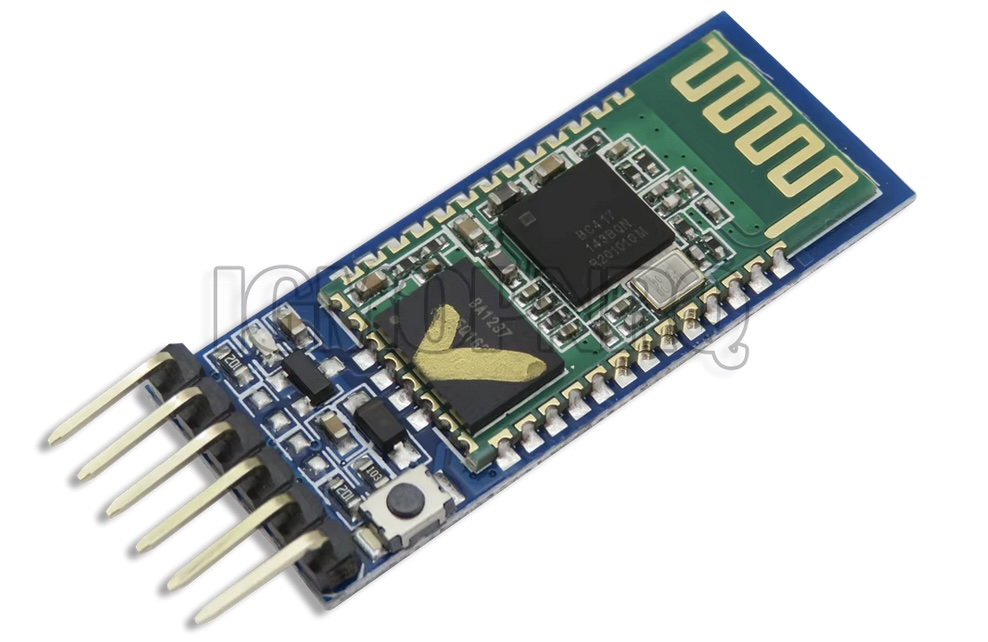
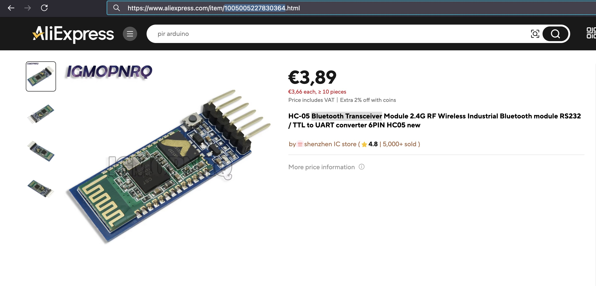

## Bluetooth Transceiver (HC-05)



## Where stored
Cupboard __1__ Drawer __2__  position __A3__

## Description


## Order
<a href="https://nl.aliexpress.com/item/1005005227830364.html">https://nl.aliexpress.com/item/1005005227830364.html</a>


## Wiring to Raspberry Pi Pico


## Installation libraries
Copy next files to the Raspberry Pi Pico

```bash

```

## Example code

This code is not tested yet on a pico....!!!!
```python


```

## More info


