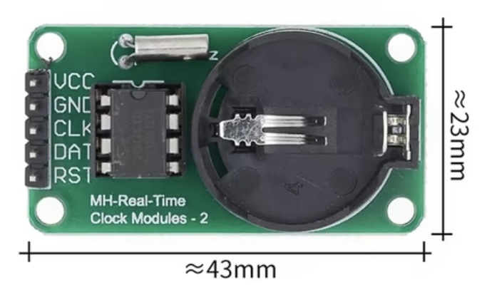
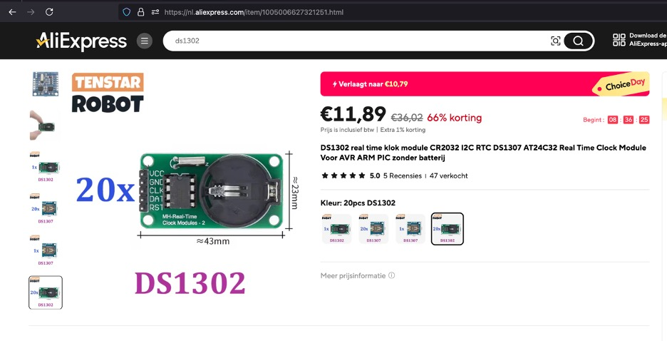
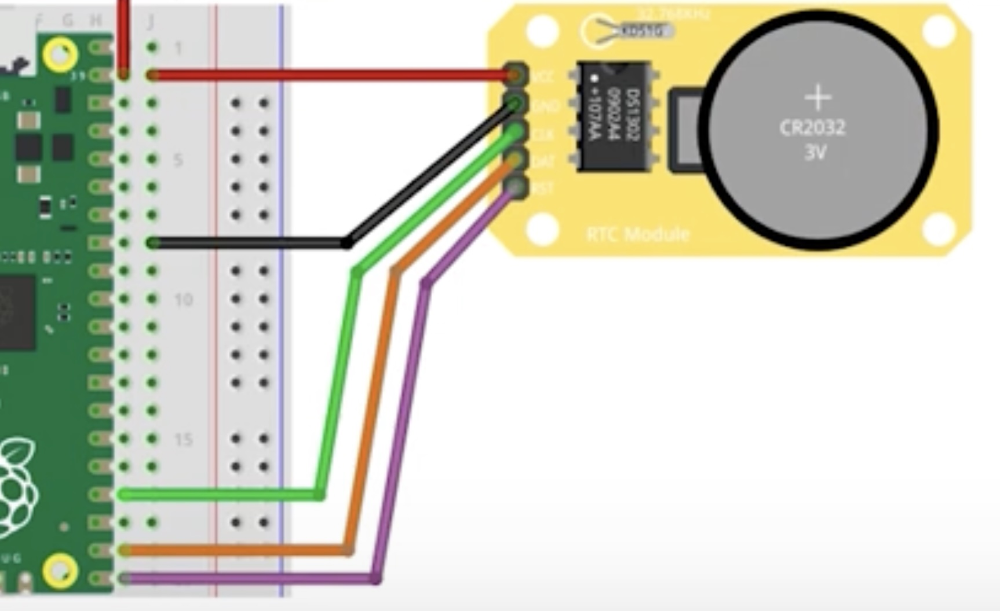

## DS1302 - Realtime_Clock_module

Realtime_Clock_module




## Description
The DS1302 is a low-cost real-time clock (RTC) integrated circuit that keeps track of time (seconds, minutes, hours) and date (day, month, year), including leap-year compensation up to the year 2100. It has an integrated trickle charger, allowing it to work with a backup battery to maintain the time even when the main power supply is off. The DS1302 is designed for interfacing with microcontrollers like Arduino, ESP32, or Raspberry Pi, using a simple serial interface for communication.

Key Features:

	1.	Real-Time Clock (RTC):
	•	Tracks seconds, minutes, hours (12-hour or 24-hour mode with AM/PM indicator), day of the week, day, month, and year.
	•	Automatic leap-year compensation through the year 2100.
	2.	Serial Communication:
	•	Communicates using a simple 3-wire interface (SCLK, I/O, and CE pins), which is less complex than I2C or SPI, though not as fast.
	•	Can be interfaced with microcontrollers using basic digital I/O pins.
	3.	Dual Power Supply:
	•	Can operate on a main power source (3.3V to 5V) and includes a pin for a backup battery (typically a CR2032 coin cell), allowing it to keep time even when the main system power is off.
	•	The built-in trickle charger can be used to charge a rechargeable backup battery.
	4.	Memory Storage:
	•	31 bytes of non-volatile RAM (NVRAM) are included, allowing the user to store small amounts of data (e.g., system settings or configurations) that persist even when power is removed.
	5.	Low Power Operation:
	•	Designed for very low power consumption when running off the backup battery, extending battery life for months or even years.

Pinout:

The DS1302 typically comes in an 8-pin DIP or SOIC package with the following pins:

	•	VCC: Main power supply (typically 3.3V to 5V).
	•	GND: Ground.
	•	SCLK (Serial Clock): Clock signal for data transmission.
	•	I/O (Data): Bidirectional data line for sending and receiving data.
	•	CE (Chip Enable): Enables the data input/output; must be set high during communication.
	•	Vbat: Backup battery input for maintaining timekeeping when main power is off.
	•	X1 and X2: Connections for a 32.768 kHz external crystal oscillator to keep time.

Advantages:

	1.	Backup Battery Support: Can maintain timekeeping for long periods, even when the main system is powered down, thanks to the backup battery feature.
	2.	Simple Interface: The 3-wire serial interface is easy to implement in most microcontroller systems and doesn’t require complex wiring or libraries.
	3.	Time and Date Management: Tracks time, day, and date with automatic leap-year correction, making it useful for a wide variety of time-sensitive applications.
	4.	NVRAM: The small non-volatile memory allows storage of persistent data alongside timekeeping, which can be useful in applications like logging or data storage.
	5.	Low Power: It consumes very little power in battery mode, allowing it to run for extended periods without needing replacement or recharge.

Applications:

	•	Timekeeping in Embedded Systems: Ensures systems can maintain accurate time and date when powered off.
	•	Data Loggers: Adds accurate timestamps to collected data in systems such as environmental monitors or sensors.
	•	Alarms and Timers: Used in alarm clocks, time-triggered events, and similar applications.
	•	Wearable Devices: Suitable for portable, battery-powered devices where maintaining accurate time is crucial.
	•	Home Automation: Can track time for scheduling events like lighting control, thermostat settings, or security systems.
	•	Industrial Control Systems: Tracks time in automation systems to log events or manage timed operations.

Operation Modes:

	•	Read/Write Time and Date: You can write or read time and date data to/from the DS1302 via the serial interface.
	•	Burst Mode: Allows for reading or writing the entire timekeeping or NVRAM data in a single operation, improving efficiency.

Limitations:

	•	Accuracy Dependent on Crystal: The timekeeping accuracy of the DS1302 is largely dependent on the quality of the external 32.768 kHz crystal oscillator. Inaccurate or low-quality crystals can cause the clock to drift over time.
	•	Old Technology: While still popular, the DS1302 is considered somewhat outdated compared to more modern RTCs like the DS1307 or DS3231, which offer features like I2C interfaces and built-in temperature-compensated oscillators for better accuracy.

Comparison with Other RTCs:

	•	DS1307: The DS1307 is a more advanced version of the DS1302, offering I2C communication and slightly more memory (56 bytes of NVRAM). However, it lacks a built-in trickle charger.
	•	DS3231: The DS3231 is a much more accurate RTC because it includes an integrated temperature-compensated crystal oscillator (TCXO), meaning it maintains accurate time even with temperature fluctuations, making it superior to the DS1302 in terms of precision.

In summary, the DS1302 is a versatile and cost-effective real-time clock module ideal for basic timekeeping applications in embedded systems. It supports backup battery operation, making it reliable for projects that require persistent time tracking. However, for projects requiring higher accuracy, newer alternatives like the DS3231 may be more appropriate.

## specs

## Order
<a href="https://nl.aliexpress.com/item/1005006627321251.html">https://nl.aliexpress.com/item/1005006627321251.html</a>


## Wiring to Raspberry Pi Pico



## installation libraries
Copy the next module to the Raspberry Pico
```python
	ds1302.py
```


## Example code
```python
from machine import Pin
from time import sleep
from ds1302 import DS1302

PIN_CLK = 0
PIN_DIO = 1
PIN_CS  = 2

# Initialize DS1302 RTC with specified pins (clk, dio, cs)
ds = DS1302(Pin(PIN_CLK),Pin(PIN_DIO),Pin(PIN_CS))

# Set the date and time on the RTC
ds.year  (2024)
ds.month (12)
ds.day   (31)
ds.hour  (23)
ds.minute(59)
ds.second(50)

# Print the date and time
while True:
    print( f"Date={ds.month():2}/{ds.day():2}/{ds.year():4} Time={ds.hour():02}:{ds.minute():02}:{ds.second():02}")
    sleep(1)
```


