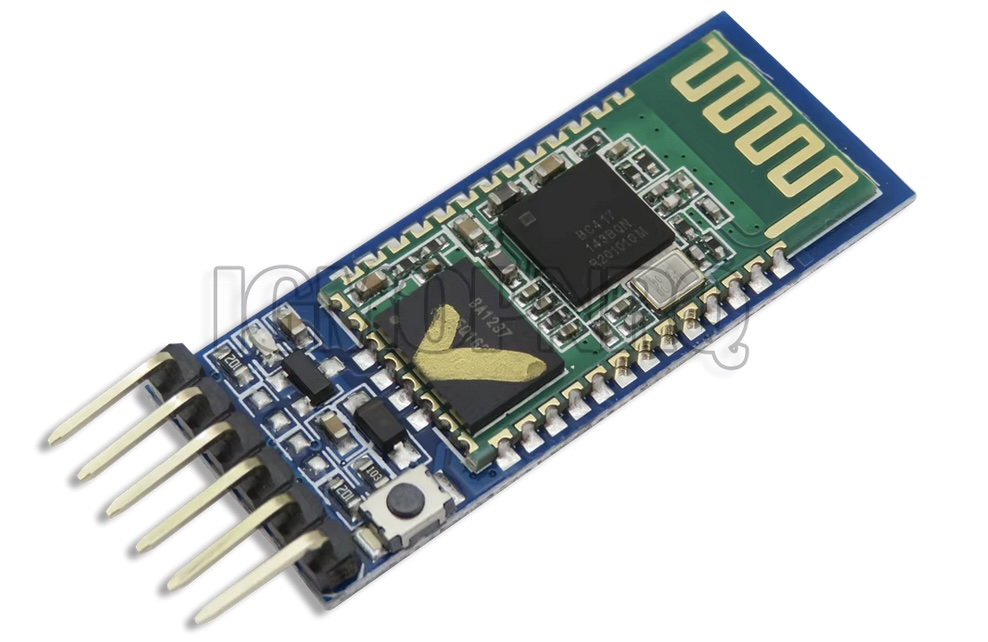
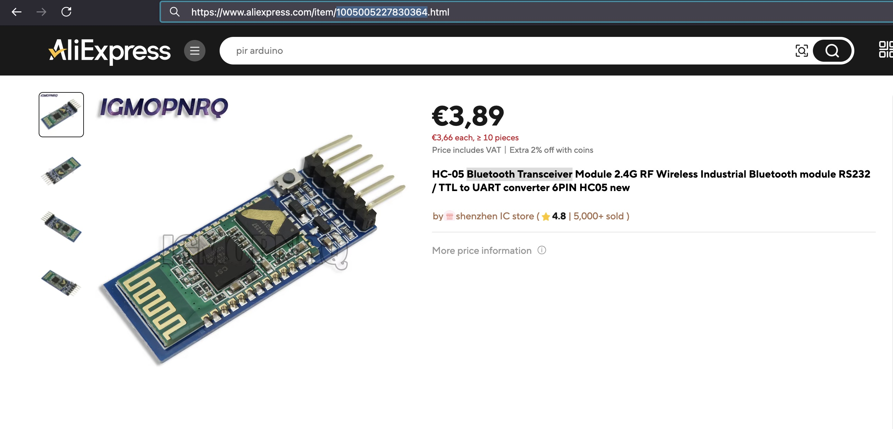
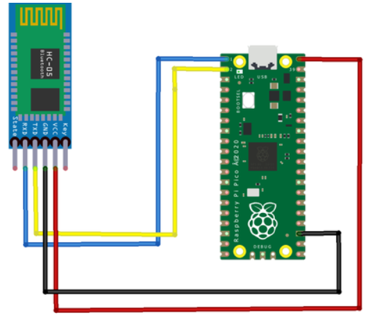

## Bluetooth Transceiver (HC-05)



## Description
The HC-05 is a popular Bluetooth module used to provide wireless serial communication in embedded systems. It supports both master and slave modes, making it versatile for a wide range of applications where wireless serial data transfer is required. Here’s a detailed description:

Key Features

	•	Bluetooth Standard: Bluetooth 2.0 + EDR (Enhanced Data Rate)
	•	Operating Voltage: 3.3V (can tolerate 5V on certain pins)
	•	Communication: UART (Universal Asynchronous Receiver/Transmitter) with configurable baud rate
	•	Default Baud Rate: 9600 bps (can be changed from 1200 bps to 1382400 bps)
	•	Range: Up to 10 meters (in an open environment, Class 2 Bluetooth device)
	•	Role: Can be configured as a Master or Slave device
	•	Connection Type: Supports full-duplex communication
	•	Power Consumption: Low power consumption during operation and power-saving mode when idle

Pin Description

	1.	VCC: Connects to 3.3V (though some modules may accept 5V).
	2.	GND: Ground pin.
	3.	TXD: Transmitter pin for UART communication. Connect to the RX pin of the host device.
	4.	RXD: Receiver pin for UART communication. Connect to the TX pin of the host device.
	5.	State Pin: High when the module is connected, low when disconnected (used for status indication).
	6.	EN (Enable) Pin: Used to enable or disable the module.
	7.	Key/AT Pin: Used to enter AT Command mode when held HIGH before powering on.

Operating Modes

	1.	Data Mode: When the HC-05 is used in normal operation mode for serial communication between devices.
	2.	AT Command Mode: A special mode used to configure the module. By entering AT commands, you can modify settings like the baud rate, device name, PIN code, and role (master or slave).

Configurable Parameters (in AT Command Mode)

	•	Device Name: Can be customized using AT+NAME command.
	•	Baud Rate: Changeable via AT+UART command.
	•	Master/Slave Role: Configurable with AT+ROLE (0 = Slave, 1 = Master).
	•	Password/PIN: Default is 1234, but it can be changed using AT+PSWD command.

How It Works

	•	Master Mode: The HC-05 module initiates communication with other Bluetooth devices by searching and connecting to a slave.
	•	Slave Mode: It waits for a connection from a master device (e.g., smartphone, microcontroller).

Applications

	•	Wireless Serial Communication: Send and receive data wirelessly between microcontrollers or to/from a PC or smartphone.
	•	Home Automation: Control home devices remotely using Bluetooth.
	•	Robotics: Send commands to robots or get feedback wirelessly.
	•	Wireless Data Logging: Collect sensor data without a physical connection to a computer or server.

AT Command Mode Setup

	1.	Power off the module.
	2.	Connect the Key/AT pin to HIGH (3.3V).
	3.	Power on the module.
	4.	Open a serial terminal and start sending AT commands.

Common AT Commands

	•	AT: Check communication.
	•	AT+NAME=name: Set the module’s name.
	•	AT+UART=baud,stopbits,parity: Set the baud rate and UART configuration.
	•	AT+ROLE=role: Set the module’s role (0 = Slave, 1 = Master).
	•	AT+PSWD=XXXX: Set the PIN code.

Module Variants

	•	HC-05: Configurable as both master and slave.
	•	HC-06: A simplified version that only works in slave mode.

Typical Connection Diagram with a Microcontroller

	•	VCC → 3.3V
	•	GND → GND
	•	TXD → RXD of microcontroller (with a voltage divider if working with 5V logic)
	•	RXD → TXD of microcontroller

Important Notes

	•	Voltage Levels: Though the HC-05 runs on 3.3V, some pins can tolerate 5V inputs. However, it’s safer to use a level shifter or voltage divider when interfacing with 5V logic devices like Arduino.
	•	Pairing: By default, the HC-05 module pairs with devices using a PIN (default: 1234). Pairing is required only once, after which the devices reconnect automatically.

Conclusion

The HC-05 is a highly versatile Bluetooth module used in a wide range of DIY, hobbyist, and professional projects to provide reliable, short-range wireless communication. Its configurability, ease of use, and support for both master and slave roles make it suitable for both simple and complex applications.


## Order
<a href="https://nl.aliexpress.com/item/1005005227830364.html">https://nl.aliexpress.com/item/1005005227830364.html</a>


## Wiring to Raspberry Pi Pico


## Installation libraries
Copy next files to the Raspberry Pi Pico

```bash
No librarrys needed.
```

## Example code

```python
from machine import UART
from machine import Pin
from utime import sleep

#roep uart aan
uart = UART(0, baudrate=9600, tx=Pin(0), rx=Pin(1))

#als er iets binnen komt op je bluetooth device, return the value. anders value = None
#leest alle inputs die het device binnen krijgt, als je sleep(5) in je code hebt,
#leest die nogsteeds alles op wat gestuurd is, maar met een delay van 5 op je shell
def listenToUart():
    if uart.any():
        data = uart.readline()
        return data.decode('utf-8').strip()

#stuurt string naar bluetooth device
def sendToUart(text):
    uart.write(text)

"""
Om de bluetooth verbinding te testen:
1 Download op een Android telefoon de app "Serial Bluetooth Terminal".
2 zoek naar bluetooth connecties op je telefoon. 
3 verbind met HC-0X
4 vul pincode in, standaard pincode is 0000 of 1234. je kan er nog niet mee koppelen.
5 open de serial Bluetooth Terminal app
6 klik op de menu bar links boven
7 selecteer devices
8 selecteer vervolgens Bluetooth Classic
9 selecteer jou device
10 ga terug naar terminal, als het goed is staat er nu Connecting to HC-0X ... -> Connected
11 run deze code, in je shell zie je None. in de app kan je een text sturen. deze zie je vervolgens ook in je shell
Goed gedaan!
"""

if __name__ == "__main__":
    while True:
        print(listenToUart())
        sendToUart("test\n")
        sleep(5)
```


