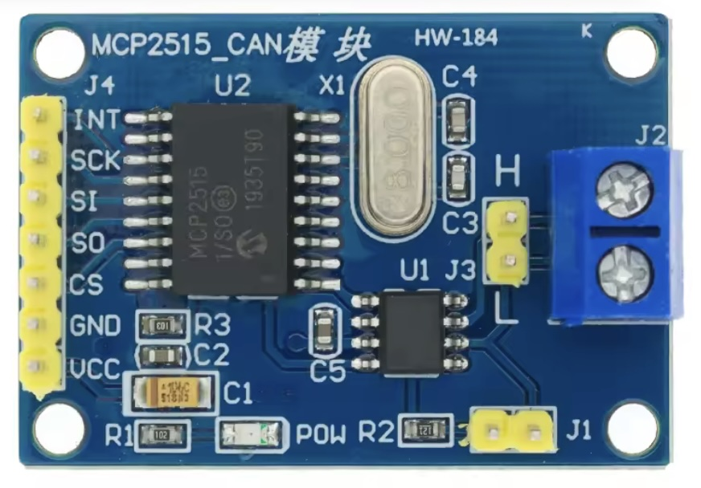

## Canbus (MCP2515)



## Description
The MCP2515 is a standalone CAN (Controller Area Network) controller with an SPI interface, widely used for CAN communication in embedded systems. It interfaces with microcontrollers to manage CAN bus communication in applications such as automotive systems, industrial automation, and IoT.

Key Features of MCP2515:
	1.	CAN Protocol Support:
	•	Fully implements the CAN V2.0B protocol.
	•	Supports standard (11-bit) and extended (29-bit) identifiers.
	2.	Data Rate:
	•	Supports CAN baud rates up to 1 Mbps.
	3.	SPI Interface:
	•	Communicates with a host microcontroller via SPI, making it compatible with various microcontrollers.
	4.	Buffers and Filters:
	•	Two transmit buffers with prioritization.
	•	Six receive filters and two masks for message filtering.
	5.	Interrupts:
	•	Generates interrupt signals for various events, like message reception, error detection, etc.
	6.	Low Power Modes:
	•	Supports sleep and power-save modes for energy-efficient applications.
	7.	Error Detection:
	•	Includes error counters and fault confinement mechanisms for robust communication.

Hardware Interface:

The MCP2515 works with an external CAN transceiver, such as the TJA1050, to connect to the CAN bus.

Typical Pinout:
	•	VDD: Power supply (typically 5V or 3.3V).
	•	GND: Ground.
	•	MISO, MOSI, SCK, CS: SPI communication pins.
	•	INT: Interrupt output.
	•	RX0BF, RX1BF: Receive buffer flags.

MicroPython Example

Here’s an example of using the MCP2515 with MicroPython on an ESP32:

Required Libraries

You need the mcp2515 library for MicroPython. You can find open-source implementations online, or you may write one.

Wiring Diagram

ESP32 Pin	MCP2515 Pin
3.3V	VDD
GND	GND
GPIO23	MOSI
GPIO19	MISO
GPIO18	SCK
GPIO5	CS
GPIO25	INT

Explanation of the Code:
	1.	SPI Initialization:
	•	Configures the SPI bus for communication with the MCP2515.
	2.	MCP2515 Initialization:
	•	The MCP2515 is set up and configured to operate at the desired bitrate.
	3.	Sending a Message:
	•	A standard CAN frame is sent with an 11-bit ID and 8 data bytes.
	4.	Receiving Messages:
	•	Interrupt-driven message reception allows handling incoming frames efficiently.

Notes:
	•	External Libraries: The example assumes you have an mcp2515 driver library for MicroPython. Adapt the API calls to match your specific library.
	•	CAN Bus Termination: Ensure the CAN bus is properly terminated with 120-ohm resistors at both ends for reliable communication.
	•	Debugging: Use logic analyzers or CAN analyzers to debug and monitor the communication if needed.

Let me know if you need help with any specific part!


## Order
<a href="https://nl.aliexpress.com/item/1005005227830364.html">https://nl.aliexpress.com/item/1005005227830364.html</a>


## Wiring to Raspberry Pi Pico


## Installation libraries
Copy next files to the Raspberry Pi Pico

```bash
No libraries needed.
```

## Example code

```python
from machine import Pin, SPI
import mcp2515

# Initialize SPI
spi = SPI(1, baudrate=1000000, polarity=0, phase=0, sck=Pin(18), mosi=Pin(23), miso=Pin(19))

# Initialize MCP2515
cs = Pin(5, Pin.OUT)  # Chip Select
int_pin = Pin(25, Pin.IN)  # Interrupt pin
can = mcp2515.MCP2515(spi, cs)

# Configure MCP2515
can.init()
can.set_bitrate(500000)  # Set CAN bus speed to 500 kbps

# Send a CAN message
message = {
    "id": 0x123,  # 11-bit CAN ID
    "data": b"\x01\x02\x03\x04\x05\x06\x07\x08",  # 8 bytes of data
    "extended": False  # Standard ID (not extended)
}
can.send(message)

# Listen for incoming messages
while True:
    if int_pin.value() == 0:  # Check if interrupt pin is triggered
        msg = can.receive()
        print(f"Received Message: ID={msg['id']} Data={msg['data']}")

```


