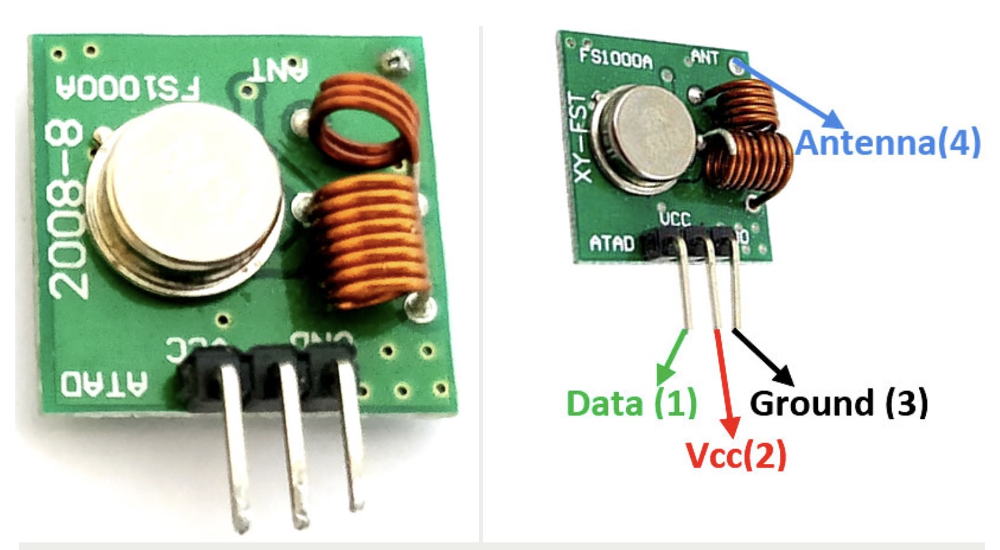

## Transmitter 433Mhz (FS1000A)



## Description
The FS1000A is a low-cost RF (radio frequency) transmitter module commonly used for wireless communication in hobbyist and embedded projects. It operates in the 315 MHz or 433 MHz bands and works in conjunction with a corresponding RF receiver module, such as the XY-MK-5V.

Key Features of the FS1000A:
	1.	Operating Frequency:
	•	315 MHz or 433 MHz (depending on the model).
	2.	Voltage Range:
	•	3V to 12V DC, with higher voltages offering increased transmission range.
	3.	Range:
	•	Up to 200 meters in open space (line of sight), depending on antenna and environmental conditions.
	4.	Data Rate:
	•	Up to 10 kbps.
	5.	Simple Design:
	•	Minimal components required to set up.
	6.	Antenna Requirement:
	•	A simple wire of approximately 17 cm for 433 MHz or 23 cm for 315 MHz improves performance.

Pinout Description:

FS1000A Pin	Function
VCC	Power supply (3–12V)
GND	Ground
DATA	Data input
ANT	Antenna connection

How It Works:
	•	The FS1000A transmits digital signals sent to its DATA pin.
	•	Pair it with an RF receiver to receive the transmitted signal.
	•	Typically used with libraries like RC Switch or custom encoding/decoding schemes.

Python Example with Raspberry Pi

Here’s an example of using the FS1000A with a Raspberry Pi to send data.

Wiring Diagram

Raspberry Pi Pin	FS1000A Pin
5V	VCC
GND	GND
GPIO17	DATA
ANT	Antenna (wire)

To transmit data, you need a library for generating RF signals, such as rpi-rf.

Explanation of the Code:
	1.	Library Initialization:
	•	The rpi-rf library is used to send RF signals.
	2.	Signal Transmission:
	•	The tx_code() method sends a code, which can be received by a compatible receiver.
	3.	Loop:
	•	A loop ensures continuous transmission of data with a delay.

Antenna Setup:

For better range:
	•	Use a straight wire (17 cm for 433 MHz, 23 cm for 315 MHz).
	•	Solder it to the ANT pin of the FS1000A module.

Use Cases:
	1.	Wireless Remote Controls:
	•	Garage doors, lights, etc.
	2.	IoT Devices:
	•	Sensor data transmission.
	3.	Automation Systems:
	•	Home automation for controlling devices.

Notes:
	•	Paired Receiver: Ensure you have a compatible receiver (e.g., XY-MK-5V) to test communication.
	•	Signal Interference: RF signals are prone to interference; avoid noisy environments.
	•	Encoding/Decoding: For robust communication, consider adding a protocol for error detection.

Let me know if you’d like assistance setting up the receiver or debugging the transmission!

## Order
<a href="https://nl.aliexpress.com/item/1005005227830364.html">https://nl.aliexpress.com/item/1005005227830364.html</a>


## Wiring to Raspberry Pi Pico


## Installation libraries
Copy next files to the Raspberry Pi Pico

```bash
pip install rpi-rf
```

## Example code

```python
from rpi_rf import RFDevice
import time

# GPIO pin connected to DATA pin of FS1000A
TRANSMIT_PIN = 17

# Initialize the RF device
rfdevice = RFDevice(TRANSMIT_PIN)
rfdevice.enable_tx()

try:
    while True:
        # Send a signal (e.g., an integer code representing a command)
        signal_code = 123456
        rfdevice.tx_code(signal_code)
        print(f"Sent code: {signal_code}")
        time.sleep(1)  # Wait before sending the next signal
except KeyboardInterrupt:
    print("Stopping transmission.")
finally:
    rfdevice.cleanup()
```


