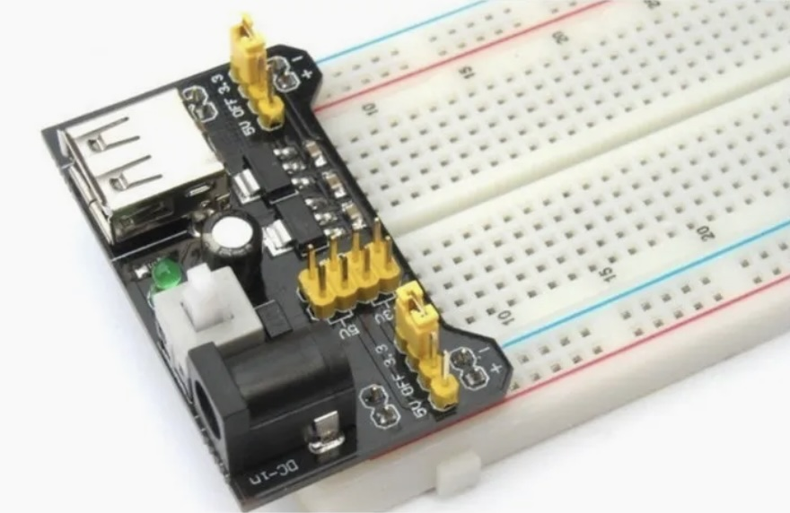
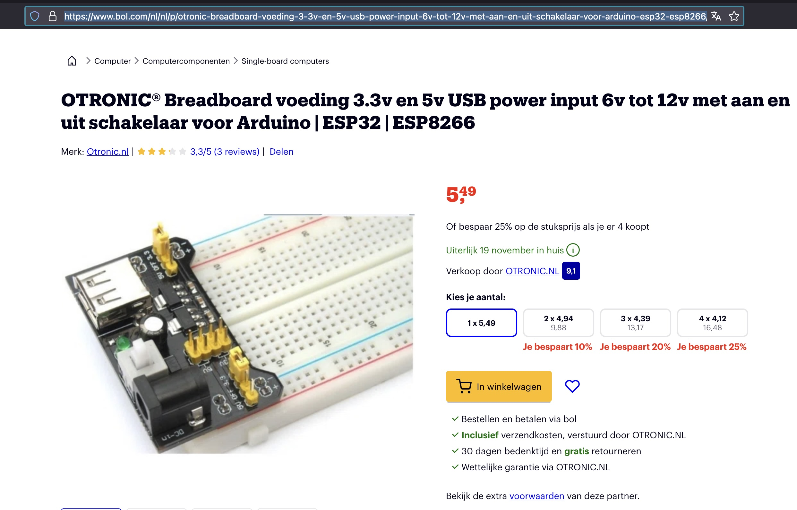

## Header Pin

## Description

## Order
<a href="https://www.bol.com/nl/nl/p/otronic-breadboard-voeding-3-3v-en-5v-usb-power-input-6v-tot-12v-met-aan-en-uit-schakelaar-voor-arduino-esp32-esp8266/9300000006843054/?Referrer=ADVNLGOO002013-S--9300000006843054&gad_source=1&gclid=Cj0KCQiA_9u5BhCUARIsABbMSPskre5UmImgKZeWT5uUeUWvtFTp6V3ZWctqS7JckVRIoTL3VwsN0YMaAmuOEALw_wcB">https://www.bol.com/nl/nl/p/otronic-breadboard-voeding-3-3v-en-5v-usb-power-input-6v-tot-12v-met-aan-en-uit-schakelaar-voor-arduino-esp32-esp8266/9300000006843054/?Referrer=ADVNLGOO002013-S--9300000006843054&gad_source=1&gclid=Cj0KCQiA_9u5BhCUARIsABbMSPskre5UmImgKZeWT5uUeUWvtFTp6V3ZWctqS7JckVRIoTL3VwsN0YMaAmuOEALw_wcB</a>

##  Versions

