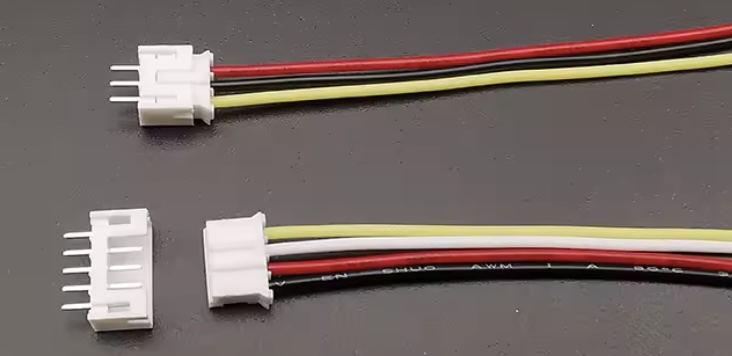

## Connector (JST PH 2.0)

## Description
# JST-PH 2.0 Connector

The **JST-PH 2.0** connector is a small, locking **wire-to-board connector** commonly used in **low-voltage electronics**, especially in **embedded systems, hobby projects, sensors, and LiPo battery connections**.

---

## Overview

- **Manufacturer:** JST (Japan Solderless Terminal)
- **Series:** PH
- **Pitch (pin spacing):** 2.0 mm
- **Connector type:** Wire-to-board
- **Locking mechanism:** Friction lock / latch
- **Orientation options:** Vertical and right-angle
- **Mounting:** Through-hole or SMT (depending on header type)

---

## Electrical Specifications

| Specification | Value |
|--------------|-------|
| Rated voltage | 100 V DC |
| Rated current | 2.0 A per pin |
| Contact resistance | ~20 mΩ |
| Insulation resistance | ≥ 100 MΩ |
| Operating temperature | −25 °C to +85 °C |

> **Note:**  
> Although rated for 2 A, many designs limit the current to **1–1.5 A** for improved reliability and reduced heating, especially when using thin wires.

---

## Wire Specifications

- Supported wire gauge: **AWG 24–30**
- Common wire gauges: **AWG 26, AWG 28**
- Crimp type: JST PH crimp terminals

---

## Mechanical Dimensions (2-pin Version)

### Female Housing (PHR-2)

- Width: ~4.5 mm  
- Height: ~6.0 mm  
- Depth: ~8.0 mm  
- Pitch: 2.0 mm  

### PCB Header (B2B-PH / S2B-PH)

- Pin spacing: 2.0 mm
- Mounting types:
  - Through-hole
  - Surface-mount (SMT)
- Orientation:
  - Vertical
  - Right-angle

---

## Typical Applications

- LiPo battery connectors (3.7 V nominal)
- Microcontroller boards (e.g. Raspberry Pi Pico)
- Sensors and small peripheral modules
- Embedded and low-power electronic devices

---

## Compatibility Notes

- **JST-PH (2.0 mm)** is **not compatible** with:
  - JST-XH (2.54 mm)
  - JST-SH (1.0 mm)
- Verify pitch and orientation before mating connectors.

---

## Safety and Design Notes

- Ensure correct polarity when used for power connections.
- Provide adequate strain relief for cables.
- Derate current in high-temperature or continuous-load applications.

---

## References

- JST PH Series Datasheet
- Manufacturer application notes

## Order
<a href="https://nl.aliexpress.com/item/1005008151857089.html">https://nl.aliexpress.com/item/1005008151857089.html</a>

##  Versions

<a href="https://grabcad.com/library/tag/jst">fusion 3d models</a>
<a href="https://www.snapeda.com/search/?q=JST+pH&search-type=parts">fusion PCB footprint</a>

