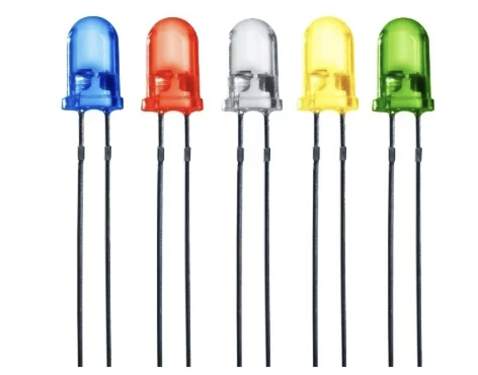
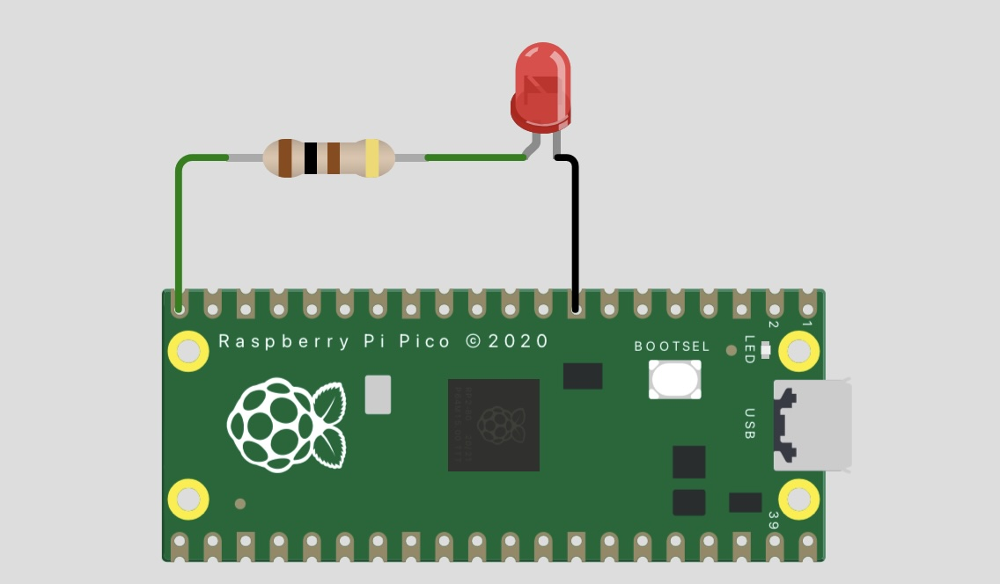

## LED 5mm




## Description
What is an LED?

An LED (Light Emitting Diode) is a semiconductor device that emits light when an electric current passes through it. LEDs are widely used due to their efficiency, long lifespan, and low power consumption.

Key Characteristics of an LED:
	1.	Polarity: LEDs are polarized components, meaning they have a specific orientation:
	•	Anode (Positive): The longer leg, connected to a higher voltage.
	•	Cathode (Negative): The shorter leg, connected to ground or a lower voltage.
	2.	Forward Voltage: LEDs require a certain voltage to operate, typically around:
	•	1.8–2.2V for red LEDs.
	•	3.0–3.4V for blue or white LEDs.
	3.	Current Limiting: LEDs need a resistor in series to limit the current; otherwise, they can be damaged.


How to Use an LED with a Raspberry Pi Pico

The Raspberry Pi Pico is a microcontroller board based on the RP2040 chip. It can control LEDs via its GPIO (General-Purpose Input/Output) pins. Here’s how to set up and use an LED with a Pico:

1. Materials Needed

	•	Raspberry Pi Pico.
	•	LED (any color).
	•	Resistor (220–330 ohms, depending on the LED).
	•	Breadboard and jumper wires.

2. Circuit Setup

	1.	Connect the Resistor to the LED:
	•	Attach one end of a 220–330 ohm resistor to the anode (longer leg) of the LED.
	•	Alternatively, the resistor can be placed between the LED and the GPIO pin.
	2.	Connect the LED to the Pico:
	•	Connect the cathode (shorter leg) of the LED to the Pico’s GND pin (ground).
	•	Connect the free end of the resistor (or the LED anode directly if resistor is placed differently) to one of the Pico’s GPIO pins (e.g., GPIO 15).

3. Write Code to Control the LED

You can program the Raspberry Pi Pico using MicroPython or C/C++. 
an example is show at the end of this page.

4. Explanation of the Code

	•	Pin(15, Pin.OUT): Configures GPIO 15 as an output.
	•	led.on(): Turns the LED on by setting GPIO 15 high.
	•	led.off(): Turns the LED off by setting GPIO 15 low.
	•	time.sleep(1): Pauses the program for 1 second.

5. Testing

	•	After uploading the code to the Pico, the LED should blink on and off every second.
	•	If it doesn’t work, double-check the connections and ensure the resistor is in place.

Tips and Safety

	•	Always use a resistor: This prevents excessive current from damaging the LED.
	•	Avoid reverse polarity: Connecting the LED backward won’t harm it in most cases, but it won’t light up.
	•	Use correct GPIO pin numbering: The Pico has both physical and logical pin numbering; make sure to use the correct one for your code.

## Order
<a href="https://nl.aliexpress.com/item/1005006140674321.html">https://nl.aliexpress.com/item/1005006140674321.html</a>


##  Versions



## Python example code

```python
from machine import Pin
import time

# Set up GPIO pin 15 as an output
led = Pin(15, Pin.OUT)

# Blink the LED
while True:
    led.on()  # Turn the LED on
    time.sleep(1)  # Wait for 1 second
    led.off()  # Turn the LED off
    time.sleep(1)  # Wait for 1 second
```
