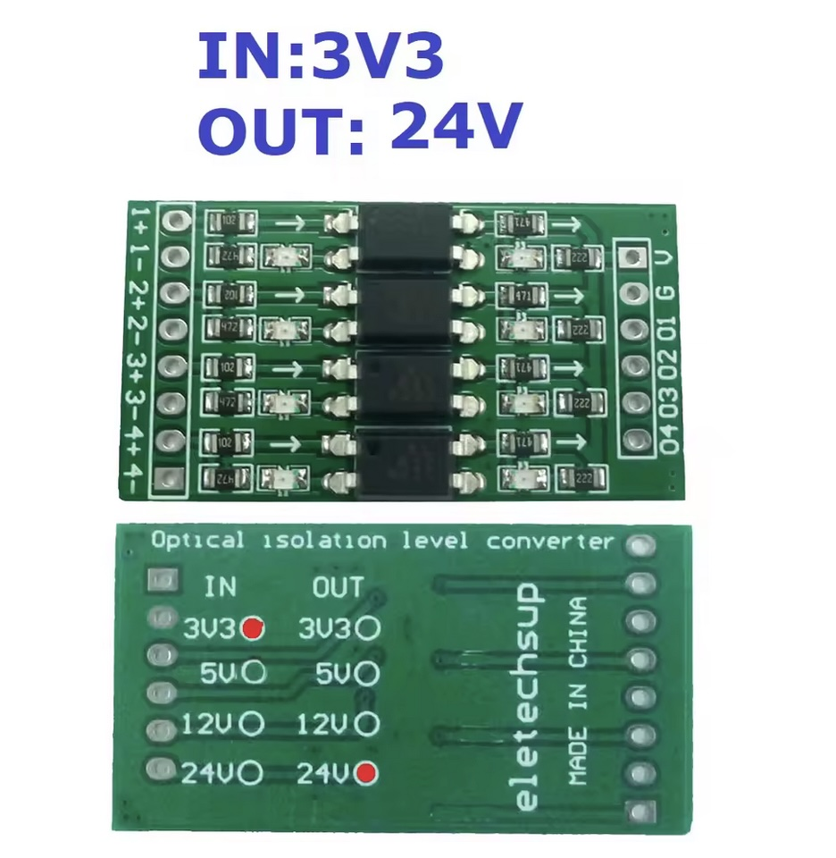
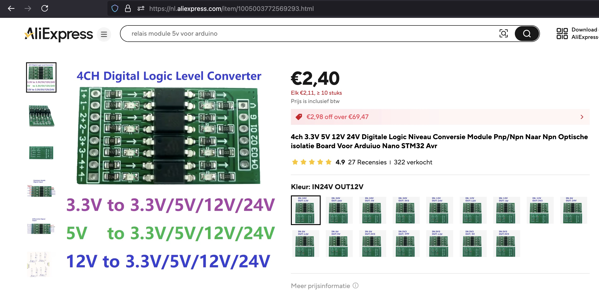
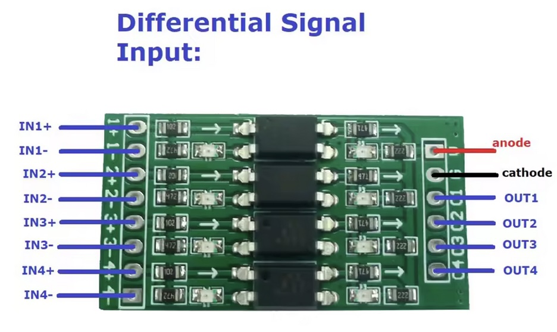

## LevelShifter (OP71A04)




## Description
Beperk de schakelfrequentie tot 10KHZ

Versies

IN        UIT
3.3V    12V
3.3V    24V
12V     3.3V
24V     3.3V


## Order
<a href="https://nl.aliexpress.com/item/1005003772569293.html">https://nl.aliexpress.com/item/1005003772569293.html</a>


## Wiring to Raspberry Pi Pico




## installation libraries
No python libraries needed to install


## Example code

```python
# no micropython code to control the module
```

