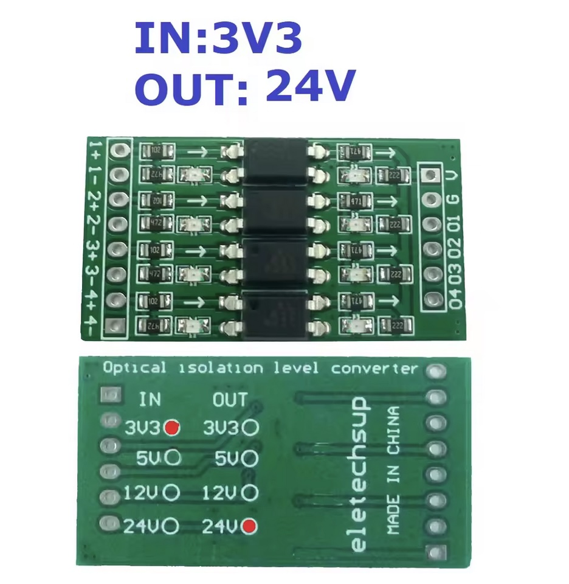
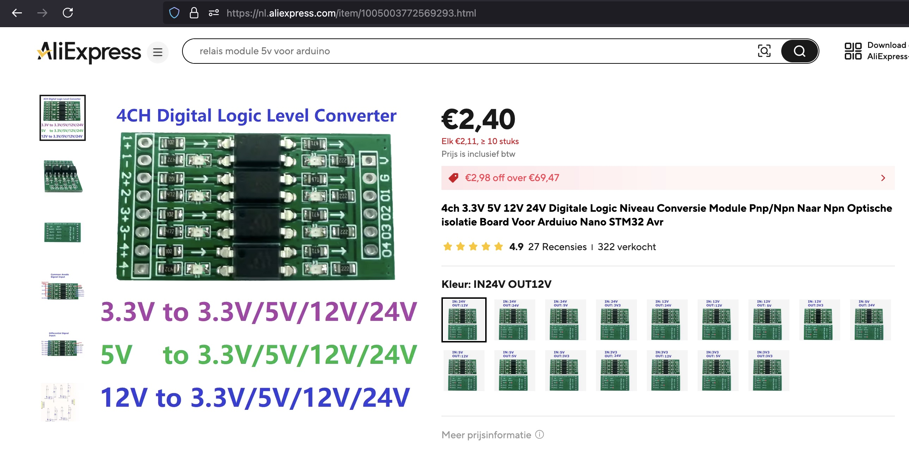
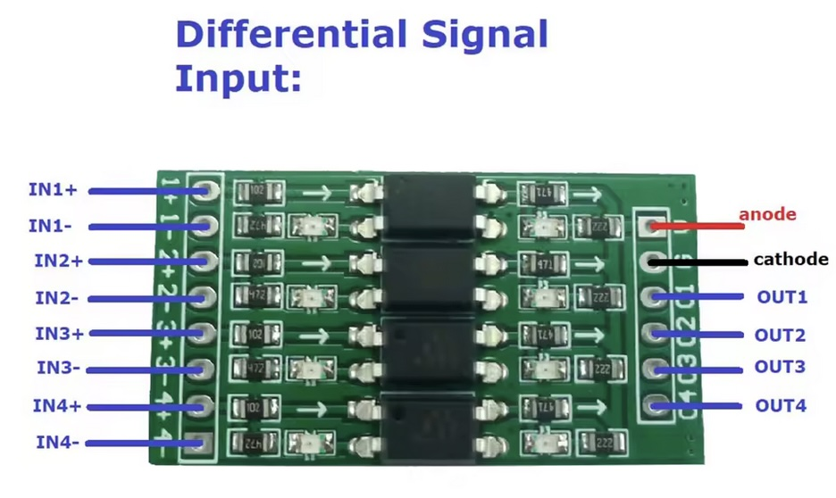
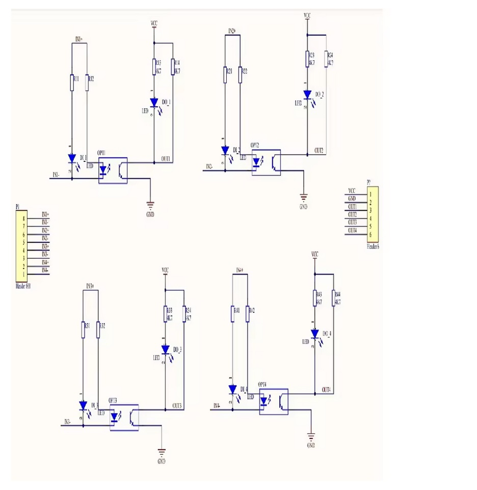
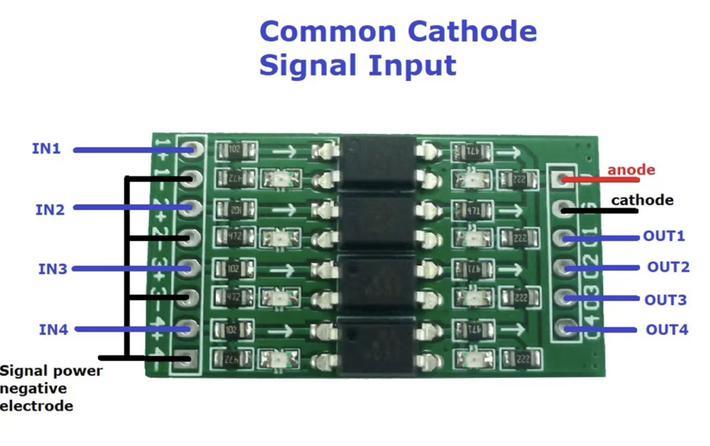
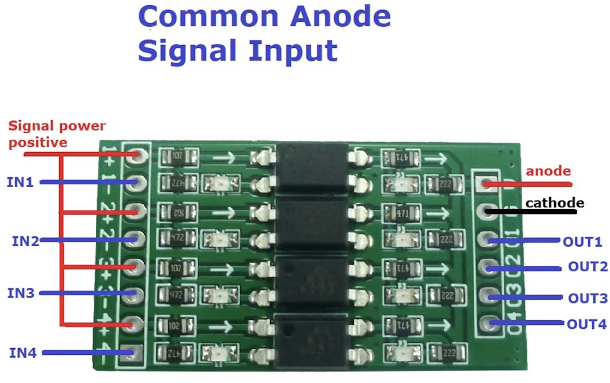

## LevelShifter (OP71AO4)




## Description
Beperk de schakelfrequentie tot 10KHZ

### Versies

|     IN        |      OUT      |
| ------------- | ------------- |
|     3.3V      |      12V      |
|     3.3V      |      24V      |
|      12V      |     3.3V      |
|      24V      |     3.3V      |

## Order
<a href="https://nl.aliexpress.com/item/1005003772569293.html">https://nl.aliexpress.com/item/1005003772569293.html</a>


## Wiring







## installation libraries
No python libraries needed to install


## Example code

```python
# no micropython code to control the module
```

