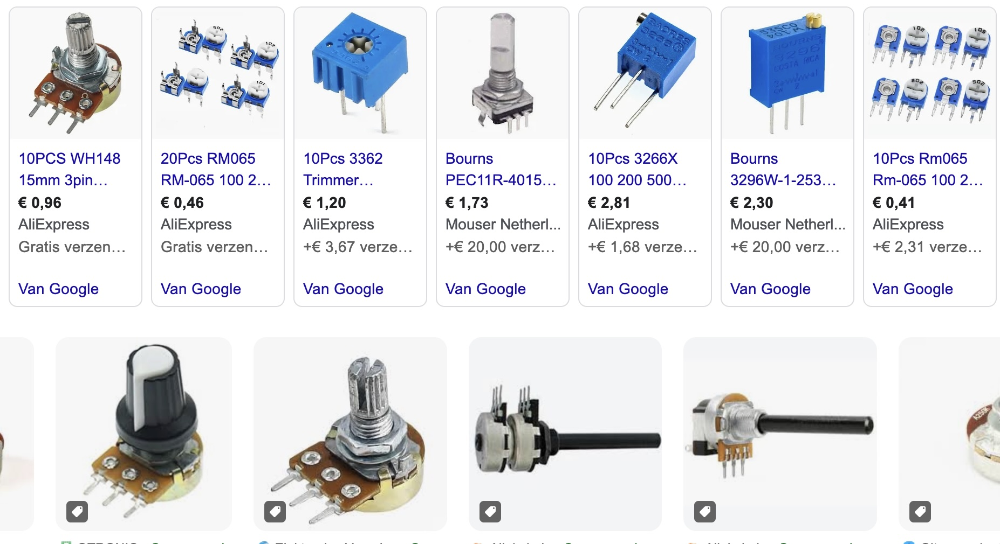
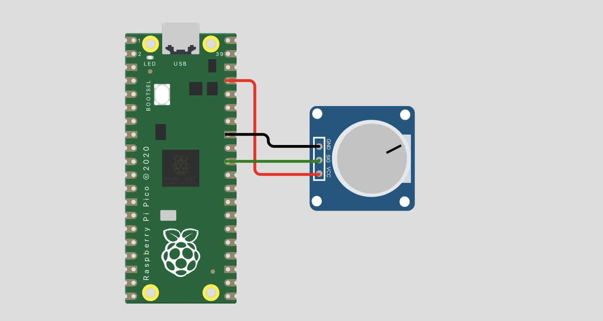

## Potmeter




## Description

## Order
<a href="https://nl.aliexpress.com/item/1005006140674321.html">https://nl.aliexpress.com/item/1005006140674321.html</a>


##  Wiring




## Python example code

```python
from machine import ADC, Pin
import time

# Configure ADC pin (GP26 is ADC0)
pot = ADC(Pin(26))  

while True:
    # Read the raw ADC value (0-65535)
    raw_value = pot.read_u16()
    
    # Convert to a voltage value (0-3.3V)
    voltage = raw_value * 3.3 / 65535
    
    print(f"Raw Value: {raw_value}, Voltage: {voltage:.2f}V")
    time.sleep(0.1)  # Delay to avoid flooding the output
```

