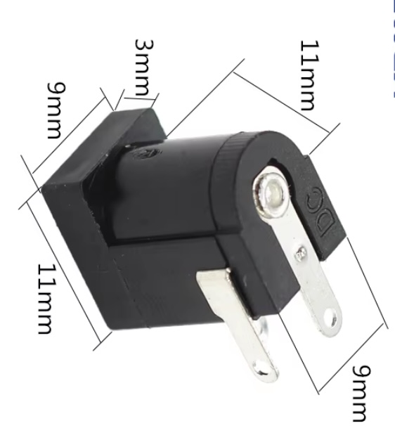

## Power Jack (DC-005 or PJ-002A)




## Description
The PJ-002A is a commonly used power jack, specifically designed for providing a connection point for DC power sources in electronic devices and projects. It is often used in conjunction with power adapters and batteries to supply power to various electronic circuits, particularly in DIY electronics and prototyping.

Key Features

	•	Type: Typically a DC barrel jack connector, often classified as a 2.1 mm x 5.5 mm connector, which is a standard size for many power applications.
	•	Configuration: It usually features a center pin for the positive voltage and the outer barrel for the ground, making it easy to connect power sources with a consistent polarity.
	•	Mounting Style: The PJ-002A is designed for through-hole mounting, allowing it to be soldered directly onto printed circuit boards (PCBs) or connected via wires.
	•	Durability: Constructed from durable materials to withstand repeated use, making it suitable for both prototyping and long-term applications.
	•	Versatility: Can be used in various applications, including powering microcontrollers, LED strips, sensors, and other electronic components.

Specifications

	•	Input Voltage: Supports a wide range of input voltages, typically from 7V to 12V, although the exact specifications may vary based on the specific application.
	•	Pin Configuration:
	•	Center Pin: Positive (+) connection
	•	Outer Barrel: Ground (-) connection
	•	Dimensions: Standard size of 2.1 mm internal diameter and 5.5 mm external diameter, with a length that typically ranges from 10 mm to 12 mm.
	•	Current Rating: Generally rated for a maximum current of around 2A, making it suitable for most small to medium-sized electronic projects.

Working Principle

The PJ-002A functions by providing a reliable connection point for DC power sources. Here’s how it works:

	1.	Connection: The connector accepts a compatible DC barrel plug, which inserts into the jack. The design ensures a snug fit, minimizing the chance of accidental disconnection.
	2.	Power Transfer: When connected, power is transferred from the DC source through the center pin (positive) and outer barrel (ground) to the connected circuitry, supplying the necessary voltage and current for operation.
	3.	Polarity Consistency: The standard configuration of center-positive ensures consistent polarity across devices, reducing the risk of misconnection and damage to electronic components.

Applications

The PJ-002A power jack is used in a variety of applications, including:

	•	Consumer Electronics: Commonly found in devices such as portable speakers, cameras, and other battery-operated electronics.
	•	DIY Projects: Popular among hobbyists and makers for use in Arduino projects, Raspberry Pi applications, and other electronics projects.
	•	Robotics: Used in robotic applications where a stable power source is required.
	•	Prototyping: Often used in prototyping boards to easily connect power supplies during the development phase.

Advantages

	•	Ease of Use: Simple design makes it easy to connect and disconnect power sources, facilitating prototyping and testing.
	•	Widely Compatible: Standard size and pin configuration allow for compatibility with many power adapters and cables.
	•	Durability: Built to withstand frequent connections and disconnections, making it suitable for various applications.
	•	Cost-Effective: Generally inexpensive and readily available, making it an economical choice for hobbyists and engineers alike.

Limitations

	•	Current Limitation: While suitable for many applications, the maximum current rating of 2A may limit its use in higher-power devices.
	•	Physical Size: The size of the connector may not be suitable for very compact designs, where space is a critical factor.
	•	Wear Over Time: As with any mechanical connector, repeated use may lead to wear and potential connection issues over time.

Conclusion

The PJ-002A power jack is a versatile and reliable component widely used in electronics for connecting DC power sources. Its standard size, ease of use, and durability make it a favorite among hobbyists, engineers, and manufacturers. Whether for DIY projects, consumer electronics, or prototyping, the PJ-002A provides a simple and effective solution for powering various devices.

## Order
<a href="https://nl.aliexpress.com/item/1005006459299143.html">https://nl.aliexpress.com/item/1005006459299143.htm</a>


## Wiring to Raspberry Pi Pico
look at : <a href="https://github.com/MKEadmin/ElektronischeComponenten/blob/main/Components/Voltage%20regulator%20(7805)/README.md">[https://nl.aliexpress.com/item/1005006459299143.htm](https://github.com/MKEadmin/ElektronischeComponenten/blob/main/Components/Voltage%20regulator%20(7805)/README.md)</a>

## Installation libraries
Copy next files to the Raspberry Pi Pico

```bash

```

## Example code
```python


```


