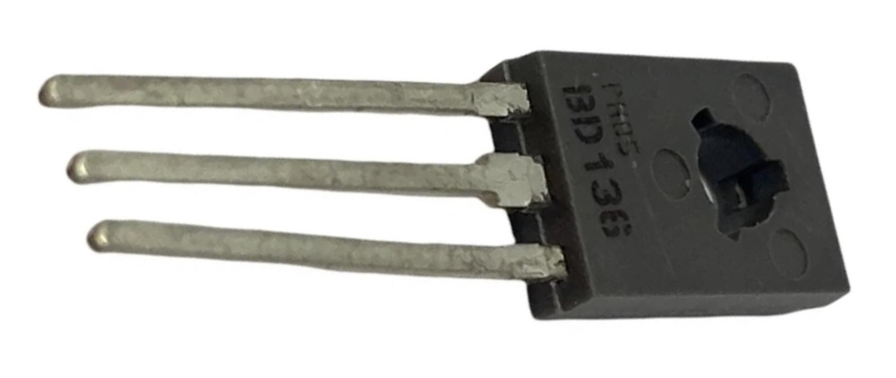

## Transistor (BD136)




## Description
The BD136 is a NPN bipolar junction transistor (BJT) widely used in electronic applications for amplification and switching purposes. It is known for its robustness and versatility, making it suitable for various medium-power applications. The BD136 is commonly found in audio amplifiers, signal processing circuits, and power control applications.

Key Features

	•	Type: NPN bipolar junction transistor.
	•	Package Type: Available in different packages, such as TO-220 and TO-92, which allows for easy mounting in various applications.
	•	Voltage Rating: Maximum collector-emitter voltage (V_CE) of up to 45V, suitable for moderate voltage applications.
	•	Current Rating: Maximum continuous collector current (I_C) of 1.5A, making it appropriate for medium-power applications.
	•	Gain Characteristics: DC current gain (h_FE) typically ranges from 40 to 200, allowing for effective signal amplification.

Specifications

	•	Collector-Emitter Voltage (V_CE): 45V
	•	Collector-Base Voltage (V_CBO): 45V
	•	Emitter-Base Voltage (V_EBO): 5V
	•	Collector Current (I_C): 1.5A
	•	DC Current Gain (h_FE): 40 to 200
	•	Power Dissipation (P_D): Up to 0.8W (depending on the package and thermal conditions)
	•	Operating Temperature Range: Typically from -55°C to +150°C.

Pin Configuration

In a TO-220 package, the pin configuration for the BD136 is typically as follows:

	1.	Base (B): The control terminal used to turn the transistor on or off.
	2.	Collector (C): The terminal through which the main current flows, connected to the load.
	3.	Emitter (E): The terminal that allows current to flow out of the transistor to ground.

Working Principle

The BD136 operates by using a small input current at the base to control a larger current flowing from the collector to the emitter. Here’s how it works:

	1.	Base Current (I_B): A small current applied to the base terminal controls a larger current flowing from the collector to the emitter.
	2.	Current Gain (h_FE): The relationship between the base current and collector current is given by:

This means a small base current can control a much larger collector current, making the BD136 effective for amplification.
	3.	Switching Action: In switching applications, when the base current exceeds a certain threshold, the transistor enters saturation mode, allowing maximum current to flow from collector to emitter. When the base current is removed, the transistor turns off, stopping the flow of current.

Applications

The BD136 is used in various applications, including:

	1.	Amplifiers: Commonly employed in audio and signal amplification circuits to enhance weak signals.
	2.	Switching Circuits: Used for controlling larger loads with low-power control signals, such as relay drivers, LED drivers, and motor controllers.
	3.	Oscillator Circuits: Found in oscillator circuits for generating audio or radio frequency signals.
	4.	Voltage Regulation: Used in linear voltage regulators to maintain stable output voltage levels.
	5.	Signal Processing: Utilized in filters, modulators, and other signal processing applications.

Advantages

	•	Versatile: Suitable for a wide range of applications, making it a popular choice among engineers and hobbyists.
	•	High Current and Voltage Ratings: Capable of handling moderate power loads, ideal for various electronic designs.
	•	Simple to Use: Easy integration into circuits with straightforward biasing configurations.

Limitations

	•	Power Dissipation: Requires proper heat management to avoid overheating during high-power applications.
	•	Frequency Response: Not suitable for high-frequency applications compared to some other transistor types (like FETs).
	•	Voltage Ratings: The maximum voltage ratings may limit its use in high-voltage applications without additional components.

Conclusion

The BD136 NPN transistor is a reliable and versatile component widely used in electronics for amplification and switching applications. Its robust design, moderate power handling capabilities, and ease of use make it suitable for various circuits, from simple hobby projects to more complex electronic devices. Whether used in audio amplification, switching, or signal processing, the BD136 remains a popular choice in the electronics community.

## Order
<a href="https://nl.aliexpress.com/item/1005006160604822.html">https://nl.aliexpress.com/item/1005006160604822.htm</a>


## Wiring to Raspberry Pi Pico


## Example code
```python
# can not be programmed via the pico
```


