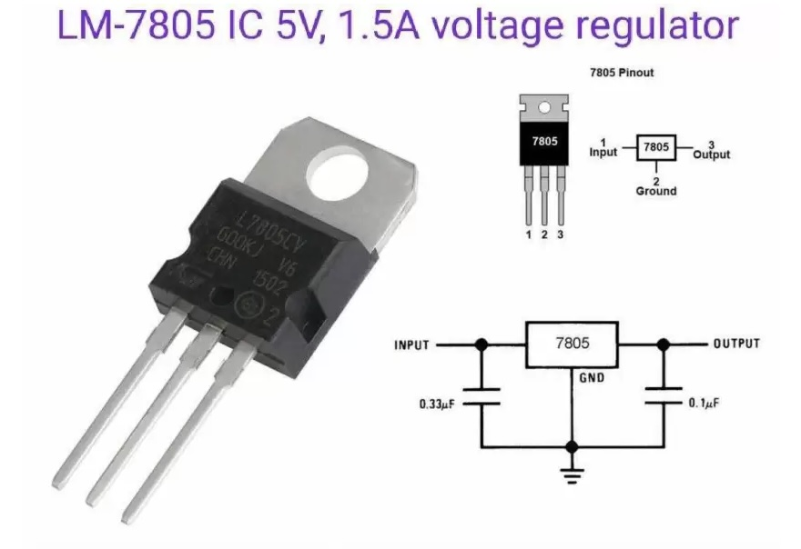
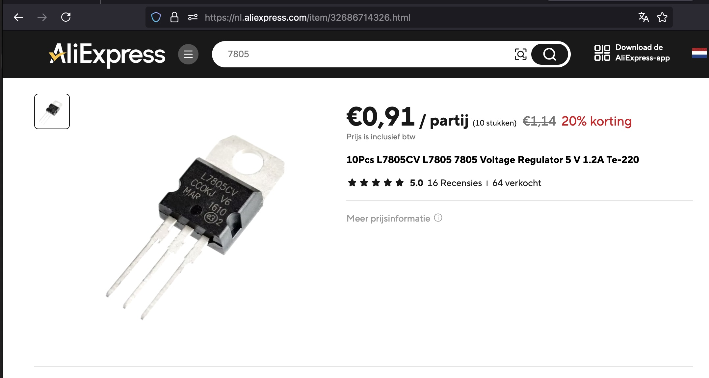
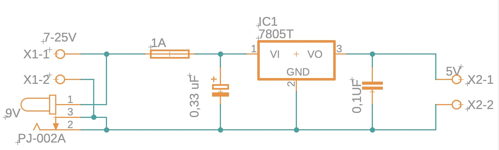

## Voltage regulator (7805)

## Description
The 7805 is a popular voltage regulator integrated circuit (IC) used to provide a stable output voltage of 5 volts from a higher input voltage source. It is widely utilized in electronic circuits and projects to power microcontrollers, sensors, and other components that require a regulated 5V supply. The 7805 is part of the 78xx series of voltage regulators, which are designed to output fixed voltages.

Key Features

	•	Output Voltage: Provides a regulated output of 5V.
	•	Input Voltage Range: Accepts a wide input voltage range, typically from 7V to 35V, depending on the package and specifications.
	•	Maximum Output Current: Generally rated for up to 1A of output current, though this can vary based on the specific package and cooling conditions.
	•	Thermal Protection: Built-in thermal shutdown feature prevents damage due to overheating.
	•	Short-Circuit Protection: Designed to protect itself from damage if the output is shorted.
	•	Low Dropout Voltage: The dropout voltage (the minimum difference between input and output voltage) is typically around 2V, allowing it to operate efficiently with a small voltage drop.
	•	Ease of Use: Requires minimal external components, making it simple to implement in circuits.

Specifications

	•	Input Voltage: 7V to 35V (depending on specific model)
	•	Output Voltage: 5V ±5% (approximately 4.75V to 5.25V)
	•	Maximum Output Current: Up to 1A
	•	Dropout Voltage: Typically 2V
	•	Temperature Range: Generally operates from -40°C to +125°C
	•	Package Types: Available in various packages, including TO-220, TO-3, and DIP, among others.

Working Principle

The 7805 voltage regulator operates by maintaining a constant output voltage of 5V regardless of variations in the input voltage or load current, as long as the input voltage is within specified limits. Here’s how it works:

	1.	Voltage Regulation: The IC uses feedback from the output to control the internal circuitry, adjusting the resistance to maintain a stable output voltage.
	2.	Power Dissipation: When the input voltage is higher than the output voltage, the difference is dissipated as heat. The 7805 requires proper heat sinking if the voltage drop and current draw result in significant power dissipation.
	3.	Output Stability: The internal circuitry continually monitors the output voltage and adjusts as needed to ensure a consistent 5V output, even with fluctuations in input voltage or changes in load.

Applications

The 7805 voltage regulator is widely used in various applications, including:

	•	Power Supply Circuits: Commonly used in power supply circuits to convert higher DC voltages to a stable 5V output.
	•	Microcontroller Power Supply: Provides power for microcontrollers like Arduino, Raspberry Pi, and other embedded systems.
	•	Consumer Electronics: Used in devices requiring a stable 5V supply, such as sensors, displays, and other peripherals.
	•	Prototyping: A go-to choice for prototyping in electronics labs and projects due to its simplicity and reliability.

Advantages

	•	Simplicity: Easy to use and implement in circuits with minimal external components.
	•	Cost-Effective: Widely available and inexpensive, making it an economical choice for many applications.
	•	Reliability: Robust design with built-in protection features, enhancing the reliability of connected devices.
	•	Wide Availability: Commonly found in electronic components stores and used in numerous projects, making it easy to source.

Limitations

	•	Heat Dissipation: Can generate significant heat under load, requiring proper heat sinking to prevent overheating.
	•	Efficiency: Not as efficient as switching regulators, especially when the input voltage is significantly higher than 5V, due to power loss as heat.
	•	Fixed Output Voltage: Limited to a fixed output voltage (5V), which may not be suitable for applications requiring adjustable voltages.

Conclusion

The 7805 voltage regulator is a reliable and easy-to-use component for providing a stable 5V output in various electronic circuits and applications. Its simplicity, cost-effectiveness, and built-in protection features make it a popular choice for powering microcontrollers, sensors, and other electronic devices. Despite some limitations related to heat dissipation and efficiency, the 7805 remains a staple in both hobbyist and professional electronic designs.

## Order
<a href="https://nl.aliexpress.com/item/1005006459299143.html">https://nl.aliexpress.com/item/1005006459299143.htm</a>

## Wiring

In the folder Fusion360 there is a file [7805 Voeding.fsch]. This is a Fusion 360 project file with the complete wiring as show above. OPen this file in Fusion360 and copy the parts to your project. This includes the correct capasitors.

