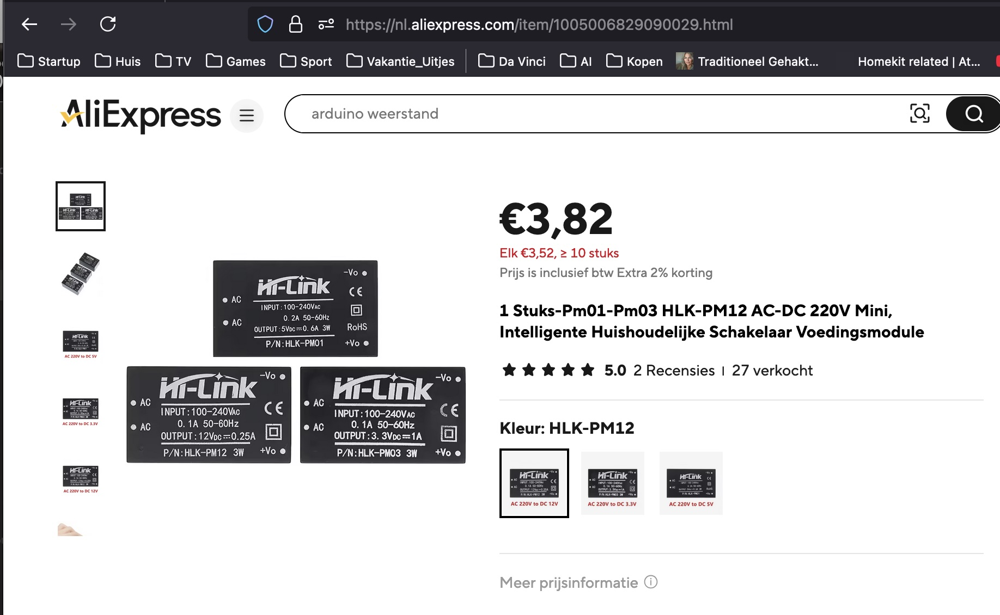
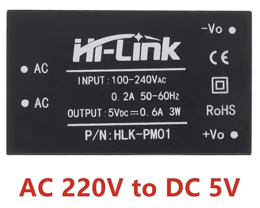

## Voltage regulator (HLK_PM01)




## Description
The HLK-PM01 is a compact and efficient AC-DC power module designed to provide a stable, low-voltage DC output from a high-voltage AC input. It is ideal for small electronic devices, IoT applications, embedded systems, and projects requiring reliable low-power operation with minimal design complexity.

1. Overview

The HLK-PM01 is an isolated AC-DC power supply module that converts mains AC voltage (110V–240V AC) into a 5V DC output. It is a compact, efficient, and cost-effective solution for providing a regulated power supply to low-power electronic devices and microcontrollers.

2. Key Features
	•	Input Voltage Range: 100V–240V AC (wide range for global compatibility).
	•	Output Voltage: 5V DC (regulated).
	•	Output Power: Up to 3W.
	•	Current Output: Maximum of 600mA.
	•	Compact Size: Small form factor (approx. 34mm × 20mm × 15mm).
	•	High Efficiency: Conversion efficiency up to 80%.
	•	Isolation: Electrically isolated, ensuring safety and reliability.
	•	Low Ripple and Noise: Provides clean, stable DC output.
	•	Overcurrent and Short-Circuit Protection: Built-in safety mechanisms to prevent damage.
	•	Wide Operating Temperature Range: Suitable for environments ranging from -20°C to +60°C.

3. Technical Specifications

Parameter	Value
Input Voltage	100–240V AC (50/60Hz)
Output Voltage	5V DC (regulated)
Output Current	600mA (max)
Output Power	3W (max)
Isolation Voltage	3000V AC (input to output)
Efficiency	~80%
Ripple and Noise	≤ 150mV (peak-to-peak)
Operating Temperature	-20°C to +60°C
Storage Temperature	-40°C to +80°C
Dimensions	34mm × 20mm × 15mm
Weight	~15g

4. Design and Components

The HLK-PM01 consists of:
	1.	Input Terminals: Accept high-voltage AC input (100V–240V).
	2.	Output Terminals: Provide regulated 5V DC output.
	3.	Internal Transformer: Steps down and isolates the voltage.
	4.	Rectification and Regulation Circuitry: Converts AC to stable DC.
	5.	Safety Features: Built-in short-circuit, overcurrent, and thermal protection for reliable operation.

The module is encased in a durable, fire-retardant plastic shell, ensuring electrical safety and physical protection.

5. Advantages
	•	Compact Size: Saves space in small electronics or embedded systems.
	•	High Efficiency: Up to 80% efficiency reduces energy waste and heat generation.
	•	Isolation: Provides electrical isolation between input and output for enhanced safety.
	•	Easy Integration: Can directly interface with microcontrollers (e.g., Arduino, ESP32, Raspberry Pi).
	•	Safety Features: Protects both the module and connected devices from faults.
	•	Reliable and Durable: Designed for long-term operation under various conditions.
	•	Global Compatibility: Works with a wide range of input voltages (100–240V AC).

6. Applications

The HLK-PM01 is ideal for a variety of low-power applications, including:
	•	IoT Projects: Powering ESP8266, ESP32, and other Wi-Fi modules.
	•	Smart Home Devices: Low-power embedded controllers for home automation.
	•	Microcontroller Power Supply: Direct power for Arduino, Raspberry Pi Pico, STM32, and other microcontrollers.
	•	Sensors and Actuators: Supplying power for connected sensors, relays, and motors.
	•	DIY Electronics Projects: General use where isolated 5V power is needed.
	•	Embedded Systems: Power for small, low-power embedded circuits.
	•	Industrial Control: Low-voltage control systems and interfaces.

7. Installation and Usage
	1.	Connect Input Power:
	•	Connect the AC input terminals to mains voltage (100–240V AC). Proper care must be taken to ensure safe connections.
	2.	Connect Output:
	•	The output terminals provide a 5V DC regulated voltage. Connect these to the load, such as a microcontroller or electronic circuit.
	3.	Mounting:
	•	The HLK-PM01 module can be mounted onto a PCB using solder pads or screw connectors.
	4.	Safety Precautions:
	•	Since the module deals with high voltage AC input, ensure proper insulation and spacing when integrating it into projects.

8. Safety Considerations
	•	Avoid direct contact with the module while powered, as it handles high voltage on the input side.
	•	Always verify connections before powering the module.
	•	Ensure the module is adequately isolated within an enclosure for safety.
	•	Use appropriate fuses and protective devices in your circuit for additional safety.

9. Limitations
	•	Output Power Limit: Maximum of 3W (600mA @ 5V). Exceeding this can damage the module.
	•	No Adjustable Output: The HLK-PM01 only outputs a fixed 5V.
	•	High Voltage Handling: Requires care during use, especially for beginners working with AC power.

10. Summary

The HLK-PM01 is a small, efficient, and isolated AC-DC power module that converts mains AC voltage into a stable 5V DC output. Its compact design, reliability, and built-in safety features make it an excellent choice for powering IoT devices, microcontrollers, and small electronic circuits. This module simplifies power supply design, allowing developers to integrate it easily into a wide range of applications.

For projects requiring a safe, isolated, and low-power solution, the HLK-PM01 offers a highly efficient and cost-effective option.

For accurate and detailed information, always refer to the official datasheet provided by the manufacturer, Hi-Link.

## Order
<a href="https://nl.aliexpress.com/item/1005006334953525.html">https://nl.aliexpress.com/item/1005006334953525.htm</a>



## Wiring to Raspberry Pi Pico


## Installation libraries
Copy next files to the Raspberry Pi Pico

```bash

```

## Example code
```python


```


