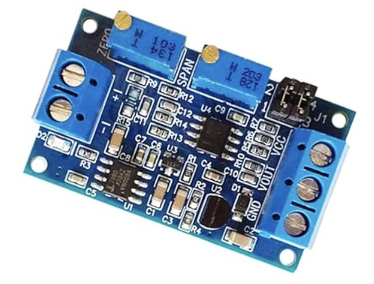
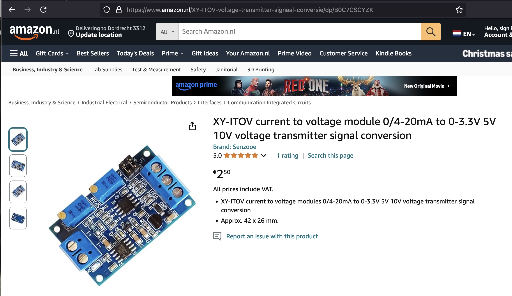

## Voltage regulator (XY-ITOV)




## Description

The Voltage Regulator XY-ITOV is an electronic module designed to regulate and control voltage output for a variety of applications, such as powering devices, protecting circuits, and maintaining stable voltage levels. Here’s a complete description:

1. Overview

The XY-ITOV voltage regulator is a DC-DC step-down (buck) converter module. It takes an input DC voltage and provides a regulated, lower output voltage. It is commonly used in electronic projects, DIY builds, power supplies, and other low-voltage applications.

2. Key Features
	•	Type: DC-DC Step-Down (Buck) Voltage Regulator
	•	Adjustable Voltage Output: Allows you to set the desired output voltage using a built-in potentiometer or display interface.
	•	Input Voltage Range: Typically supports a wide range of input voltages (e.g., 5V–35V DC).
	•	Output Voltage Range: Adjustable output, usually between 1.25V and 30V (depending on the module’s specifications).
	•	Current Handling: Capable of handling up to 2A–5A (varies based on model).
	•	Display Interface: Some XY-ITOV models feature an LED or LCD display that shows input voltage, output voltage, and output current.
	•	Compact Design: Small form factor, making it suitable for embedded projects and constrained spaces.
	•	Overcurrent and Overheat Protection: Some versions include built-in protection mechanisms.

3. Technical Specifications
	•	Input Voltage: 5V–35V DC
	•	Output Voltage: Adjustable (1.25V–30V DC)
	•	Maximum Current Output: Typically 2A to 5A (with proper heat dissipation)
	•	Conversion Efficiency: High efficiency, often above 90% depending on the input/output voltage levels and current.
	•	Voltage Adjustment Method: Via onboard potentiometer or digital interface.
	•	Display (Optional): LED/LCD screen for real-time voltage and current monitoring.

4. Design and Components
	•	Input/Output Terminals: Screw terminals or solder pads for connecting wires.
	•	Potentiometer: Adjusts the output voltage by turning the knob.
	•	Switching Regulator IC: Handles the step-down voltage conversion process.
	•	Inductor and Capacitors: Smooth out voltage spikes and regulate current flow.
	•	Display (Optional): Integrated display that shows live voltage and current readings.
	•	Heat Sink (Optional): On higher-current versions, a heat sink is attached for thermal management.

5. Applications

The XY-ITOV voltage regulator is versatile and ideal for a range of uses, such as:
	•	Power supply for electronic devices and projects.
	•	Battery-powered applications where voltage regulation is required.
	•	Arduino, Raspberry Pi, or other microcontroller projects.
	•	LED drivers and DIY lighting projects.
	•	Voltage stabilization for sensitive electronics.
	•	Automotive electronics.
	•	Charging lithium-ion batteries (with proper current control).

6. Operation
	1.	Connect Input Voltage: Apply the input voltage to the “Input” terminals of the module (ensure polarity is correct).
	2.	Adjust Output Voltage: Use the potentiometer (or display controls) to set the desired output voltage.
	3.	Monitor Output: If the module has a display, check the real-time voltage and current.
	4.	Connect Load: Attach the load to the “Output” terminals of the module.

7. Advantages
	•	High Efficiency: Low energy loss during voltage regulation.
	•	Compact and Portable: Small size for integration into various devices.
	•	Adjustable: Flexible output voltage range.
	•	User-Friendly: Simple setup and adjustment.
	•	Optional Display: Easy monitoring of voltage and current values.

8. Limitations
	•	Not suitable for step-up (boost) applications (it is a buck converter).
	•	Heat dissipation is required for higher current outputs; a heat sink or cooling may be needed.
	•	Voltage adjustment requires precision, especially if no display is available.

9. Summary

The XY-ITOV voltage regulator is a reliable, efficient, and easy-to-use DC-DC step-down voltage regulator module. It is highly favored in electronics projects and small-scale power management applications due to its adjustable voltage output, compact design, and optional display for real-time monitoring. With proper current and heat management, it provides an excellent solution for stable and regulated power supply needs.

For accurate specifications, always refer to the specific XY-ITOV datasheet provided by the manufacturer or retailer, as details may vary slightly between versions.


## Order
<a href="https://nl.aliexpress.com/item/1005006334953525.html">https://nl.aliexpress.com/item/1005006334953525.htm</a>



## Wiring to Raspberry Pi Pico


## Installation libraries
Copy next files to the Raspberry Pi Pico

```bash

```

## Example code
```python


```


