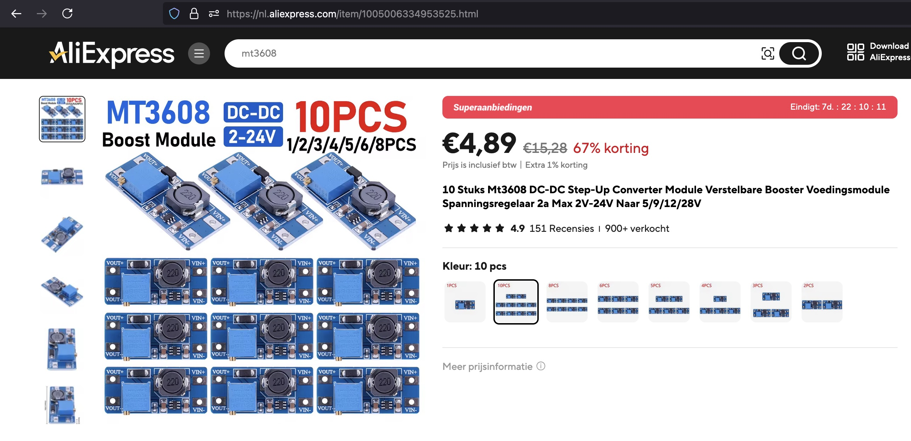

## DC-DC Step-Up Converter (MT3608)


## Description


## specs

## Order
<a href="https://nl.aliexpress.com/item/1005006334953525.html">https://nl.aliexpress.com/item/1005006334953525.htm</a>



## Wiring to Raspberry Pi Pico


## Installation libraries
Copy next files to the Raspberry Pi Pico

```bash

```

## Example code
```python


```


