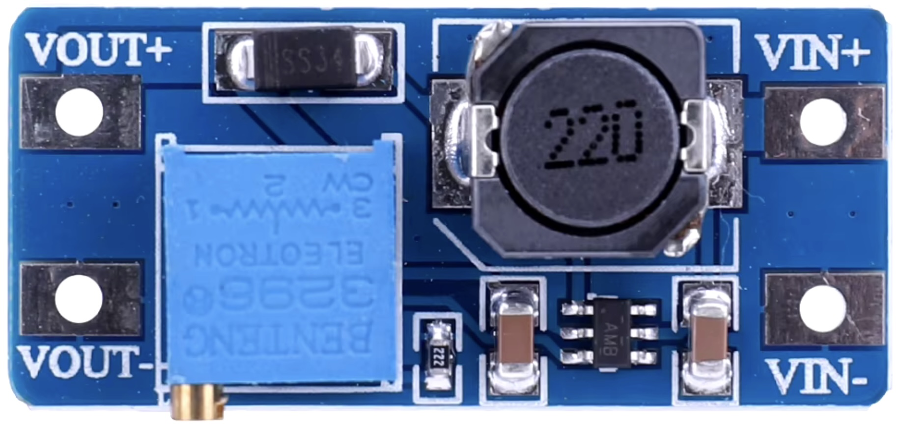

## DC-DC Step-Up Converter (MT3608)




## Description
The MT3608 is a compact, high-efficiency step-up (boost) DC-DC converter that can raise a lower input voltage to a higher output voltage. It is widely used in battery-powered devices and embedded systems where it is necessary to step up a low voltage (e.g., from a single-cell lithium battery) to a higher voltage for operating circuits like sensors, microcontrollers, or other peripherals.

Key Features

	•	Input Voltage: 2V to 24V
	•	Output Voltage: Up to 28V (typically adjustable)
	•	Output Current: Up to 2A (depending on the input/output voltage difference and thermal management)
	•	Efficiency: Up to 93%, making it highly efficient for portable devices
	•	Switching Frequency: 1.2 MHz, which helps reduce the size of external components like inductors and capacitors
	•	Low Quiescent Current: Less than 1mA, which is important for power-saving applications
	•	Shutdown Current: Below 1µA, helping to conserve battery power when the converter is disabled
	•	Internal Switch: Contains a built-in power MOSFET (N-channel) for stepping up the voltage.

Pin Description

	1.	VIN: Input voltage pin (2V to 24V).
	2.	GND: Ground pin.
	3.	SW (Switch): This is the switching pin, connected to an external inductor and freewheeling diode.
	4.	FB (Feedback): This pin connects to the resistive voltage divider, which sets the output voltage. The converter adjusts its output to maintain 1.23V on this pin.
	5.	EN (Enable): This pin is used to enable or disable the converter. If this pin is high, the converter is active; if low, the converter is disabled (shutdown mode).

Working Principle

The MT3608 works on the principle of pulse-width modulation (PWM). It steps up a lower DC voltage to a higher DC voltage by storing energy in an inductor and transferring it to the output through a series of switching operations. Here’s how the boost converter operates:

	1.	Switch ON: When the internal MOSFET switch turns on, current flows from the input through the inductor, storing energy in its magnetic field.
	2.	Switch OFF: When the switch turns off, the energy stored in the inductor is released and transferred to the load through the diode, causing the output voltage to increase.

This continuous switching and energy transfer process step up the input voltage to the desired higher output voltage. The output voltage is regulated by adjusting the duty cycle of the PWM signal based on the feedback from the FB (Feedback) pin.

External Components (Typical Application Circuit)

	1.	Inductor (L): Connected between the input voltage and the SW pin. Typical value: 10 µH to 22 µH.
	2.	Diode (D1): A Schottky diode is typically used for its fast switching and low forward voltage drop.
	3.	Capacitors (CIN, COUT): Ceramic capacitors are commonly used to filter the input and output voltages (typical values: 10 µF to 22 µF).
	4.	Resistors (R1, R2): A resistive voltage divider is connected between the output voltage and the FB pin to set the output voltage. The values of these resistors determine the output voltage.

Output Voltage Calculation

The output voltage  is set by a voltage divider formed by two resistors (R1 and R2) connected to the FB pin. The output voltage is calculated as:



Where:

	•	1.23V is the reference voltage at the FB pin.
	•	R1 and R2 are the resistors in the voltage divider.

Efficiency Considerations

	•	High Efficiency: The MT3608 achieves up to 93% efficiency, which means minimal power loss and lower heat generation, making it suitable for battery-powered applications.
	•	Component Selection: The efficiency is influenced by the selection of external components like the inductor and diode. An inductor with low DC resistance (DCR) and a fast-recovery Schottky diode are typically recommended to optimize efficiency.
	•	Input and Output Voltages: Efficiency varies with the input and output voltage differential. The closer the input voltage is to the output voltage, the higher the efficiency.

Operating Conditions

	•	Load Current: The MT3608 can supply up to 2A of current depending on the input voltage and output voltage. However, output current decreases as the input-output voltage difference increases.
	•	Input Voltage: The input voltage should be in the range of 2V to 24V. The MT3608 will not function if the input voltage is below 2V.

Protections

	•	Overcurrent Protection: The internal MOSFET switch is protected against overcurrent by automatically limiting the maximum output current to avoid damage to the converter or external components.
	•	Thermal Shutdown: The MT3608 includes thermal protection, which disables the converter if the junction temperature exceeds a safe threshold, preventing thermal damage.
	•	Short Circuit Protection: Protects the chip and load in case of an accidental short circuit.

Applications

	•	Battery-Powered Devices: Convert low battery voltages (e.g., from single-cell lithium-ion batteries) to higher voltages for powering microcontrollers or sensors.
	•	Portable Electronics: Power portable gadgets that require a higher operating voltage than the input voltage provided by a battery.
	•	USB Power Supplies: Boost voltage to 5V from lower sources (like 3.7V lithium batteries) for USB-powered devices.
	•	Solar Power Systems: Step up the low voltage from solar panels to a usable level for charging or powering electronic devices.
	•	LED Drivers: Provide a stable voltage to power high-brightness LEDs from low-voltage sources.
	•	Powering Sensors and Peripherals: For projects where sensors or other components require a higher voltage than the microcontroller’s supply voltage.

Advantages

	•	Compact and Efficient: The MT3608 offers a compact solution for stepping up voltage, with high efficiency and minimal external components.
	•	Adjustable Output: The output voltage is adjustable, making it versatile for different applications.
	•	Low Quiescent Current: Its low standby current makes it ideal for low-power applications where conserving battery life is essential.
	•	High Switching Frequency: Its high switching frequency allows the use of small external components, saving board space in portable designs.

Limitations

	•	Output Current Limitation: While capable of 2A output current in some conditions, the current capability reduces as the difference between input and output voltage increases. A significant voltage boost might result in lower output current capacity.
	•	Heat Generation: At high loads or high voltage boosts, the MT3608 can generate heat. Proper thermal management, such as adequate heat dissipation, may be needed in such scenarios.

Typical Application Circuit

Here is a simplified connection diagram of the MT3608:

	•	VIN → 2V to 24V (connected to input power source)
	•	GND → Ground
	•	SW → Connected to the inductor (10µH to 22µH)
	•	VOUT → Output voltage (0V to 28V, depending on configuration)
	•	FB → Connected to a voltage divider (R1, R2) to set the output voltage

Example Use Case

Suppose you want to boost a 3.7V lithium-ion battery to 5V to power a microcontroller or charge a smartphone via a USB port. The MT3608 can step up the voltage to 5V while maintaining high efficiency, conserving battery power, and providing sufficient current for the connected device.

Conclusion

The MT3608 is a highly efficient and compact step-up converter designed for a wide variety of applications that require boosting a lower voltage to a higher one. Its adjustable output voltage, high efficiency, and ability to deliver up to 2A of current make it ideal for powering portable electronics, battery-powered systems, and projects requiring efficient DC-DC conversion. With proper design and component selection, it can provide a reliable solution for stepping up voltage in constrained spaces or battery-operated devices.

## Order
<a href="https://nl.aliexpress.com/item/1005006334953525.html">https://nl.aliexpress.com/item/1005006334953525.htm</a>


## Wiring to Raspberry Pi Pico


## Installation libraries
Copy next files to the Raspberry Pi Pico

```bash

```

## Example code
```python


```


