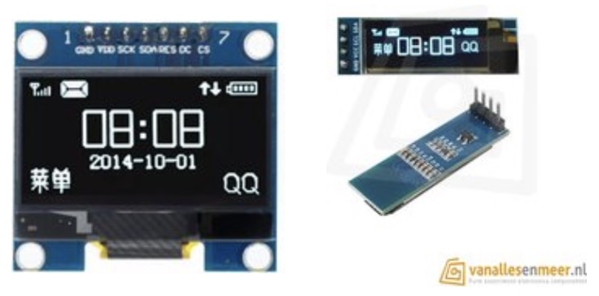
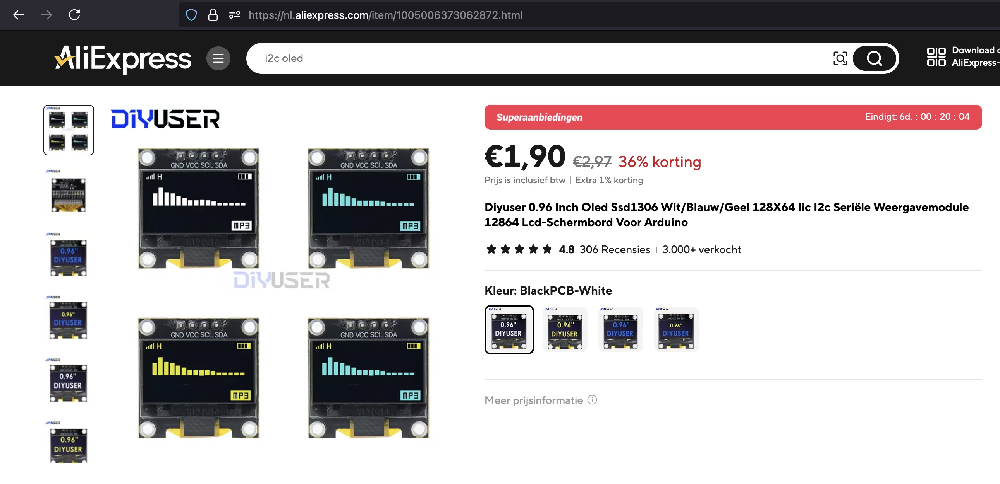

## Display Oled (SSD1306)




## Description

## Order
<a href="https://nl.aliexpress.com/item/1005006373062872.html">https://nl.aliexpress.com/item/1005006373062872.htm</a>



## Wiring to Raspberry Pi Pico


## Installation libraries
Copy next files to the Raspberry Pi Pico

```bash

```

## Example code
```python


```


