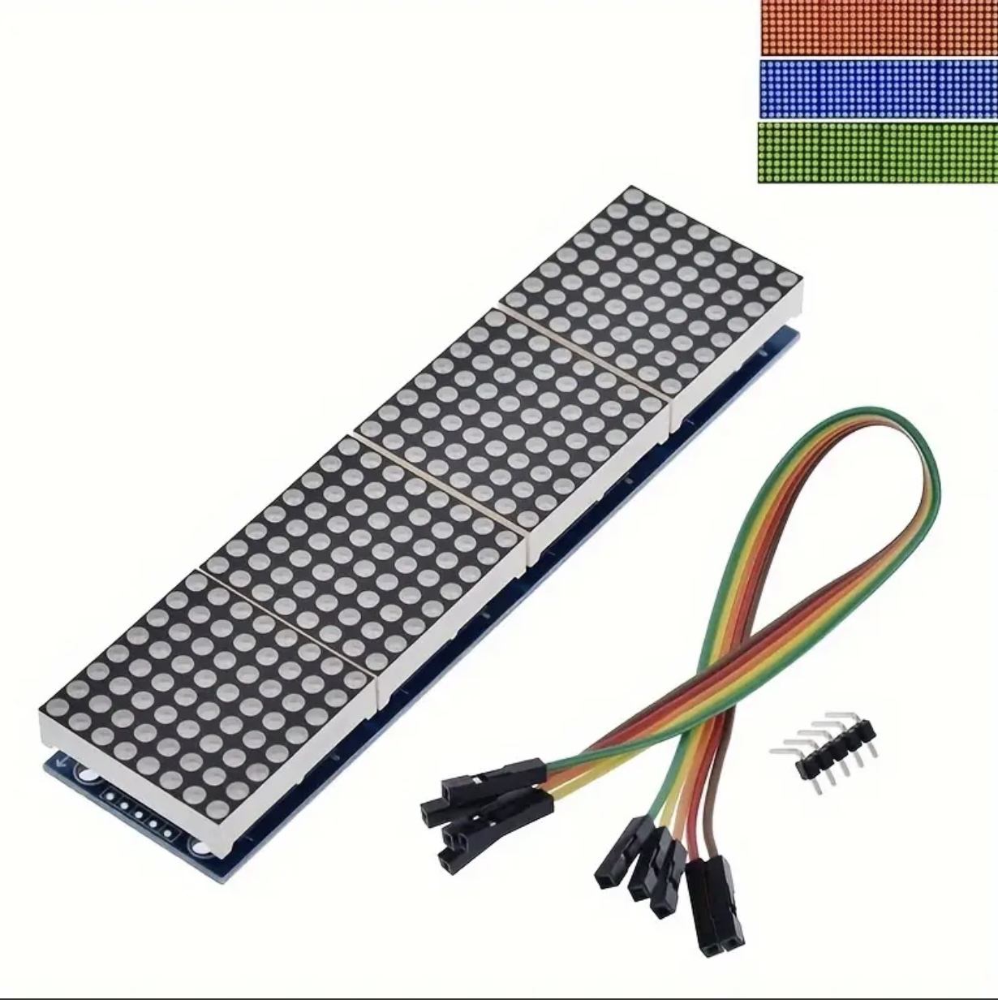

## Display Matrix (Max7219)



## Where stored
Cupboard __1__ Drawer __2__  position __A3__

## Description
The 8x8 Dot Matrix with MAX7219 is a compact LED display module featuring a grid of 64 LEDs arranged in 8 rows and 8 columns. It's widely used for displaying text, numbers, and simple graphics in microcontroller projects. When equipped with the MAX7219 driver, the module can be controlled with only 3 data pins (DIN, CS, and CLK) along with power (VCC and GND), significantly reducing the number of GPIO pins needed. This makes it ideal for use with microcontrollers like the Raspberry Pi Pico, Arduino, and ESP32, especially in projects that require multiple displays or limited I/O pins. The MAX7219 driver handles the multiplexing of the LEDs and supports chaining multiple modules to create larger displays.

Key Components:

	•	8x8 Dot Matrix display solderd onto a adapterboard. 
	•	Raspberry Pi Pico.
	•	Breadboard Jumper Wires.
	•	USB A to Micro USB wire.
	•	USB A to Micro USB wire.
 
Pinouts (via I2C module):

	•	VCC(Voltage Common Collector)	: Connect the VCC pin to the 3V3 pin.
	•	GND(Ground)			: Connect the GND pin to the Ground pin (any of them will work).
	•	DIN(Data in)			: Connect the Din pin to the GP3 pin.
 	•	CS(Chip Select)			: Connect the CS pin to the GP5 pin.
	•	CLK(Clock)			: Connect the CLK pin to the GP2 pin.

Advantages:

	1.	Fewer Pins: Reduces the number of GPIO pins needed (from 8 to 4).
	2.	Simplified Wiring: The I2C bus allows multiple devices to be connected in parallel, making it more flexible in large projects.
	3.	Contrast Control: The potentiometer on the I2C board allows for easy adjustment of the display’s contrast.
	4.	Backlight Control: Some I2C modules also provide pins or code functionality to control the backlight.

Typical Use Cases:

	•	Displaying sensor data.
	•	Providing user interfaces for embedded systems.
	•	Showing system status, error messages, or simple menus.

This setup is ideal for hobbyists and developers working with microcontroller platforms, as it simplifies both wiring and code.

## specs

## Order
<a href="https://nl.aliexpress.com/item/1005006140674321.html">https://nl.aliexpress.com/item/1005006140674321.html</a>


## Wiring to Raspberry Pi Pico


## Installation libraries
Copy next files to the Raspberry Pi Pico

```bash
Max7219.py
```

## Example code
import sys
if sys.platform != 'rp2': # raspian pico
    print(40 * "-")
    print(">>>>>> Demo for Respberry Pi Pico <<<<<<")
    print(40 * "-")
    quit()
    
"""
    about   : Max7219Matrix is IDisplay inherrited class for displaying
              on a max 7219 matrix connected to a pico
    Version : 1.0.0
    Date    : 10 April 2024
    
    MAX7219 driver: https://github.com/mcauser/micropython-max7219
    Note: this driver is designed for 4-in-1 MAX7219 modules.
"""

from machine import Pin, SPI
from utime import sleep
from Max7219 import Matrix8x8

PIXELS_MODULE_WIDTH: int = 8
PIXELS_MODULE_HEIGHT:int = 8
PIXELS_HEIGHT = PIXELS_MODULE_WIDTH
PSI_CHANNEL = 0
SCROLL_DELAY = 50  # MAX7219 display scrolling speed (ms)
SLEEP_ANIMATION = .5
PIXEL_ON = 1
PIXEL_OFF = 0

_pin_sck = 2
_pin_mosi = 3
_pin_cs = 5
_brightness = 4
number_of_modules_x = 4
number_of_modules_y = 1
_width  = number_of_modules_x * PIXELS_MODULE_WIDTH
_height = number_of_modules_y * PIXELS_MODULE_HEIGHT

spi = SPI(PSI_CHANNEL, sck=Pin(_pin_sck), mosi=Pin(_pin_mosi))
cs = Pin(_pin_cs, Pin.OUT)
display = Matrix8x8(spi, cs, number_of_modules_x * number_of_modules_y)
display.brightness(_brightness)

display.text("hoi", 2, 1)
display.show()
