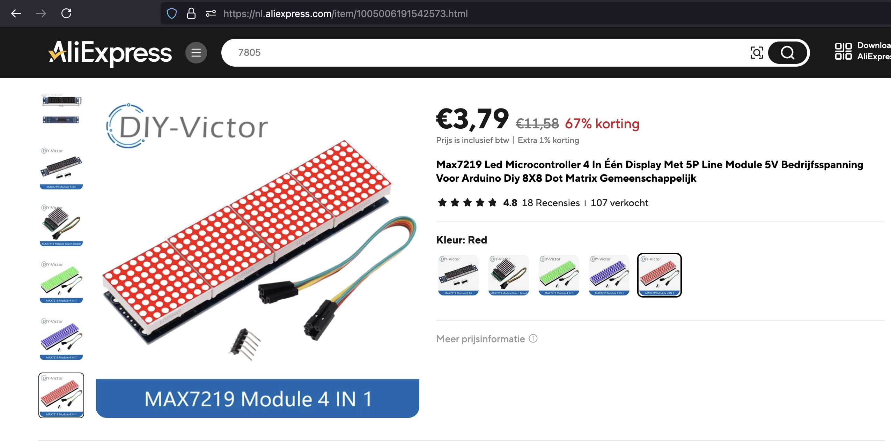
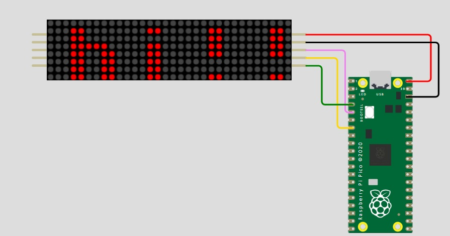

## Display Matrix (Max7219)


## Where stored
Cupboard __1__ Drawer __2__  position __A3__

## Description
The 8x8 Dot Matrix with MAX7219 is a compact LED display module featuring a grid of 64 LEDs arranged in 8 rows and 8 columns. It's widely used for displaying text, numbers, and simple graphics in microcontroller projects. When equipped with the MAX7219 driver, the module can be controlled with only 3 data pins (DIN, CS, and CLK) along with power (VCC and GND), significantly reducing the number of GPIO pins needed. This makes it ideal for use with microcontrollers like the Raspberry Pi Pico, Arduino, and ESP32, especially in projects that require multiple displays or limited I/O pins. The MAX7219 driver handles the multiplexing of the LEDs and supports chaining multiple modules to create larger displays.

Key Components:

	•	8x8 Dot Matrix display solderd onto a adapterboard. 
	•	Raspberry Pi Pico.
	•	Breadboard Jumper Wires.
	•	USB A to Micro USB wire.
	•	USB A to Micro USB wire.
 
Pinouts (via I2C module):

	•	VCC(Voltage Common Collector)	: Connect the VCC pin to the VBUS pin.
	•	GND(Ground)			: Connect the GND pin to the Ground pin (any of them will work).
	•	DIN(Data in)			: Connect the Din pin to the GP3 pin.
 	•	CS(Chip Select)			: Connect the CS pin to the GP5 pin.
	•	CLK(Clock)			: Connect the CLK pin to the GP2 pin.

Advantages:

	•	Fewer Pins: Reduces the number of GPIO pins needed (from 8 to 4).
	•	Simplified Wiring: The I2C bus allows multiple devices to be connected in parallel, making it more flexible in large projects.
	•	Contrast Control: The potentiometer on the I2C board allows for easy adjustment of the display’s contrast.
	•	Ease of use: Fewer pins and minimal code needed to change makes for an easier experience
 	•	High brightness: You can controll the brightness yourself 
	•	Low powerconsumption: Plugging it into your laptop is enough to power it.
 
Typical Use Cases:

	•	Clocks
	•	Scoreboars
	•	Calculators
 	•	Bus stop annunciators
   	•	Stock market and financial tickers

This setup is ideal for hobbyists and developers working with microcontroller platforms, as it simplifies both wiring and code.

## Order
<a href="https://nl.aliexpress.com/item/1005006140674321.html">https://nl.aliexpress.com/item/1005006191542573.html?</a>



## Wiring to Raspberry Pi Pico


## Installation libraries
Copy next files to the Raspberry Pi Pico

```bash
Max7219.py
```

## Example code
```python
from machine import Pin, SPI
from Max7219 import Matrix8x8

PSI_CHANNEL = 0 # Sets SPI channel to 0
PIN_SCK = 2     # shows to which pin it needs to be connected on the Raspberry pi pico
PIN_MOSI = 3    # shows to which pin it needs to be connected on the Raspberry pi pico
PIN_CS = 5      # shows to which pin it needs to be connected on the Raspberry pi pico

BRIGHTNESS = 4  		 # Select the brightness of the screen(ranges from 0-15)
number_of_modules_x = 4  # The number of Screens connected in the X access(width)
number_of_modules_y = 1  # The number of screens conencted in the Y access(height)

spi = SPI(PSI_CHANNEL, sck=Pin(PIN_SCK), mosi=Pin(PIN_MOSI))
cs = Pin(PIN_CS, Pin.OUT)

display = Matrix8x8(spi, cs, number_of_modules_x * number_of_modules_y)
display.brightness(BRIGHTNESS)

display.text("hi!!", 2, 1)  # Enter the text you wish to display
display.show()  			# This actualy shows the text on the display

```
