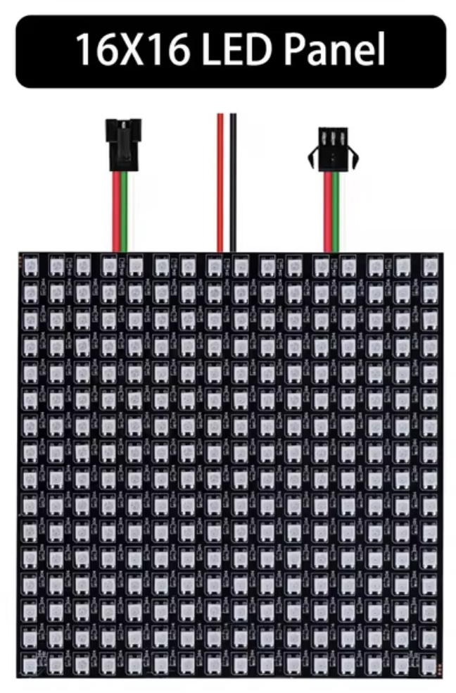

## Display Neopixel (WS2812)




## Description
The WS2812 is an individually addressable RGB LED that integrates both an LED and a control IC in a single package. It is widely used in projects and products requiring colorful and dynamic lighting effects. Each LED can be controlled independently, allowing for vibrant animations and color combinations. WS2812 LEDs are commonly used in LED strips, displays, and matrices.

Key Features

	•	RGB LEDs: Each unit contains a Red, Green, and Blue LED that can combine to produce millions of colors.
	•	Individually Addressable: Each LED can be controlled independently in terms of color and brightness.
	•	Built-in Controller IC: The WS2812 has an integrated controller chip within each LED package, eliminating the need for complex external circuits.
	•	8-bit Color Depth: Each LED’s Red, Green, and Blue channels can be controlled with 8-bit resolution (256 levels per channel), resulting in 24-bit color (16.8 million colors).
	•	Daisy-Chainable: Multiple LEDs can be connected in series, with data passing from one LED to the next, making it easy to control a large number of LEDs with just a single data line.
	•	Single-wire Communication Protocol: The data is transmitted over a single data line, reducing the number of required pins on the microcontroller.
	•	High Refresh Rate: Capable of high refresh rates, making it suitable for animated effects and smooth color transitions.
	•	5V Operation: Typically operates from a 5V supply, though some variants can tolerate a broader range.

Electrical Characteristics

	•	Operating Voltage: 4V to 7V (nominal 5V).
	•	Current Consumption: Each LED can consume up to 60 mA at full brightness (all RGB channels on at maximum), so a strip of 10 LEDs would consume about 600 mA at full brightness.
	•	Data Transfer Rate: Typically operates at a frequency of 800 kHz.
	•	Power Dissipation: Maximum of around 1.44W per LED at full brightness (60mA * 5V).

Pin Description

	1.	VDD (5V): Power supply pin (connects to a 5V power source).
	2.	GND: Ground pin.
	3.	DIN (Data In): Data input pin. Receives serial data from the microcontroller or the previous LED in the chain.
	4.	DOUT (Data Out): Data output pin. Sends data to the next LED in the chain.

Communication Protocol

The WS2812 uses a proprietary single-wire communication protocol, making it easy to control many LEDs with just one data line. The data is transmitted in a series of 24-bit packets (8 bits each for Red, Green, and Blue). The timing of the data pulses is critical for proper communication.

Data Format

	•	Each WS2812 LED requires 24 bits of data (8 bits for each color channel in the order of Green, Red, and Blue).
	•	The data structure is:
	•	8 bits for Green: (0-255) value for Green intensity.
	•	8 bits for Red: (0-255) value for Red intensity.
	•	8 bits for Blue: (0-255) value for Blue intensity.

Bit Timing

The WS2812 interprets the length of the high and low pulses to differentiate between a logic “0” and “1”:

	•	Logic 0: 0.4 µs high, 0.85 µs low
	•	Logic 1: 0.8 µs high, 0.45 µs low
	•	The complete bit transmission takes 1.25 µs.

Data Cascade

	•	Each WS2812 LED reads the first 24 bits of data from the data input pin, then shifts the remaining bits to its output pin. This allows the data to “cascade” through multiple LEDs, with each one taking its turn to read its data.
	•	The data cascade allows you to control an entire strip of LEDs with a single data pin from the microcontroller.

Timing Diagram

The timing for the WS2812 protocol is critical, and strict adherence to the timing requirements is necessary for proper operation. Below is a rough description of the waveform:

	1.	Reset Pulse: After sending all the data, a reset pulse (low signal) longer than 50 µs is required to signal the end of data transmission.
	2.	Bit Transmission: Each bit is transmitted using a high-time and low-time signal. The duration of these signals determines whether the bit is a “1” or “0”.
	3.	Color Update: After receiving the data, each LED updates its color instantly.

Cascading Multiple WS2812 LEDs

Multiple WS2812 LEDs can be connected in series, with the DOUT of one LED connected to the DIN of the next. The controller (e.g., Arduino, Raspberry Pi, or other microcontrollers) only needs to control the first LED in the chain, and the data is passed down the line. The number of LEDs is only limited by power supply capacity and available memory in the microcontroller.

Power Considerations

When using long strips of WS2812 LEDs, power management becomes important:

	•	Each LED draws up to 60mA at full brightness, so the total current required for a long strip can be substantial. For example, 100 LEDs at full brightness could draw up to 6A.
	•	Power Injection: For long strips, power should be injected at multiple points to avoid voltage drop, which can cause the LEDs at the end of the strip to appear dimmer or behave erratically.

Popular Variants

	•	WS2812B: A more common, improved version of the original WS2812. The primary difference is in the internal design for better performance and slightly different pin arrangements, but the functionality remains the same.
	•	WS2811: A separate variant where the control IC is separate from the LEDs. It often controls multiple LEDs at once (e.g., three LEDs per IC).
	•	SK6812: Another variant with similar functionality but offers RGBW (with an additional White channel) for higher brightness and more color options.

Applications

	•	LED Strips and Matrices: Used in decorative lighting, architectural lighting, and pixel displays.
	•	Wearable Electronics: Integrated into clothing, costumes, and other wearables for colorful lighting effects.
	•	Digital Signage and Displays: Create dynamic advertisements or signs.
	•	Art Installations: Used for creating interactive and dynamic lighting in art and visual installations.
	•	Custom Lighting Solutions: Can be used to build custom mood lighting, ambilight systems, or ambient room lighting.
	•	Gaming Setups: RGB lighting for gaming peripherals, PC cases, and desk setups.

Advantages

	•	Individually Addressable: Each LED can be controlled independently, providing incredible flexibility in design and effects.
	•	Easy to Control: Only requires a single data line, reducing the complexity of wiring and control.
	•	Compact and Self-Contained: The integrated controller allows each LED to manage its own timing and state, without the need for external drivers.
	•	Cost-Effective: The WS2812 and its variants are relatively inexpensive, making them popular in hobbyist and commercial projects.

Limitations

	•	Timing-Sensitive Protocol: The data protocol is timing-critical, and deviations from the required timing can cause communication errors. Fast microcontrollers with precise timing (e.g., Arduino or ESP8266/ESP32) are generally required.
	•	Power Consumption: Power requirements can be substantial when using a large number of LEDs at full brightness.
	•	Heat Dissipation: High brightness and large numbers of LEDs can generate significant heat, which must be managed in larger installations.

Controlling WS2812 with a Microcontroller (Example with Arduino)

The WS2812 can be easily controlled using libraries such as Adafruit NeoPixel or FastLED for Arduino. Here is a simple example using the Adafruit NeoPixel library:

```C
#include <Adafruit_NeoPixel.h>

#define PIN 6  // Pin connected to the data line of WS2812
#define NUM_LEDS 16  // Number of LEDs in the strip

Adafruit_NeoPixel strip = Adafruit_NeoPixel(NUM_LEDS, PIN, NEO_GRB + NEO_KHZ800);

void setup() {
  strip.begin();  // Initialize the strip
  strip.show();   // Initialize all pixels to 'off'
}

void loop() {
  strip.setPixelColor(0, strip.Color(255, 0, 0));  // Set the first pixel to red
  strip.show();  // Update the strip with new data
  delay(500);    // Wait for 500ms

  strip.setPixelColor(0, strip.Color(0, 255, 0));  // Set the first pixel to green
  strip.show();  // Update the strip with new data
  delay(500);    // Wait for 500ms

  strip.setPixelColor(0, strip.Color(0, 0, 255));  // Set the first pixel to blue
  strip.show();  // Update the strip with new data
  delay(500);    // Wait for 500ms
}
```
Conclusion

The WS2812 is a versatile, high-performance RGB LED that offers individually addressable control via a simple serial data protocol. Its ability to produce millions of colors, ease of use, and compact form factor make it highly popular in a wide variety of lighting and display applications. While it requires careful timing for communication,
## Order
<a href="https://nl.aliexpress.com/item/1005006160604822.html">https://nl.aliexpress.com/item/1005006160604822.htm</a>


## Wiring to Raspberry Pi Pico


## Installation libraries
Copy next files to the Raspberry Pi Pico

```bash

```

## Example code
```python


```


