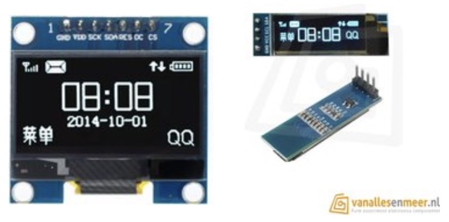
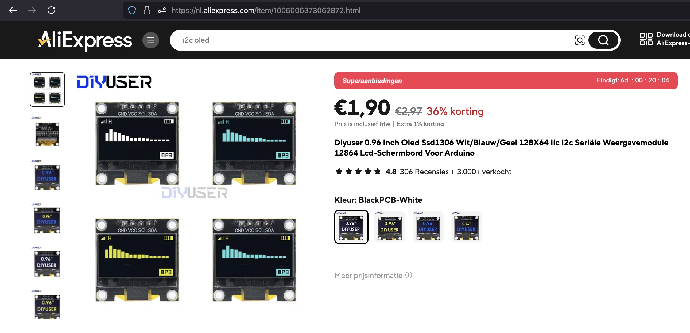

## Display Oled (SSD1306)




## Description
The SSD1306 is a widely used OLED display driver that supports small, low-power displays, typically monochrome OLED panels with resolutions of 128x64 or 128x32 pixels. It is popular in embedded systems, wearables, and DIY electronics projects due to its simplicity, low power consumption, and clear display capabilities.

Key Features

	•	Display Technology: Supports OLED (Organic Light-Emitting Diode) displays.
	•	Monochrome Display: Displays in single color (typically white, blue, or yellow), with each pixel either on or off.
	•	Resolution: Commonly used with displays that have resolutions of:
	•	128x64 pixels (most common).
	•	128x32 pixels (smaller variants).
	•	Communication Interfaces: Supports multiple communication protocols:
	•	I²C (Inter-Integrated Circuit): A simple two-wire interface, often used for short-range communication with microcontrollers like Arduino, Raspberry Pi, and ESP8266/ESP32.
	•	SPI (Serial Peripheral Interface): A faster, four-wire interface, useful when speed is critical.
	•	Parallel Interface (optional): Some variants support an 8-bit parallel communication mode.
	•	Low Power Consumption: The OLED technology allows the SSD1306 to use less power compared to LCDs since the pixels emit their own light.
	•	Memory Inside the Controller: The display data is stored inside the SSD1306 chip, which reduces the need for continuous data transmission from the microcontroller.
	•	Built-in Display RAM: The controller has 1KB of GDDRAM (Graphic Display Data RAM) that directly corresponds to the pixels on the display.
	•	For a 128x64 display, each pixel corresponds to a bit in the GDDRAM, with 1 byte representing 8 vertical pixels.
	•	On-chip Display Functions: The SSD1306 can perform several functions, including horizontal and vertical scrolling, contrast control, inversion, and display dimming.
	•	Flexible Power Supply: Can operate with a 3.3V or 5V logic power supply, making it compatible with a variety of microcontrollers.

Electrical Characteristics

	•	Supply Voltage (VDD): 1.65V to 3.3V for the logic part.
	•	Supply Voltage (VCC): 7V to 15V for the display power.
	•	Power Consumption: Varies depending on the display size and how many pixels are lit, but typically very low due to the efficient OLED technology.

Pin Description (Common Configuration)

	1.	VCC: Power supply for the OLED display panel (7V to 15V).
	2.	GND: Ground pin.
	3.	D0 (SCK/CLK): Clock pin for SPI communication.
	4.	D1 (MOSI/SDA): Data pin for SPI or I²C communication.
	5.	RES (Reset): Resets the display; a low signal triggers the reset.
	6.	DC (Data/Command): Selects between data and command mode (used in SPI mode).
	7.	CS (Chip Select): Used in SPI mode to select the display chip.
	8.	SDA (I²C Data): Data pin for I²C communication.
	9.	SCL (I²C Clock): Clock pin for I²C communication.

Display Memory Structure

	•	The SSD1306 has a 1KB GDDRAM that acts as the framebuffer. The content of the GDDRAM is what gets displayed on the OLED.
	•	For a 128x64 display, each pixel is represented by a single bit, so there are 8192 bits (128x64 = 8192 pixels) in total, which fit within the 1KB of GDDRAM.

Communication Protocols

1. I²C Mode

	•	The SSD1306 communicates over a 2-wire I²C interface. The microcontroller communicates with the display using an address (commonly 0x3C or 0x3D) and sends commands/data.
	•	Wiring:
	•	SCL: Serial clock.
	•	SDA: Serial data.
	•	RES: Reset pin for the display.
	•	Pros: Simple, requires only two data pins, and uses low resources.
	•	Cons: Slower than SPI for large data transfers.

2. SPI Mode

	•	Uses 4 or 5 wires to communicate, and is much faster than I²C due to the higher clock rate.
	•	Wiring:
	•	SCK: Serial clock.
	•	MOSI: Serial data input.
	•	DC: Data/Command control.
	•	CS: Chip select.
	•	RES: Reset.
	•	Pros: Faster communication speed, better for applications that require frequent updates.
	•	Cons: Requires more pins than I²C.

Command Set

The SSD1306 provides a set of commands for configuring and controlling the display. Some of the most commonly used commands include:

	•	Display ON/OFF: Turns the display on or off.
	•	Set Contrast: Adjusts the brightness of the display.
	•	Entire Display ON: Forces all pixels to be on.
	•	Set Column and Row Addresses: Defines the section of the screen to update.
	•	Invert Display: Inverts the colors on the display (black to white, white to black).
	•	Scroll Commands: Allows horizontal, vertical, and diagonal scrolling of the content on the display.

Initialization Sequence

Before using the SSD1306, an initialization sequence must be sent via I²C or SPI to configure the display. Here’s an example initialization sequence for a 128x64 OLED display:

sendCommand(0xAE);  // Display OFF
sendCommand(0x20);  // Set Memory Addressing Mode
sendCommand(0x10);  // Horizontal addressing mode
sendCommand(0xB0);  // Set Page Start Address for Page Addressing Mode
sendCommand(0xC8);  // Set COM Output Scan Direction
sendCommand(0x00);  // Set low column address
sendCommand(0x10);  // Set high column address
sendCommand(0x40);  // Set start line address
sendCommand(0x81);  // Set contrast control register
sendCommand(0xFF);  // Set contrast to maximum (0xFF)
sendCommand(0xA1);  // Set segment re-map 0 to 127
sendCommand(0xA6);  // Set normal display (not inverted)
sendCommand(0xA8);  // Set multiplex ratio (1 to 64)
sendCommand(0x3F);  // 1/64 duty
sendCommand(0xD3);  // Set display offset
sendCommand(0x00);  // No offset
sendCommand(0xD5);  // Set display clock divide ratio/oscillator frequency
sendCommand(0xF0);  // Set divide ratio
sendCommand(0xD9);  // Set pre-charge period
sendCommand(0x22);  // Set pre-charge to 22 clocks
sendCommand(0xDA);  // Set com pins hardware configuration
sendCommand(0x12);
sendCommand(0xDB);  // Set VCOMH
sendCommand(0x20);  // Set VCOMH deselect level
sendCommand(0x8D);  // Charge Pump setting
sendCommand(0x14);  // Enable charge pump
sendCommand(0xAF);  // Display ON

This command sequence powers on the display and prepares it to receive pixel data.

Advantages of SSD1306 OLED Displays

	•	High Contrast: OLED displays have high contrast ratios because the pixels emit their own light, making them bright and sharp compared to LCDs.
	•	Wide Viewing Angles: OLED displays offer nearly 180° viewing angles without loss of quality.
	•	Low Power Consumption: OLEDs consume less power than backlit displays, especially when showing darker content.
	•	Compact Size: Available in small form factors, ideal for wearable devices, handheld projects, or compact electronic gadgets.

Common Applications

	•	Wearable Devices: Displays in smartwatches or fitness trackers.
	•	Embedded Systems: Used in DIY electronics and hobbyist projects (Arduino, Raspberry Pi).
	•	IoT Devices: Display for small Internet-of-Things gadgets.
	•	Portable Electronics: Display for handheld devices, multimeters, or sensor readouts.
	•	User Interfaces: Text or graphical displays for control panels, dashboards, or data loggers.
	•	Clocks and Timers: Used in custom clock projects to display time and other information.
	•	Portable Test Equipment: Used in devices like oscilloscopes or voltmeters.

SSD1306 Libraries and Support

The SSD1306 is supported by a wide range of software libraries for various platforms:

	•	Adafruit SSD1306 Library: Widely used in the Arduino community. Supports both I²C and SPI modes.
	•	U8g2 Library: A universal 8-bit graphics library that supports SSD1306 and many other displays.
	•	MicroPython/ESP8266/ESP32: Libraries are available for MicroPython and other embedded platforms for easy interfacing.

Conclusion

The SSD1306 OLED driver is a compact, power-efficient solution for controlling small OLED displays. With features like high contrast,

## Order
<a href="https://nl.aliexpress.com/item/1005006373062872.html">https://nl.aliexpress.com/item/1005006373062872.htm</a>



## Wiring to Raspberry Pi Pico


## Installation libraries
Copy next files to the Raspberry Pi Pico

```bash

```

## Example code
```python


```


