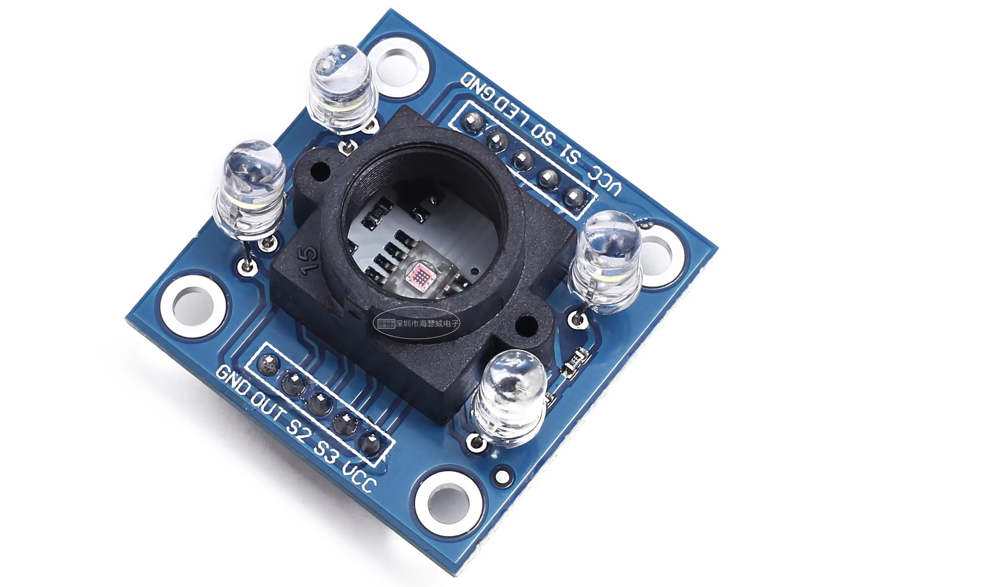
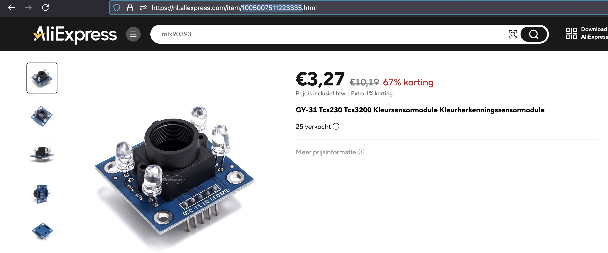

## ColorSensor (GY-31 TCS230 TCS3200 )



## Description
The GY-31 is a color recognition sensor module based on the TCS3200/TCS230 color sensor. It is commonly used in electronics projects to detect and measure colors. The sensor uses an array of photodiodes to detect different wavelengths of light and provides corresponding frequency outputs, which can be processed to identify colors. The GY-31 is widely used in robotics, sorting machines, and various other applications that require color detection.

Key Features:

	1.	Sensor Model: TCS3200/TCS230
	2.	Power Supply: 3.3V to 5V
	3.	Photodiode Array: 8 x 8 (64) photodiodes
	4.	Output: Square wave frequency proportional to light intensity
	5.	Detection Range: Red, Green, Blue (RGB)
	6.	Control Pins:
	•	S0, S1: Frequency scaling (output control)
	•	S2, S3: Photodiode filter selection for detecting different colors (Red, Green, Blue)
	•	OUT: Output frequency signal
	•	LED: White LED for illuminating the object being sensed
	7.	Communication: Frequency output

Pinout of the GY-31:

	•	VCC: Power supply pin (3.3V or 5V)
	•	GND: Ground pin
	•	S0, S1: Used to set the frequency scaling
	•	S2, S3: Used to select which photodiode filters (red, green, or blue) to use
	•	OUT: Frequency output signal
	•	LED: Controls the onboard LED for lighting up the object

Working Principle:

The TCS3200 sensor on the GY-31 module uses an array of photodiodes to detect red, green, and blue light. The S2 and S3 pins are used to select which color light the sensor should measure. For each color (Red, Green, or Blue), the sensor outputs a square wave with a frequency proportional to the intensity of that color.

You can adjust the sensitivity of the sensor by setting the frequency scaling using the S0 and S1 pins.

Using the GY-31 with MicroPython:

To interface the GY-31 sensor with a microcontroller like the ESP32 or ESP8266 using MicroPython, you need to connect the module to the microcontroller and write a program to read the output frequency corresponding to the color intensity.

Connections:

	•	VCC → 3.3V or 5V
	•	GND → GND
	•	S0, S1, S2, S3 → GPIO pins for controlling frequency scaling and filter selection
	•	OUT → GPIO pin for reading the frequency

Conclusion:

The GY-31 color sensor is a useful tool for color detection projects, and its TCS3200/TCS230 sensor offers frequency-based output that can be easily interfaced with microcontrollers like the ESP32/ESP8266 using MicroPython. By reading the output frequency for each color, you can calculate the RGB values and perform tasks like color sorting or object detection in your project.

## Order
<a href="https://nl.aliexpress.com/item/1005007511223335.html">https://nl.aliexpress.com/item/1005007511223335.html</a>


## Wiring to Raspberry Pi Pico


## Installation libraries
Copy next files to the Raspberry Pi Pico

```bash

```

## Example code

This code is not tested yet on a pico....!!!!
```python
#Here’s a basic code to use the GY-31 sensor with an ESP8266 or ESP32 using MicroPython. This example uses PWM (pulse width #modulation) to read the frequency output from the sensor.

from machine import Pin, time_pulse_us
import time

# Define pins
S0 = Pin(14, Pin.OUT)
S1 = Pin(12, Pin.OUT)
S2 = Pin(13, Pin.OUT)
S3 = Pin(15, Pin.OUT)
OUT = Pin(16, Pin.IN)

# Frequency scaling setup
S0.value(1)  # S0 HIGH
S1.value(0)  # S1 LOW -> 20% scaling

def read_color():
    # Measure Red
    S2.value(0)
    S3.value(0)
    time.sleep(0.1)
    red_time = time_pulse_us(OUT, 1)
    
    # Measure Green
    S2.value(1)
    S3.value(1)
    time.sleep(0.1)
    green_time = time_pulse_us(OUT, 1)
    
    # Measure Blue
    S2.value(0)
    S3.value(1)
    time.sleep(0.1)
    blue_time = time_pulse_us(OUT, 1)
    
    return red_time, green_time, blue_time

# Main loop
while True:
    red, green, blue = read_color()
    print("Red: ", red)
    print("Green: ", green)
    print("Blue: ", blue)
    time.sleep(1)
```
Explanation:

	•	S0 and S1: Set the frequency scaling to 20%, which reduces the frequency output to a level easier to measure with the microcontroller.
	•	S2 and S3: Select the color to be measured (Red, Green, or Blue).
	•	OUT: The frequency signal is read using time_pulse_us, which measures the pulse width (duration of a high signal).

By reading the pulse width for each color (Red, Green, Blue), you can infer the intensity of each color. Based on these values, you can determine the color of the object in front of the sensor.


## More info
https://github.com/uraich/TCS3200-MicroPython/tree/main
https://randomnerdtutorials.com/arduino-color-sensor-tcs230-tcs3200/


