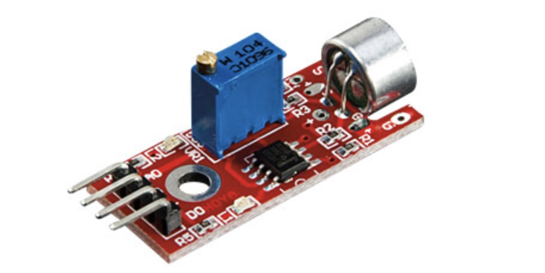

## Sound Sensor (ST1146)



## Where stored
Cupboard __1__ Drawer __2__  position __A3__

## Description
The ST1146 sound sensor is a compact and versatile device designed for detecting sound levels in various applications. It is commonly used in projects involving sound detection, audio processing, and sound-triggered events. The sensor can be integrated into a wide range of products, from simple DIY electronics to sophisticated audio systems.

Key Features

	•	Microphone Sensor: The ST1146 incorporates a microphone to capture sound waves and convert them into electrical signals.
	•	Analog Output: Provides an analog voltage output that correlates with the sound level detected, allowing for easy interfacing with microcontrollers and analog systems.
	•	Sensitivity Adjustment: Many versions of the ST1146 feature adjustable sensitivity settings to optimize sound detection for specific applications and environments.
	•	Compact Design: The small size of the sensor makes it suitable for integration into space-constrained designs and projects.
	•	Low Power Consumption: Designed for low power operation, making it suitable for battery-operated devices and applications.

Specifications

	•	Operating Voltage: Typically operates at a voltage range of 3V to 5V, making it compatible with various microcontrollers.
	•	Output Type: Provides an analog voltage output proportional to the sound intensity.
	•	Frequency Response: Designed to detect a wide range of sound frequencies, often from 20 Hz to 20 kHz, covering the audible range for humans.
	•	Signal-to-Noise Ratio (SNR): Offers a good SNR for clear sound detection in noisy environments.
	•	Response Time: Fast response time for real-time sound detection and processing.

Working Principle

The ST1146 sound sensor works by using a microphone to convert sound waves into electrical signals. Here’s a breakdown of its operation:

	1.	Sound Wave Detection: The microphone picks up sound waves in the environment. When sound waves hit the microphone diaphragm, they cause it to vibrate.
	2.	Signal Conversion: These vibrations are converted into an analog electrical signal that corresponds to the amplitude and frequency of the sound.
	3.	Analog Output: The resulting voltage output is proportional to the sound level detected, allowing the sensor to provide a continuous signal that can be read by a microcontroller or other processing unit.

Applications

The ST1146 sound sensor can be utilized in various applications, including:

	•	Sound-Activated Devices: Used in projects that require sound-activated triggers, such as lights that turn on with claps or other sound events.
	•	Noise Level Monitoring: Implemented in systems that monitor ambient noise levels for environmental assessments or control systems.
	•	Audio Processing Projects: Used in audio applications such as music visualizers or sound level indicators.
	•	Security Systems: Integrated into alarm systems to detect sounds, such as breaking glass or unauthorized entry.
	•	Robotics: Applied in robots to enable sound-based interaction and response capabilities.

Advantages

	•	User-Friendly: Simple to integrate with microcontrollers like Arduino and Raspberry Pi, making it accessible for hobbyists and engineers.
	•	Adjustable Sensitivity: The ability to adjust sensitivity allows for tailored performance in various environments and applications.
	•	Compact Form Factor: Small size makes it ideal for projects with limited space.
	•	Cost-Effective: Generally low-cost compared to other sound detection solutions, making it a practical choice for many applications.

Limitations

	•	Environmental Sensitivity: Performance can be affected by ambient noise, wind, and other environmental factors, potentially leading to false triggers.
	•	Limited Detection Range: While it can detect a wide range of frequencies, the effective detection range may be limited in very noisy environments.
	•	Analog Output: The analog output may require additional signal conditioning or processing for precise applications.

Conclusion

The ST1146 sound sensor is a valuable component for projects and applications requiring sound detection and processing. Its compact design, low power consumption, and adjustable sensitivity make it a versatile choice for hobbyists and professionals alike. Whether used in simple sound-activated devices or more complex audio processing systems, the ST1146 provides reliable sound detection capabilities for various applications.

## Order
<a href="https://nl.aliexpress.com/item/32974849050.html">https://nl.aliexpress.com/item/32974849050.html</a>


## Wiring to Raspberry Pi Pico


## Installation libraries
Copy next files to the Raspberry Pi Pico

```bash

```

## Example code

This code is not tested yet on a pico....!!!!
```python


```

## More info


