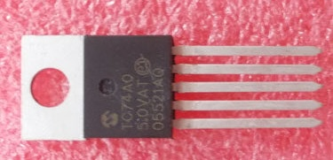

## Temperature (TC74)

## Description
The TC74 is a simple, low-power, digital temperature sensor that provides accurate temperature readings over a wide range of environmental conditions. Manufactured by Microchip Technology, the TC74 is designed to output temperature data in Celsius, and it communicates digitally via the I2C (Inter-Integrated Circuit) protocol, making it easy to interface with various microcontrollers and embedded systems.

Key Features:

	1.	Temperature Measurement:
	•	Range: -40°C to +125°C.
	•	Accuracy: ±2°C (typical) from -40°C to +85°C.
	•	The sensor directly outputs temperature in degrees Celsius as a digital value.
	2.	I2C Communication:
	•	I2C Interface: The sensor communicates via the I2C bus using two pins (SDA for data, SCL for the clock).
	•	It operates as a slave device on the I2C bus, allowing easy communication with a microcontroller or processor.
	•	Multiple TC74 sensors can be connected to the same I2C bus if they are assigned different addresses.
	3.	Low Power Consumption:
	•	The TC74 is designed for low-power operation, making it ideal for battery-powered applications.
	•	It has an active mode and a shutdown mode to reduce power consumption when temperature measurement is not needed continuously.

Pinouts:

The TC74 typically comes in an 8-pin package (SOIC or DIP), with the following key pins:

	•	VCC: Power supply, typically 2.7V to 5.5V.
	•	GND: Ground.
	•	SDA: Serial Data Line for I2C communication.
	•	SCL: Serial Clock Line for I2C communication.
	•	ADDR: Some models have an address pin to set the I2C address (for multiple sensors on the same bus).

Advantages:

	1.	Simple Integration: The TC74’s digital output (in Celsius) means no complex conversion or calibration is required, making it easy to use in projects.
	2.	Accurate Readings: With a typical accuracy of ±2°C, the TC74 is suitable for many general-purpose temperature sensing applications.
	3.	I2C Interface: I2C allows for efficient communication, especially when connecting multiple sensors or when GPIO pin count is limited.
	4.	Compact Size: The sensor is available in small packages, making it ideal for applications with limited space.
	5.	Low Power Modes: The sensor can be put into shutdown mode when not in use, saving power for low-energy systems.

Applications:

	•	Consumer Electronics: Used for temperature monitoring in devices like laptops, smartphones, and other electronics.
	•	HVAC Systems: To measure and control environmental temperature in heating, ventilation, and air conditioning systems.
	•	Embedded Systems: Monitoring temperature in industrial control systems, robotics, and home automation projects.
	•	Battery-Powered Devices: Its low-power consumption makes it a good fit for portable devices where conserving energy is critical.
	•	Environmental Monitoring: Can be used in weather stations or to track ambient temperature in various environments.

Key Characteristics:

	•	Resolution: The TC74 provides an 8-bit digital output, with a resolution of 1°C.
	•	No External Components: The TC74 does not require external calibration or additional components (e.g., resistors, capacitors), simplifying its implementation.
	•	Stable Performance: The sensor is built to provide consistent readings over a long period, even in varying environmental conditions.

Power and Response Time:

	•	Operating Voltage: Typically 2.7V to 5.5V.
	•	Low Power Consumption: Consumes very little power during active operation and even less when in shutdown mode.
	•	Response Time: The sensor has a relatively fast response time for environmental temperature changes, allowing it to quickly detect fluctuations in temperature.

Limitations:

	•	8-bit Resolution: With a resolution of 1°C, the TC74 may not be suitable for applications requiring very fine-grained temperature readings (i.e., below 1°C increments).
	•	Fixed I2C Address on Some Models: Some versions have a fixed I2C address, limiting the number of sensors you can connect to a single bus without using additional hardware.

In summary, the TC74 is a reliable, easy-to-use digital temperature sensor that communicates over I2C. It is ideal for projects requiring simple temperature monitoring, especially where low power consumption and ease of integration are important. It is commonly used in consumer electronics, HVAC systems, and embedded applications.

## specs

## Order
<a href="https://nl.aliexpress.com/item/1005006140674321.html">https://nl.aliexpress.com/item/1005006140674321.html</a>

## Wiring to Raspberry Pi Pico

## installation libraries

No python libraries needed to install

## Connecting for example to Raspberry Pico

