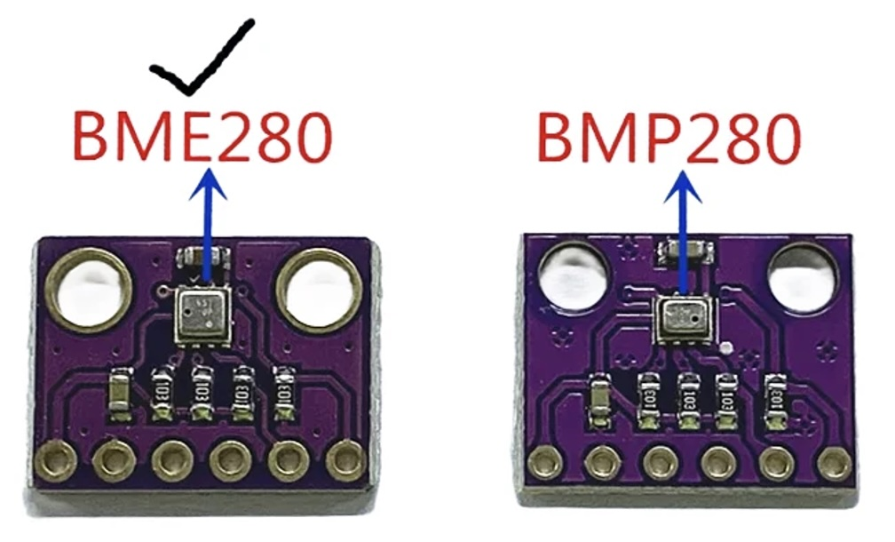

## BME280 - Tempereture Pressure Humidity sensor



## Description
The BME280 is a high-precision environmental sensor capable of measuring temperature, humidity, and barometric pressure. It’s a widely used sensor in environmental monitoring and weather station applications, offering high accuracy and low power consumption. The sensor is designed by Bosch Sensortec and is often used in conjunction with microcontroller platforms like Arduino, ESP32, and Raspberry Pi.

Key Features:

	1.	Temperature Measurement:
	•	Range: -40°C to +85°C.
	•	Accuracy: ±1.0°C typical.
	•	It provides accurate ambient temperature readings, which can be used in HVAC systems, weather stations, or environmental monitoring projects.
	2.	Humidity Measurement:
	•	Range: 0% to 100% relative humidity.
	•	Accuracy: ±3% RH typical.
	•	It’s useful for tracking indoor air quality, humidity control, and weather forecasting.
	3.	Barometric Pressure Measurement:
	•	Range: 300 hPa to 1100 hPa.
	•	Accuracy: ±1 hPa typical.
	•	This can be used for weather forecasting, altitude measurement, and drone flight control.

Communication Protocols:

	•	I2C (Inter-Integrated Circuit):
	•	It uses the I2C bus, making it easy to interface with microcontrollers, needing only two data lines: SDA (data) and SCL (clock).
	•	SPI (Serial Peripheral Interface):
	•	For faster communication, the sensor can also communicate via SPI, commonly used in systems where speed is a priority.

Pinouts:

	•	VCC: Power supply, typically 3.3V (some modules may accept 5V).
	•	GND: Ground.
	•	SDA: Serial Data Line for I2C communication.
	•	SCL: Serial Clock Line for I2C communication.
	•	CS: Chip Select (for SPI communication).
	•	SDI/SPI_MOSI: Serial Data In/Master Out Slave In (for SPI communication).
	•	SDO/SPI_MISO: Serial Data Out/Master In Slave Out (for SPI communication).
	•	SCK: Serial Clock (for SPI communication).

Advantages:

	1.	Multi-Sensor Capability: The BME280 combines three sensors in one compact package, reducing the need for multiple separate components.
	2.	Low Power Consumption: Ideal for battery-powered devices, with various power-saving modes.
	3.	Compact Size: Small form factor, making it easy to integrate into small projects and wearable devices.
	4.	High Accuracy: Suitable for applications requiring precise environmental monitoring, including industrial and commercial use.

Applications:

	•	Weather Stations: Measuring atmospheric conditions for weather forecasting and climate studies.
	•	HVAC Systems: Ensuring optimal temperature, humidity, and pressure control in homes and buildings.
	•	Altitude Measurement: Used in drones, aircraft, and navigation systems to determine altitude based on air pressure.
	•	IoT Projects: In environmental monitoring systems or smart home projects.
	•	Wearables: Monitoring ambient conditions for fitness and health applications.

The BME280 sensor is highly versatile and widely used in projects that require reliable and accurate environmental data. With its ability to measure temperature, humidity, and pressure, it offers a powerful solution for both hobbyists and professionals in fields like meteorology, climatology, and IoT.

## Order
<a href="https://nl.aliexpress.com/item/1005006716811673.html">https://nl.aliexpress.com/item/1005006716811673.html</a>


## Wiring to Raspberry Pi Pico


## installation libraries
Copy the next class to the raspberry pico
```bash
BME280.py
```

## Example code
```python
# Complete project details at https://RandomNerdTutorials.com/raspberry-pi-pico-bme280-micropython/
from machine import Pin, I2C
from time import sleep
from BME280 import BME280

# Initialize I2C communication
i2c = I2C(id=0, scl=Pin(1), sda=Pin(0), freq=40000)

# Initialize BME280 sensor
bme = BME280(i2c=i2c)
        
while True:
    try:
        # Print sensor readings
        print("--------------------------------------")
        print(f"Temperature: {bme.getTemperature()[0]:10.2f}")
        print(f"Humidity   : {bme.getHumidity()[0]:10.2f}")
        print(f"Pressure   : {bme.getPressure()[0]:10.2f}")
        
    except Exception as e:
        # Handle any exceptions during sensor reading
        print('An error occurred:', e)

    sleep(5)
```


