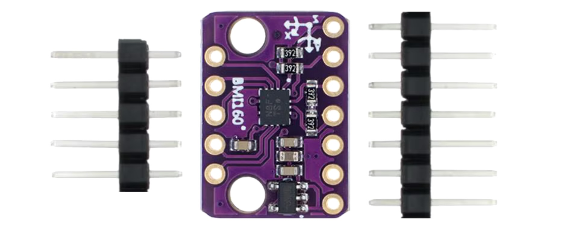
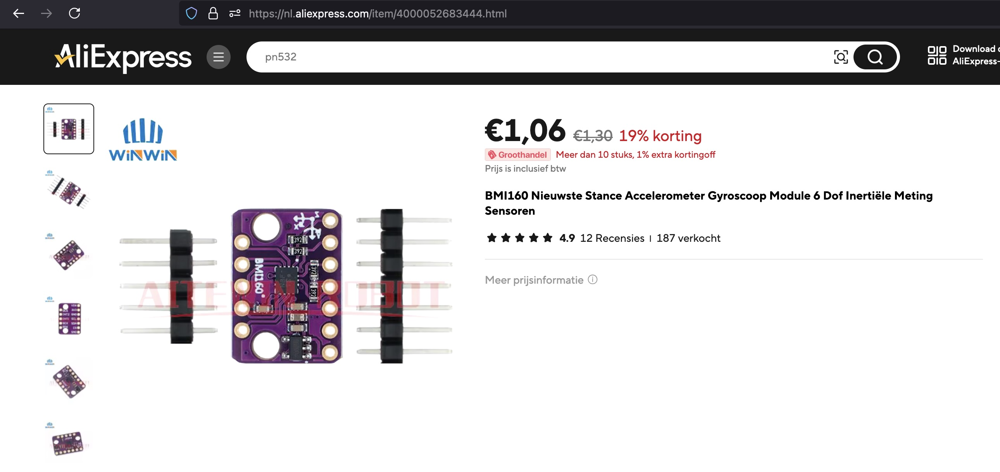

## Gyroscope Accelerometer (BMI160)



## Where stored
Cupboard __1__ Drawer __2__  position __A3__

## Description


## Order
<a href="https://nl.aliexpress.com/item/4000052683444.html">https://nl.aliexpress.com/item/1005006385279953.html</a>


## Wiring to Raspberry Pi Pico


## Installation libraries
Copy next files to the Raspberry Pi Pico

```bash
pip3 install micropython-bmi160
```

## Example code
```python
import time
from machine import Pin, I2C
from micropython_bmi160 import bmi160

i2c = I2C(1, sda=Pin(2), scl=Pin(3))  # Correct I2C pins for RP2040
bmi = bmi160.BMI160(i2c)

while True:
    accx, accy, accz = bmi.acceleration
    print(f"x:{accx:.2f}m/s2, y:{accy:.2f}m/s2, z{accz:.2f}m/s2")
    gyrox, gyroy, gyroz = bmi.gyro
    print(f"x:{gyrox:.2f}°/s, y:{gyroy:.2f}°/s, z{gyroz:.2f}°/s")
    time.sleep(0.5)
```


## more information
https://micropython-bmi160.readthedocs.io/en/latest/index.html


