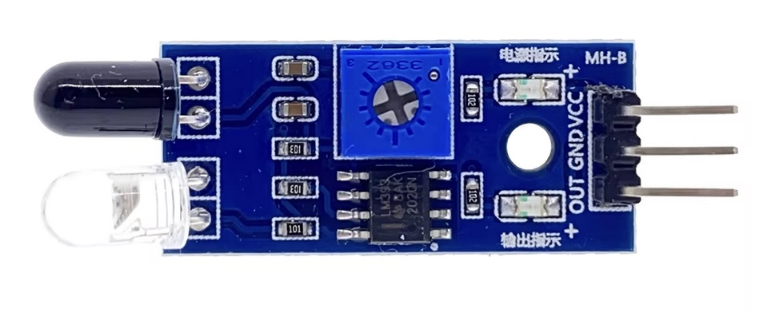

## HW201 - LCD display with i2c module



## Where stored
Cupboard __1__ Drawer __2__  position __A3__

## Description


## Order
<a href="https://nl.aliexpress.com/item/1005006385279953.html">https://nl.aliexpress.com/item/1005006385279953.html</a>


## Wiring to Raspberry Pi Pico


## Installation libraries
Copy next files to the Raspberry Pi Pico

```bash

```

## Example code
```python


```


