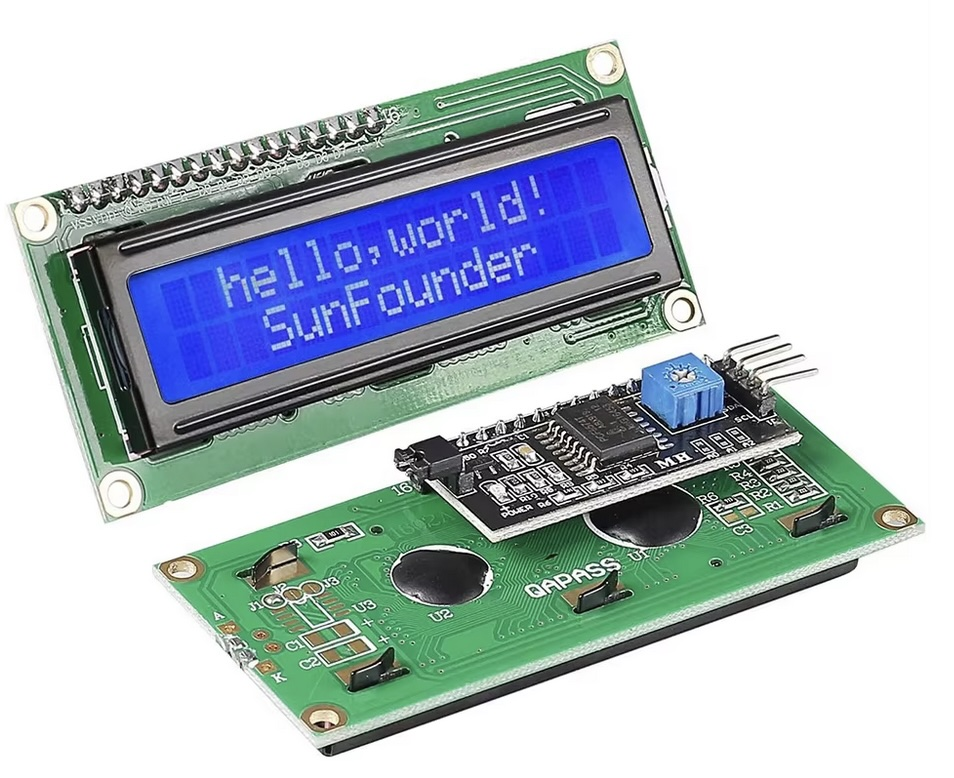
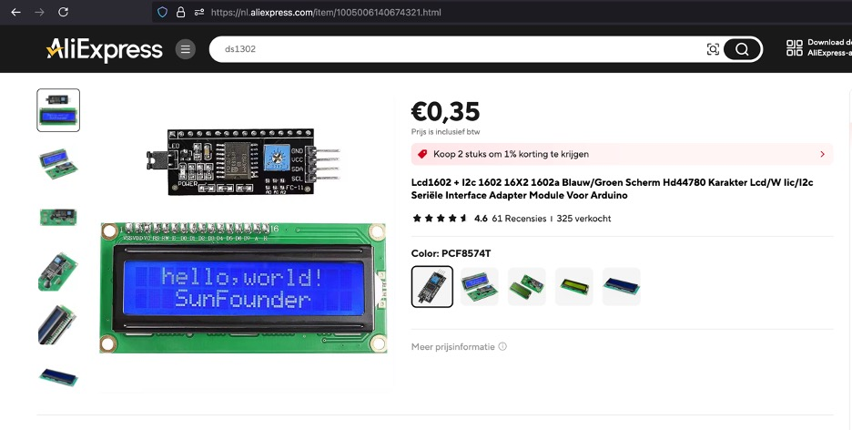
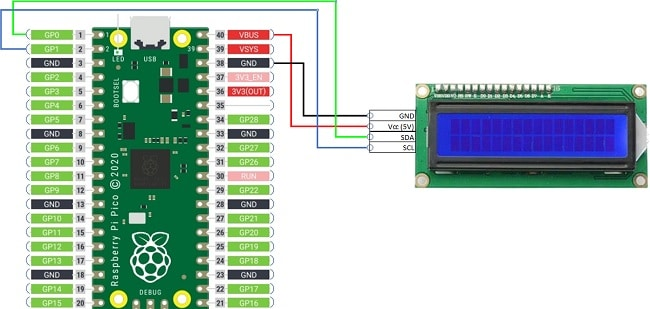

## Lcd1602 - LCD display with i2c module



## Where stored
Cupboard __1__ Drawer __2__  position __A3__

## Description
The LCD1602 with an I2C module is a 16x2 character display that can show two rows of 16 characters each. It’s widely used in microcontroller projects due to its simplicity and ease of use. When equipped with an I2C (Inter-Integrated Circuit) module, it reduces the number of required data pins from the typical 8 or more down to just 4 (VCC, GND, SDA, and SCL). This makes it more efficient for use with microcontrollers like Arduino, ESP32, and Raspberry Pi, especially when working with limited GPIO pins.

Key Components:

	•	LCD1602 Display:
	•	A 16-column by 2-row display matrix that uses a Hitachi HD44780 or compatible controller.
	•	Capable of displaying ASCII characters, custom characters, and simple animations.
	•	I2C Module (PCF8574):
	•	A small PCB board that fits on the back of the LCD1602.
	•	Converts parallel data communication to the I2C protocol.
	•	Has an adjustable potentiometer to control the contrast of the display.
	•	Typically uses the PCF8574 I/O expander IC to handle the communication.

Pinouts (via I2C module):

	•	VCC: Power supply (usually 5V).
	•	GND: Ground.
	•	SDA: Serial Data Line (for I2C communication).
	•	SCL: Serial Clock Line (for I2C communication).

Advantages:

	1.	Fewer Pins: Reduces the number of GPIO pins needed (from 8 to 4).
	2.	Simplified Wiring: The I2C bus allows multiple devices to be connected in parallel, making it more flexible in large projects.
	3.	Contrast Control: The potentiometer on the I2C board allows for easy adjustment of the display’s contrast.
	4.	Backlight Control: Some I2C modules also provide pins or code functionality to control the backlight.

Typical Use Cases:

	•	Displaying sensor data.
	•	Providing user interfaces for embedded systems.
	•	Showing system status, error messages, or simple menus.

This setup is ideal for hobbyists and developers working with microcontroller platforms, as it simplifies both wiring and code.

## specs

## Order
<a href="https://nl.aliexpress.com/item/1005006140674321.html">https://nl.aliexpress.com/item/1005006140674321.html</a>


## Wiring to Raspberry Pi Pico


## Installation libraries
Copy next files to the Raspberry Pi Pico

```bash
pico_i2c_lcd.py
lcd_api.py
```

## Example code
```python
from machine import I2C, Pin
from pico_i2c_lcd import I2cLcd
from time import sleep

I2C_ADDR = 0x27 # <Vul hier het adres in>
NUMBER_OF_ROWS = 2
NUMBER_OF_COLUMNS = 16

i2c = I2C(0, sda=Pin(0), scl=Pin(1), freq=400000)
lcd = I2cLcd(i2c, I2C_ADDR, NUMBER_OF_ROWS, NUMBER_OF_COLUMNS)

lcd.clear()
lcd.blink_cursor_on()
lcd.putstr("daVinci")
lcd.putstr("I2C Address:"+str(I2C_ADDR)+"\n")

lcd.blink_cursor_off()
lcd.clear()
lcd.putstr("Backlight Test")
for i in range(10):
    lcd.backlight_on()
    sleep(0.2)
    lcd.backlight_off()
    sleep(0.2)
lcd.backlight_on()
lcd.hide_cursor()
```


