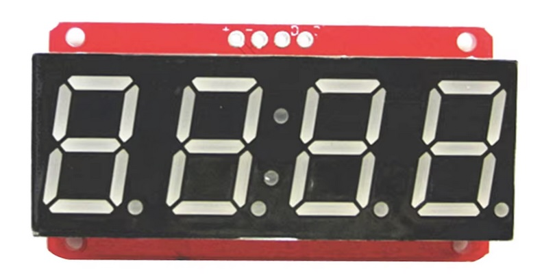

## LED 7-Segment (HT16K33)




## Description
The HT16K33 is a widely used LED driver and I²C interface controller designed for controlling multi-segment LED displays, especially 7-segment displays, as well as RGB LEDs. It integrates a range of features that facilitate efficient control and management of LED displays in a compact form factor. The HT16K33 is popular in various applications, including clocks, scoreboards, and other electronic displays due to its ease of use and versatility.

Key Features

	•	I²C Interface: Supports I²C communication, allowing easy integration with microcontrollers like Arduino, Raspberry Pi, and others.
	•	Display Control: Capable of driving up to 16 LEDs or segments per chip.
	•	Multiple Configurations: Supports both common cathode and common anode LED configurations.
	•	Built-in PWM Control: Features a 16-step PWM brightness control for adjusting the brightness of LEDs.
	•	Scanning: Automatic scanning of the display, allowing multiplexing of multiple segments.
	•	Low Power Consumption: Designed for low power operation, making it suitable for battery-powered applications.
	•	Integrated Oscillator: Contains an internal oscillator for generating the display timing signals.
	•	Multiple HT16K33 Chips: Can be daisy-chained to control more than one display with a single I²C bus.

Pin Configuration

The HT16K33 comes in a 28-pin package (e.g., DIP, TSSOP). Here are the main pins:

	1.	VDD: Power supply pin (typically 3.3V to 5V).
	2.	GND: Ground pin.
	3.	SDA: Serial data line for I²C communication.
	4.	SCL: Serial clock line for I²C communication.
	5.	A0, A1, A2: Address pins used to set the I²C address of the chip. Allows multiple chips to be connected on the same I²C bus.
	6.	INT: Interrupt pin, can be used for specific applications.
	7.	LED outputs (D0-D15): Digital outputs for driving up to 16 LEDs or segments.

Functional Overview

The HT16K33 operates as a LED matrix driver, making it suitable for a variety of display types:

	•	7-Segment Displays: Commonly used in digital clocks and counters.
	•	Matrix Displays: Can drive larger LED matrix configurations by chaining multiple HT16K33 chips.
	•	RGB LEDs: Can be used to control RGB LEDs with the right configurations.

Operation Modes

The HT16K33 operates in different modes based on the application:

	1.	Display ON/OFF Control: You can turn the display on or off through a command.
	2.	Blinking Control: The HT16K33 can blink the entire display at specified intervals.
	3.	Brightness Control: Adjust the brightness of the LEDs with a 16-level PWM controller.
	4.	Keyscan Functionality: The chip includes a keyscan feature for detecting button presses on a matrix keypad.

Communication Protocol

The HT16K33 communicates with microcontrollers using the I²C protocol:

	•	Addressing: The chip can be assigned an I²C address based on the states of the A0, A1, and A2 pins. The default address is typically 0x70, but can be changed to 0x71, 0x72, etc., based on the configuration of the address pins.
	•	Data Transmission: Commands and data can be sent over the I²C bus to control the display, change brightness, and more.

Application Examples

The HT16K33 is versatile and can be found in various applications:

	1.	Digital Clocks: Driving 7-segment displays for timekeeping.
	2.	Scoreboards: Displaying scores and stats in sports.
	3.	Tally Counters: Used in counters that display numerical values.
	4.	Indicators and Alarms: For visual indicators in alarms and notification systems.
	5.	DIY Electronics Projects: Popular among hobbyists for building custom displays and indicators.

Example Code for Arduino

Here’s an example of how to use the HT16K33 with an Arduino to control a simple 7-segment display:

```cpp
#include <Wire.h>
#include "HT16K33.h"

HT16K33 display;

void setup() {
  Wire.begin();
  display.begin(0x70); // Set the I2C address of the HT16K33
  display.setBrightness(15); // Set the maximum brightness
  display.clear(); // Clear the display
}

void loop() {
  for (int i = 0; i < 10; i++) {
    display.print(i); // Print numbers 0-9 on the display
    delay(1000); // Wait for a second
  }
}
```

In this code:

	•	Wire library is used for I²C communication.
	•	HT16K33 library simplifies control of the LED display.
	•	The begin() function initializes the display with the specified I²C address.
	•	The print() function displays numbers on the 7-segment display.

Advantages

	•	Ease of Use: Simple I²C interface allows for straightforward integration with microcontrollers.
	•	Versatile Applications: Can be used for a wide range of displays and configurations.
	•	Low Power Consumption: Suitable for battery-operated devices.
	•	Multiple Display Support: Ability to control multiple displays with a single I²C bus.
	•	Brightness Control: Integrated PWM allows for smooth brightness adjustments.

Limitations

	•	Limited Number of Outputs: The maximum number of LEDs or segments driven by a single chip is 16; for larger displays, multiple chips must be chained.
	•	Basic Functionality: While great for driving LEDs, it may lack more advanced features found in dedicated display drivers.
	•	I²C Limitations: The speed of I²C communication can be a limiting factor in applications requiring very fast updates.

Conclusion

The HT16K33 is a highly versatile LED driver suitable for a wide array of applications requiring the control of LED displays. Its ease of use, low power consumption, and the ability to communicate over the I²C protocol make it an excellent choice for hobbyists and professionals alike. Whether used in digital clocks, scoreboards, or other electronic displays, the HT16K33 is an effective solution for managing LED outputs in embedded systems.

## Order
<a href="https://nl.aliexpress.com/item/1005006840973575.html">https://nl.aliexpress.com/item/1005006840973575.htm</a>


## Wiring to Raspberry Pi Pico


## Installation libraries
Copy next files to the Raspberry Pi Pico

```bash

```

## Example code
```python


```


