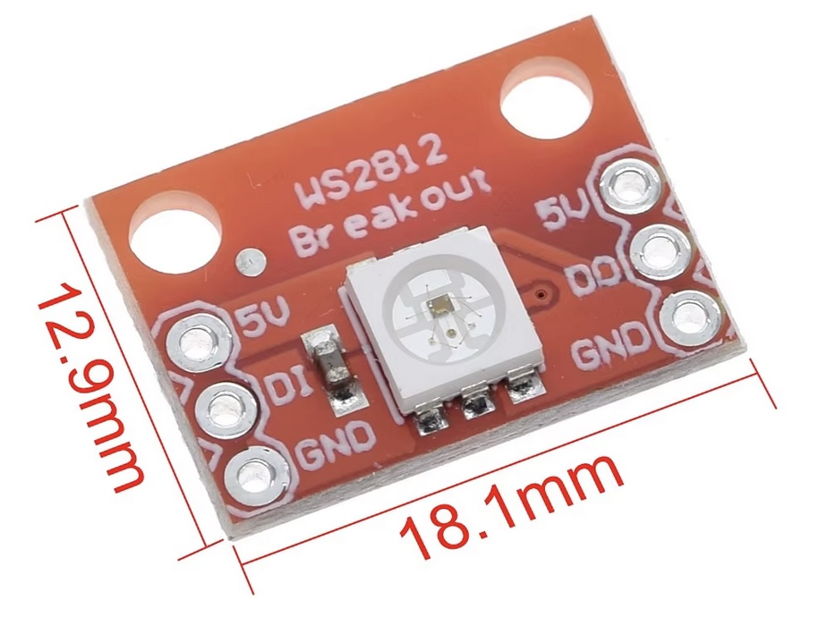

## LED RGB (WS2812)




## Description
The WS2812 is a popular and versatile individually addressable RGB LED (or smart LED) that has become widely used in various lighting applications, especially in decorative lighting, displays, and art installations. The WS2812 features an integrated control circuit and RGB chip, allowing for the control of the color and brightness of each individual LED. This capability makes it ideal for creating complex lighting effects with minimal wiring.

Key Features

	•	Individually Addressable: Each WS2812 LED can be controlled individually, allowing for a wide range of color effects.
	•	Integrated Control Circuit: Combines RGB LEDs with a control IC in a single package, simplifying the design and reducing component count.
	•	Single-Wire Communication: Uses a single data line to control all LEDs in a chain, reducing wiring complexity.
	•	Full-Color Spectrum: Capable of producing millions of colors by mixing red, green, and blue light.
	•	Low Power Consumption: Efficient operation, especially important for battery-powered applications.
	•	High Refresh Rate: Supports fast data rates, allowing for smooth transitions and animations.
	•	Compact Size: Available in various forms, including individual 5050 SMD LEDs, LED strips, and panels.

Specifications

	•	Input Voltage: Typically operates at 5V.
	•	Data Rate: Standard data rate of 800 Kbps for the WS2812B variant.
	•	Control Protocol: Uses a proprietary control protocol that allows for precise timing and control.
	•	Color Depth: Each color channel (Red, Green, Blue) typically has an 8-bit depth, allowing for 256 levels per channel (0-255).
	•	Number of LEDs: Multiple WS2812 LEDs can be connected in series (up to 1024 LEDs on a single data line, depending on power and timing considerations).
	•	Power Consumption: A single LED can draw up to 60 mA at full brightness (20 mA per color channel).

Pin Configuration

The WS2812 typically has four pins (in a 5050 SMD package):

	1.	VDD: Power supply pin (5V).
	2.	GND: Ground pin.
	3.	DIN: Data input pin for receiving control signals.
	4.	DOUT: Data output pin for passing data to the next LED in the chain.

Working Principle

The WS2812 LEDs operate by receiving data signals that dictate their color and brightness. The control circuit inside each LED interprets the signals and adjusts the color output accordingly.

	1.	Data Transmission: Data is sent in a specific timing format, which is interpreted by the LED. Each LED reads a specific number of bits from the data stream and then passes the remaining bits to the next LED in the chain.
	2.	Color Mixing: Each LED can mix colors by controlling the intensity of the red, green, and blue channels independently. By changing the intensity values, a wide range of colors can be produced.
	3.	Chaining LEDs: Multiple WS2812 LEDs can be connected in series. The data signal is sent to the first LED, which reads the data and sends the remainder to the next LED, and so forth.

Applications

The WS2812 LEDs are used in a variety of applications, including:

	1.	Decorative Lighting: Commonly found in LED strips for home decoration, holiday lights, and event displays.
	2.	Signage and Displays: Used in LED signs, displays, and interactive installations for vibrant colors and animations.
	3.	Art Installations: Frequently used by artists for light sculptures and dynamic art pieces.
	4.	Wearable Technology: Utilized in clothing and accessories to create illuminated designs.
	5.	DIY Projects: Popular in hobbyist projects for creating custom lighting solutions.

Example Code for Arduino

Here’s a simple example of how to control WS2812 LEDs using an Arduino with the FastLED library:

```cpp
#include <FastLED.h>

#define LED_PIN 6          // Pin where the LED strip is connected
#define NUM_LEDS 30        // Number of LEDs in the strip
CRGB leds[NUM_LEDS];      // Array of LED objects

void setup() {
  FastLED.addLeds<WS2812, LED_PIN, GRB>(leds, NUM_LEDS); // Initialize the LED strip
}

void loop() {
  // Simple color wipe effect
  for(int i = 0; i < NUM_LEDS; i++) {
    leds[i] = CRGB::Red;    // Set LED to red
    FastLED.show();         // Update the strip
    delay(50);              // Wait for a moment
    leds[i] = CRGB::Black;  // Turn off the LED
  }
}
```

In this code:

	•	The FastLED library is used to simplify control of the WS2812 LED strip.
	•	The addLeds() function initializes the strip with the specified pin and color order.
	•	The loop creates a simple color wipe effect, turning each LED red in sequence.

Advantages

	•	Ease of Use: The single-wire communication makes it simple to control multiple LEDs with minimal wiring.
	•	Vivid Colors: The ability to produce a wide range of colors makes it ideal for decorative and artistic applications.
	•	Scalability: Easily scalable by adding more LEDs in series without additional complexity.
	•	Cost-Effective: Provides a low-cost solution for dynamic lighting applications.

Limitations

	•	Timing Sensitivity: The WS2812 relies on precise timing for data transmission; if the timing is not correct, it can lead to flickering or incorrect colors.
	•	Power Requirements: At full brightness, a large number of WS2812 LEDs can draw significant current, necessitating careful power management and possibly external power supplies for long strips.
	•	Heat Generation: High power consumption can lead to heat generation, which may affect the lifespan of the LEDs if not managed properly.

Conclusion

The WS2812 is a versatile and widely used RGB LED that allows for rich and dynamic lighting effects in a compact package. Its individually addressable nature, combined with ease of use and wide applicability, makes it a favorite among hobbyists, artists, and professionals alike for creating eye-catching visual displays and lighting solutions. Whether used in home decoration, artistic installations, or DIY electronics projects, the WS2812 provides an effective means of achieving vibrant and customizable lighting.

## Order
<a href="https://nl.aliexpress.com/item/1005006459299143.html">https://nl.aliexpress.com/item/1005006459299143.htm</a>


## Wiring to Raspberry Pi Pico


## Installation libraries
Copy next files to the Raspberry Pi Pico

```bash

```

## Example code
```python


```


