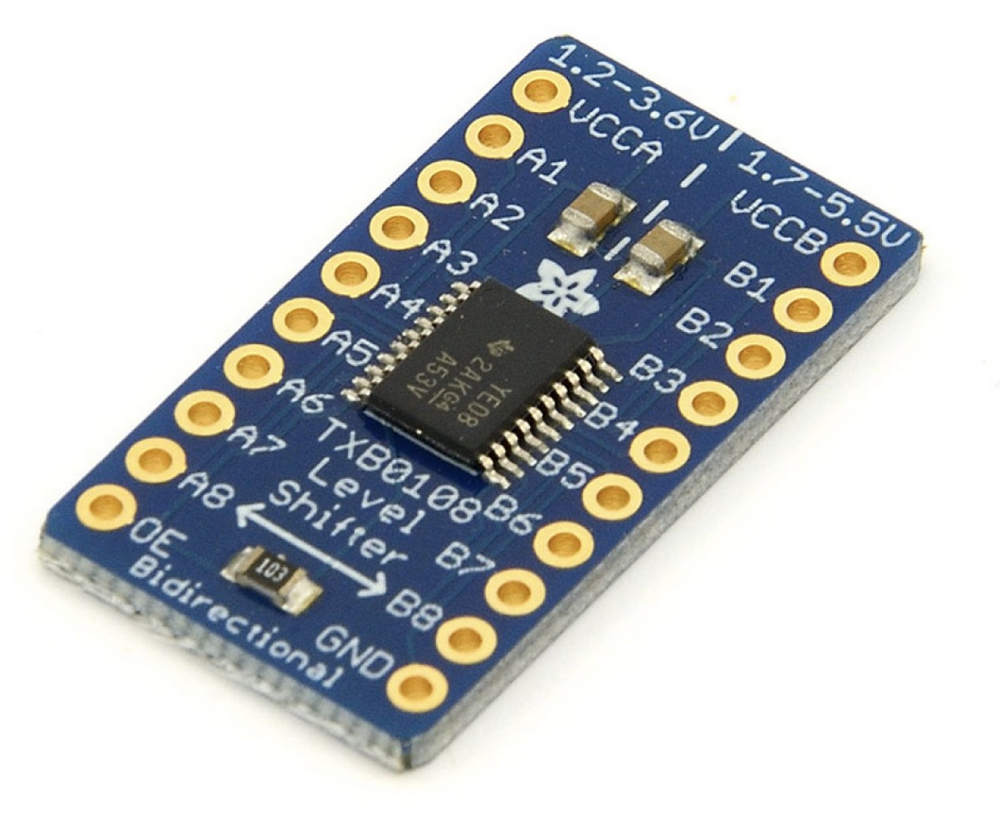
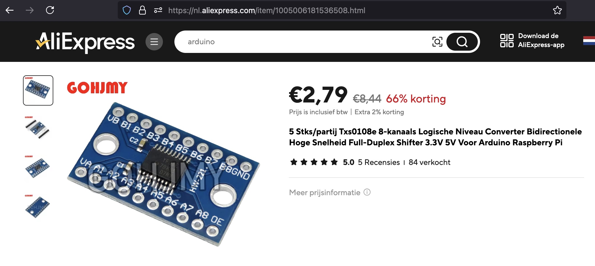
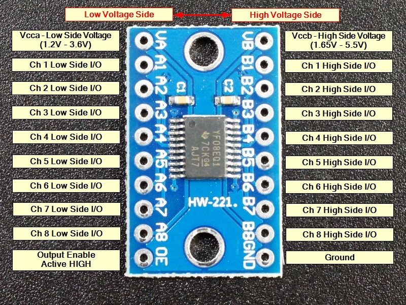

## MH-ET LIVE MAX30102 Hartslagsensormodule Pulserectie Bloedzuurstofconcentratatietest voor Arduino Ultra-Low Power

## Description

## Order
<a href="https://nl.aliexpress.com/item/1005006140674321.html">https://nl.aliexpress.com/item/1005006140674321.html</a>

## Wiring to Raspberry Pi Pico

## installation libraries

No python libraries needed to install

## Connecting for example to Raspberry Pico

