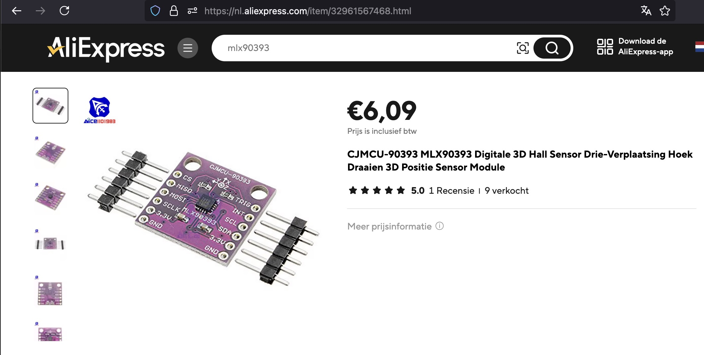

## Magnetometer (MLX90393)

## Description
The **MLX90393** is a highly sensitive, low-power, digital **magnetic field sensor** from Melexis that measures magnetic fields in three dimensions (X, Y, Z). It is commonly used in applications requiring precise magnetic field detection, such as position sensing, motion tracking, and joystick control. The MLX90393 communicates via **I2C** or **SPI** interfaces, making it easy to integrate with microcontrollers like Arduino, Raspberry Pi, and others.

### Key Features:
1. **3D Magnetic Field Sensing**:
   - The MLX90393 can measure the **magnetic field in three axes (X, Y, Z)**, making it ideal for 3D sensing applications.
   - It detects magnetic fields ranging from **±50 mT** (millitesla) to **±200 mT** with high precision, providing flexibility in various environments.

2. **16-bit Output**:
   - The sensor provides **16-bit resolution** for magnetic field measurements, offering highly accurate and detailed data.

3. **I2C and SPI Communication**:
   - It supports both **I2C** and **SPI** interfaces for communication, allowing easy interfacing with a wide variety of microcontrollers and embedded systems.
   - Configurable I2C addresses enable the use of multiple sensors on the same I2C bus.

4. **Low Power Consumption**:
   - The MLX90393 is designed for low-power operation, making it suitable for battery-powered applications. It offers different power modes, including a **sleep mode** that minimizes power usage when the sensor is inactive.
   - The sensor supports configurable **measurement modes**, where you can select between continuous measurements or on-demand readings to conserve energy.

5. **Configurable Output Range and Resolution**:
   - The MLX90393 allows users to configure the magnetic field measurement range (±50 mT to ±200 mT) and resolution, providing flexibility in adapting to different application needs.

6. **Temperature Sensor**:
   - It includes an **integrated temperature sensor** that provides ambient temperature readings alongside magnetic field data, useful for compensation and environmental monitoring.

### Pinout:
The MLX90393 typically comes in a compact **SMD package**, but breakout boards are available for easier use. Key pins include:
- **VDD**: Power supply, typically 3.3V (supports 2.2V to 3.6V).
- **GND**: Ground.
- **SDA/MISO**: I2C data line / SPI data out.
- **SCL/SCLK**: I2C clock line / SPI clock.
- **CS**: Chip Select for SPI communication.
- **INT**: Interrupt pin, can notify the microcontroller when a measurement is complete.

### Advantages:
1. **3D Magnetic Sensing**: Offers full 3D magnetic field detection, making it ideal for applications like joystick control, rotational sensing, and compass-like systems.
2. **High Precision**: The 16-bit resolution and configurable ranges provide highly detailed magnetic field measurements.
3. **Low Power and Sleep Modes**: The sensor can be set to low-power and sleep modes, extending battery life for energy-constrained systems.
4. **Multiple Interfaces**: The choice between I2C and SPI communication makes it flexible for different microcontroller platforms and systems.
5. **Temperature Compensation**: The onboard temperature sensor helps to compensate for temperature-induced errors in magnetic field measurements.

### Applications:
- **Position Sensing**: Can be used to detect linear or rotational positions in industrial equipment, robotics, or consumer electronics.
- **Joystick Control**: Detects precise movements of joystick-like controls in gaming or control systems.
- **Motion Tracking**: Useful in wearables or handheld devices for tracking movement in 3D space.
- **Compass**: Works as an electronic compass by measuring the Earth’s magnetic field to determine orientation.
- **Automotive Applications**: Suitable for use in automotive sensors to measure position or detect magnetic fields for control systems.

### How It Works:
The **MLX90393** works by detecting changes in the magnetic field around the sensor. It uses the **Hall effect** to measure magnetic flux density, and its output is a digital signal representing the strength and direction of the magnetic field in each of the three axes (X, Y, and Z).

By reading this data, you can track the position of a magnet relative to the sensor or detect changes in magnetic fields caused by movement or rotational changes. The sensor can be calibrated for a variety of magnetic field ranges to match the application’s requirements.

### Power Modes:
1. **Continuous Measurement Mode**: The sensor continuously takes measurements and updates the magnetic field data at a regular interval.
2. **Single Measurement Mode**: The sensor takes a measurement only when requested, conserving power.
3. **Sleep Mode**: The sensor enters a low-power state when not in use, significantly reducing power consumption.

### Limitations:
- **Magnetic Interference**: As with any magnetic field sensor, it can be sensitive to nearby magnetic sources, which could cause interference or require calibration.
- **Complex Calibration**: Depending on the precision required, calibration can be complex, especially in environments with varying magnetic fields.

### Comparison to Similar Sensors:
- **HMC5883L**: The HMC5883L is a commonly used 3-axis magnetometer but offers lower resolution and doesn’t support SPI. The MLX90393 provides better flexibility and performance.
- **LIS3MDL**: Another 3-axis magnetometer that provides similar functionality, but the MLX90393 offers better configurability and low-power features.

### In Summary:
The **MLX90393** is a highly accurate, 3-axis magnetic field sensor that offers low power consumption, 16-bit resolution, and flexible communication options (I2C or SPI). It is ideal for applications that require precise magnetic field sensing, including position tracking, joystick control, and motion detection. Its versatility, low power modes, and configurability make it suitable for a wide range of projects in consumer electronics, industrial systems, and automotive applications.

## specs

## Order
<a href="https://nl.aliexpress.com/item/1005006140674321.html">https://nl.aliexpress.com/item/1005006140674321.html</a>

## Wiring to Raspberry Pi Pico

## installation libraries

No python libraries needed to install

## Connecting for example to Raspberry Pico

