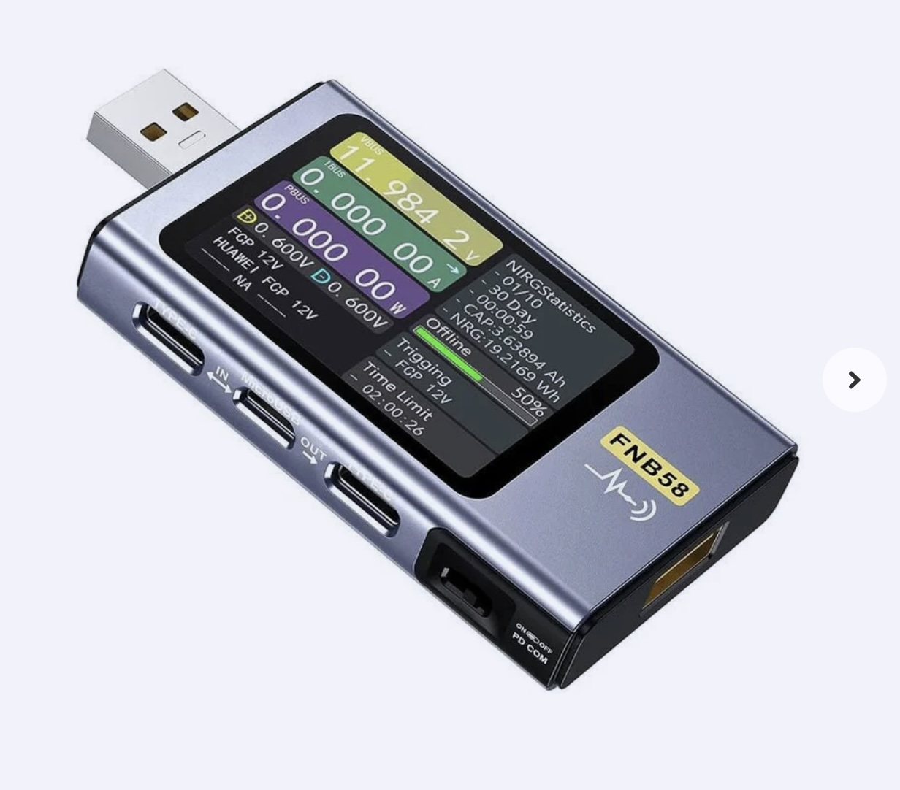

##     USB-Tester (FNB58)

## Description
The FNIRSI FNB58 is a versatile USB tester designed to monitor and analyze various parameters of USB-powered devices. Equipped with a 2.0-inch full-color TFT LCD display, it provides clear readings of voltage, current, power, resistance, capacity, and temperature. The device integrates multiple interfaces, including USB-A, Micro-USB, and USB Type-C, enhancing its compatibility with a wide range of devices. (Fnirsi)

Key Features:
	•	Measurement Capabilities: The FNB58 can measure voltage (4 V to 28 V), current (0 A to 7 A), and power (up to 120 W). It also calculates capacity (up to 9999.99 Ah) and energy consumption (up to 9999.99 Wh). (Elektor Magazine)
	•	Fast Charging Protocol Detection: The tester supports automatic detection and triggering of various fast charging protocols, including QC2.0, QC3.0, Huawei FCP, SCP, Samsung AFC, PD2.0, PD3.0, VOOC/WARP, and SuperVOOC 1.0/2.0. (Fnirsi)
	•	Cable Identification: It can identify E-Marker USB cables and OnePlus DASH cables, providing detailed information about the cable’s capabilities. (Elektor Magazine)
	•	Data Recording and Analysis: The FNB58 offers offline recording of voltage and current curves, supporting up to 9 hours of data logging. It also features high-speed ripple measurement with sampling rates up to 4 Msps. (Amazon)
	•	User Interface: Navigation is facilitated through a three-way joystick and a back button, allowing users to access various functions and settings. The device includes multiple display modes, such as compact view, detailed view, waveform display, and application-specific pages. (Elektor Magazine)
	•	Additional Functions: The tester can measure cable resistance using the differential pressure method, read data from E-Marker and DASH cables, record device startup time, and monitor onboard temperature. It also supports PD monitoring and can emulate DASH cables. (Fnirsi)

The FNIRSI FNB58 is a comprehensive tool for professionals and enthusiasts seeking to evaluate and troubleshoot USB power sources, cables, and devices. Its extensive feature set and user-friendly interface make it a valuable addition to any toolkit.

For a visual overview and demonstration of the FNIRSI FNB58 USB tester, you might find the following video helpful:
<a href="https://www.youtube.com/watch?v=RxwW3ATThSI"> FNB58</a>

## Order
<a href="https://nl.aliexpress.com/item/32829798714.html">https://nl.aliexpress.com/item/32829798714.html</a>

