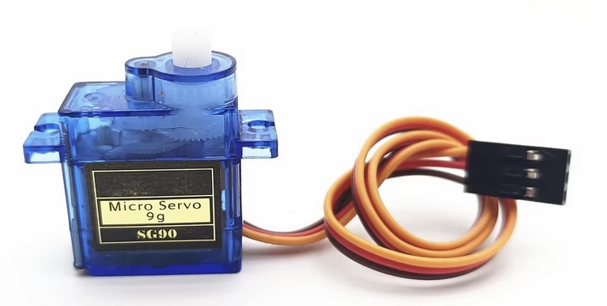
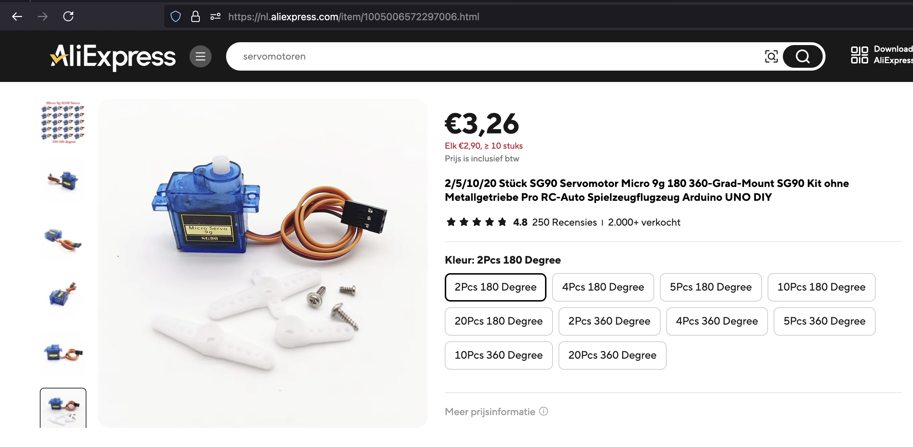
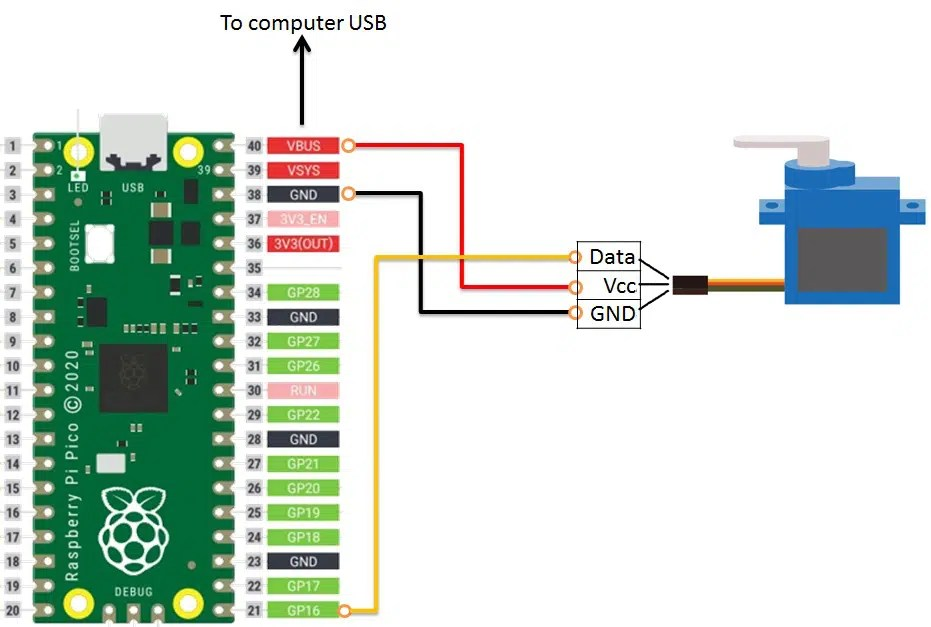

## Servo Motor (SG90)




## Description

## Order
<a href="https://nl.aliexpress.com/item/1005006572297006.html">https://nl.aliexpress.com/item/1005006572297006.htm</a>



## Wiring to Raspberry Pi Pico


## Installation libraries
Copy next files to the Raspberry Pi Pico

```bash

```

## Example code
```python

from machine import Pin, PWM
from time import sleep

servo = PWM(Pin(16))
servo.freq(50)

def set_angle(angle):
    min_duty = 2000   
    max_duty = 8000   
    duty = int(min_duty + (angle / 180) * (max_duty - min_duty))
    servo.duty_u16(duty)

while True:
    # Beweeg naar 180 graden
    set_angle(180)
    sleep(3)  # Pauzeer voor 3 seconden op 180 graden

    # Beweeg terug naar 0 graden
    set_angle(0)
    sleep(3)  # Pauzeer voor 3 seconden op 0 graden (optioneel)

```


