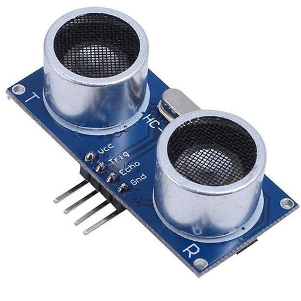

## Ultrasonic distance sensor (HC-SR04)




## Description
The HC-SR04 is a widely used ultrasonic distance sensor designed to measure the distance to an object using sound waves. It is commonly used in robotics, automation, and embedded systems for obstacle detection, distance measurement, and various range-finding applications. The sensor works by emitting ultrasonic sound waves and measuring the time it takes for the echo to return after hitting an object.

Key Features

	•	Operating Voltage: 5V DC
	•	Measuring Range: 2 cm to 400 cm (0.02 meters to 4 meters)
	•	Accuracy: Typically around ±3 mm
	•	Operating Frequency: 40 kHz (ultrasonic sound waves)
	•	Output: Time duration of the pulse that is proportional to the distance.
	•	Interface: Simple digital I/O pins for interfacing (Trigger and Echo).
	•	Compact Size: Small and lightweight, making it ideal for mobile and embedded applications.

Working Principle

The HC-SR04 works by using ultrasonic sound waves (at 40 kHz) to measure distance based on the time it takes for an echo to return to the sensor. The sensor has two primary components:

	•	Transmitter: Emits ultrasonic waves.
	•	Receiver: Detects the reflected waves (echo) after they bounce off an object.

The time difference between the transmitted signal and the received echo is used to calculate the distance to the object based on the speed of sound in air.

Steps in Operation:

	1.	Triggering: The microcontroller sends a high pulse of at least 10 µs to the Trigger Pin.
	2.	Ultrasonic Wave Emission: The sensor emits a burst of 8 ultrasonic pulses at 40 kHz.
	3.	Echo Reception: The sensor waits for the pulses to be reflected back and detected by the Echo Pin.
	4.	Time Measurement: The Echo pin goes high when the echo is detected. The duration of the high pulse is proportional to the time it took for the echo to return, which corresponds to the distance to the object.

Formula for Distance Calculation:

The distance to the object is calculated based on the time taken for the ultrasonic pulse to travel to the object and back, using the formula:



Where:

	•	Time is the duration of the Echo pin’s high pulse in microseconds (µs).
	•	0.0343 cm/µs is the speed of sound in air (343 m/s).

The factor of 2 is because the ultrasonic pulse travels to the object and back, so the time measured is for a round trip.

Electrical Characteristics

	•	Operating Voltage: 5V DC.
	•	Operating Current: 15 mA.
	•	Trigger Input Signal: 10 µs high pulse.
	•	Echo Output Signal: Output pulse width proportional to distance.
	•	Measuring Angle: Typically around 15° (narrow detection cone).
	•	Max Range: 400 cm (4 meters).
	•	Min Range: 2 cm.

Pin Description

	1.	VCC: Power supply (5V).
	2.	GND: Ground pin.
	3.	TRIG: Trigger input pin. A pulse of at least 10 µs duration is required to initiate distance measurement.
	4.	ECHO: Echo output pin. The time for which this pin remains high corresponds to the time taken by the ultrasonic wave to travel to the object and back.

Timing Diagram

	1.	The microcontroller sends a high pulse of at least 10 µs to the TRIG pin.
	2.	The sensor emits 8 cycles of a 40 kHz ultrasonic burst.
	3.	The ECHO pin goes high as soon as the echo is detected.
	4.	The duration of the ECHO pin’s high signal corresponds to the time taken for the echo to return, which can be converted to distance.

Sample Code for Using HC-SR04 with Arduino

The following example demonstrates how to interface the HC-SR04 with an Arduino to measure distance:

```C
#define TRIG_PIN 9  // Pin connected to the Trigger pin of HC-SR04
#define ECHO_PIN 10 // Pin connected to the Echo pin of HC-SR04

void setup() {
  Serial.begin(9600);       // Start the serial communication
  pinMode(TRIG_PIN, OUTPUT); // Set TRIG_PIN as an output
  pinMode(ECHO_PIN, INPUT);  // Set ECHO_PIN as an input
}

void loop() {
  long duration, distance;

  // Clear the trigger pin
  digitalWrite(TRIG_PIN, LOW);
  delayMicroseconds(2);

  // Send a 10µs pulse to the trigger pin
  digitalWrite(TRIG_PIN, HIGH);
  delayMicroseconds(10);
  digitalWrite(TRIG_PIN, LOW);

  // Read the echo pin
  duration = pulseIn(ECHO_PIN, HIGH);

  // Calculate distance in cm
  distance = (duration * 0.0343) / 2;

  // Print the distance to the Serial Monitor
  Serial.print("Distance: ");
  Serial.print(distance);
  Serial.println(" cm");

  // Small delay before the next reading
  delay(500);
}
```

In this code:

	•	pulseIn() function measures the duration of the pulse on the Echo pin.
	•	The distance is calculated based on the measured time and printed to the Serial Monitor.

Applications

	1.	Obstacle Detection: Used in robots and drones for detecting nearby objects to avoid collisions.
	2.	Distance Measurement: Can be used to measure distances to objects in a range of applications.
	3.	Liquid Level Measurement: Used to measure the level of liquid in tanks without direct contact.
	4.	Proximity Alarms: Used in security systems or parking sensors to detect how close an object is to the sensor.
	5.	Automatic Door Openers: Can detect when someone is approaching a door to open it automatically.
	6.	Smart Parking Systems: Used in cars or parking lots to measure the distance to a wall or other objects.

Advantages

	•	Affordable: The HC-SR04 sensor is inexpensive, making it ideal for low-cost projects.
	•	Easy to Interface: Simple to use with microcontrollers like Arduino, Raspberry Pi, or ESP32 using just two pins (Trigger and Echo).
	•	High Precision: Can measure distances with relatively high precision, typically within ±3 mm.
	•	Long Range: Offers a good measurement range (up to 4 meters), suitable for many applications.
	•	Low Power Consumption: Uses minimal current (15 mA), making it energy efficient.

Limitations

	•	Affected by Environmental Factors: The accuracy of the sensor can be affected by environmental conditions such as temperature, humidity, and air pressure.
	•	Cannot Detect Soft or Absorbent Materials Well: Since ultrasonic waves rely on the reflection of sound, soft materials (like fabric or foam) may not reflect sound as effectively, making it harder to detect.
	•	Limited Cone Angle: The sensor has a relatively narrow detection angle of about 15°, so it may not detect objects that are outside this cone.

Alternatives and Variants

	•	SRF05: Another ultrasonic sensor with similar characteristics but can measure slightly longer distances and has different interfacing modes.
	•	GP2Y0A21YK0F: An infrared distance sensor that uses light instead of sound waves, suitable for measuring short distances.
	•	LIDAR-based Sensors: Laser-based sensors (like the VL53L0X) offer higher precision and longer range but are generally more expensive than ultrasonic sensors.

Conclusion

The HC-SR04 ultrasonic sensor is a versatile, low-cost solution for distance measurement, widely used in robotics, automation, and embedded projects. Its ease of use and accurate range detection make it ideal for DIY enthusiasts, engineers, and developers looking for a simple yet effective sensor for obstacle avoidance, range finding, or environmental sensing tasks.

## Order
<a href="https://nl.aliexpress.com/item/1005006160604822.html">https://nl.aliexpress.com/item/1005006160604822.htm</a>


## Wiring to Raspberry Pi Pico


## Installation libraries
Copy next files to the Raspberry Pi Pico

```bash

```

## Example code
```python


```


