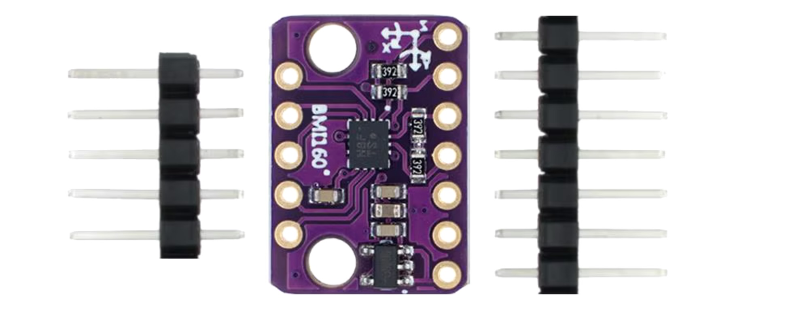
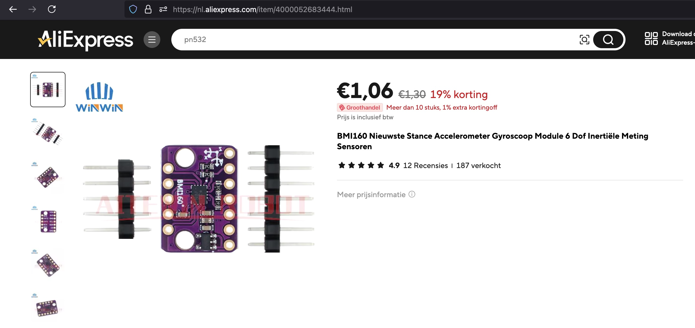

## Gyroscope Accelerometer (BMI160)



## Description
The BMI160 is an inertial measurement unit (IMU) from Bosch Sensortec that combines a 3-axis accelerometer and a 3-axis gyroscope in a single package. It is designed to provide accurate motion detection and orientation sensing for a wide range of applications, such as smartphones, wearables, drones, robotics, and other embedded systems. The sensor is highly popular for its low power consumption, small form factor, and ease of integration with microcontrollers and microprocessors.

Key Features

	•	6-axis IMU: Combines a 3-axis accelerometer and a 3-axis gyroscope.
	•	High Precision: Offers accurate motion and orientation data.
	•	Digital Interfaces: Communicates via I²C and SPI protocols, making it compatible with most microcontrollers.
	•	Low Power Consumption: Optimized for battery-powered applications.
	•	Small Form Factor: Package size of 2.5 mm x 3.0 mm x 0.83 mm, ideal for compact devices.
	•	Built-in FIFO: 1024-byte buffer to store sensor data, reducing the need for frequent data reads.
	•	Interrupt Functions: Programmable interrupt engine for wake-up, free-fall detection, tap, and motion detection.
	•	Gyroscope Range: Configurable from ±125°/s to ±2000°/s.
	•	Accelerometer Range: Configurable from ±2g to ±16g.
	•	Motion Detection and Activity Recognition: Can detect specific movements, such as walking, running, or falling.

Sensor Capabilities

1. Accelerometer:

The BMI160 features a 3-axis accelerometer for detecting linear acceleration along the X, Y, and Z axes. This is useful for measuring tilt, motion, and orientation in various applications.

	•	Range: Configurable from ±2g, ±4g, ±8g, ±16g.
	•	Sensitivity: Varies based on the range, with higher sensitivity for smaller ranges.
	•	Resolution: 16-bit output.

2. Gyroscope:

The gyroscope in the BMI160 provides angular velocity data across the X, Y, and Z axes, which is essential for detecting rotational motion and orientation changes.

	•	Range: Configurable from ±125°/s to ±2000°/s.
	•	Sensitivity: Higher sensitivity for lower ranges.
	•	Resolution: 16-bit output.

3. Temperature Sensor:

The BMI160 has an integrated temperature sensor to compensate for temperature-induced errors in the accelerometer and gyroscope readings.

Power Modes

The BMI160 is designed with multiple power-saving modes to extend battery life in mobile applications. It has different power modes for the accelerometer and gyroscope, which can be independently configured:

	•	Normal Mode: Both accelerometer and gyroscope operate at full speed and accuracy.
	•	Low Power Mode: Power consumption is reduced by adjusting the data output rate, but accuracy might be lower.
	•	Suspend Mode: The sensor is inactive to save power, and the current consumption is minimal.
	•	Fast Power-Up Mode: Wakes up from low-power mode quickly to resume normal operation.

Communication Protocols

The BMI160 supports two digital communication interfaces:

	•	I²C Interface: Operates at standard (100 kHz), fast (400 kHz), or high-speed (3.4 MHz) modes. The I²C address can be set to either 0x68 or 0x69.
	•	SPI Interface: Operates up to 10 MHz, providing fast communication for applications that require rapid data transfers.

Pin Configuration

The BMI160 has the following typical pinout for interfacing:

	1.	VDD: Power supply pin (1.7V to 3.6V).
	2.	VDDIO: Interface voltage for digital communication (compatible with 1.2V to 3.6V logic).
	3.	GND: Ground pin.
	4.	SCL/CLK: Clock input for I²C or SPI communication.
	5.	SDA/MISO: Data input/output pin for I²C or SPI communication.
	6.	CSB: Chip select pin for SPI communication (active low).
	7.	SDO: Optional address selection pin for I²C or output data for SPI.
	8.	INT1 and INT2: Configurable interrupt pins for motion events (such as tap detection, free-fall, or orientation change).

Interrupts and FIFO

	•	Interrupt Engine: The BMI160 supports two programmable interrupt pins (INT1 and INT2), which can be used to trigger various motion-based events, such as:
	•	Free-fall detection.
	•	Tap detection (single and double tap).
	•	Orientation change.
	•	Step detection.
	•	Activity recognition (e.g., walking, running).
	•	FIFO Buffer: The sensor has a 1024-byte FIFO that can store accelerometer and gyroscope data, reducing the need for frequent communication with the microcontroller. This helps conserve power and reduces the load on the MCU when processing large amounts of data.

Data Rates

The BMI160 offers adjustable output data rates (ODR) for both the accelerometer and gyroscope. This allows developers to optimize the sensor’s performance and power consumption based on application needs:

	•	Accelerometer ODR: Ranges from 0.78 Hz to 1600 Hz.
	•	Gyroscope ODR: Ranges from 25 Hz to 3200 Hz.

Example Applications

The BMI160 is used in a wide range of applications where motion sensing, gesture detection, or orientation sensing is required:

	1.	Smartphones and Wearables: Detects orientation, step counting, tap gestures, and screen rotation.
	2.	Drones and Robotics: Provides stable, high-accuracy data for flight control, navigation, and object tracking.
	3.	Gaming and Augmented Reality (AR): Tracks motion for interactive gaming or AR experiences.
	4.	Health and Fitness Devices: Step counting, activity tracking, and gesture-based control.
	5.	Virtual Reality (VR): Motion and orientation tracking for VR headsets and controllers.
	6.	Industrial Applications: Vibration monitoring, machine health diagnostics, and motion analysis.

Example Code (Arduino)

Here is an example of how to interface the BMI160 with an Arduino using the I²C interface.

```cpp
#include <Wire.h>
#include <BMI160Gen.h>

BMI160GenClass BMI160;  // Initialize the BMI160 sensor object

void setup() {
  Serial.begin(115200);
  Wire.begin();          // Initialize I²C communication
  if (BMI160.begin(BMI160GenClass::I2C_MODE)) {  // Start BMI160 in I2C mode
    Serial.println("BMI160 initialization successful.");
  } else {
    Serial.println("BMI160 initialization failed.");
    while (1);  // Stop the program if the sensor is not detected
  }
}

void loop() {
  float ax, ay, az;  // Variables to hold accelerometer data
  float gx, gy, gz;  // Variables to hold gyroscope data

  // Read accelerometer and gyroscope data
  BMI160.readMotion6(&ax, &ay, &az, &gx, &gy, &gz);

  // Print accelerometer data (in g's)
  Serial.print("Accel: ");
  Serial.print(ax);
  Serial.print(", ");
  Serial.print(ay);
  Serial.print(", ");
  Serial.println(az);

  // Print gyroscope data (in degrees per second)
  Serial.print("Gyro: ");
  Serial.print(gx);
  Serial.print(", ");
  Serial.print(gy);
  Serial.print(", ");
  Serial.println(gz);

  delay(500);  // Delay for half a second
}
```

This code reads the accelerometer and gyroscope data from the BMI160 using the BMI160Gen library, and prints the values to the Serial Monitor.

Advantages

	•	Compact Size: Fits into small devices, making it suitable for portable electronics.
	•	Low Power Consumption: Designed for battery-powered applications like wearables and IoT devices.
	•	High Performance: Offers high accuracy and low noise in both accelerometer and gyroscope data.
	•	Wide Range of Motion Detection: Capable of detecting a variety of motions, from subtle tilts to rapid spins and falls.

Limitations

	•	Limited Magnetometer: The BMI160 lacks a magnetometer, which may be necessary for full 9-axis orientation sensing. For this, the BMX160 (an extended version with a magnetometer) is recommended.
	•	Power Supply Sensitivity: Requires stable power supply voltage for optimal performance.
	•	Not Waterproof: Requires additional protective casing for outdoor or rugged environments.

Conclusion

The BMI160 is a powerful 6-axis IMU sensor that combines a 3-axis accelerometer and a 3-axis gyroscope. Its small size, low power consumption, and built-in motion detection features make it ideal for a wide range of motion sensing applications, from smartphones and wearables to drones and robotics. With support for both I²C and SPI interfaces, it is easy to integrate into many microcontroller-based projects.

## Order
<a href="https://nl.aliexpress.com/item/4000052683444.html">https://nl.aliexpress.com/item/1005006385279953.html</a>


## Wiring to Raspberry Pi Pico


## Installation libraries
Copy next files to the Raspberry Pi Pico

```bash
pip3 install micropython-bmi160
```

## Example code
```python
import time
from machine import Pin, I2C
from micropython_bmi160 import bmi160

i2c = I2C(1, sda=Pin(2), scl=Pin(3))  # Correct I2C pins for RP2040
bmi = bmi160.BMI160(i2c)

while True:
    accx, accy, accz = bmi.acceleration
    print(f"x:{accx:.2f}m/s2, y:{accy:.2f}m/s2, z{accz:.2f}m/s2")
    gyrox, gyroy, gyroz = bmi.gyro
    print(f"x:{gyrox:.2f}°/s, y:{gyroy:.2f}°/s, z{gyroz:.2f}°/s")
    time.sleep(0.5)
```


## more information
https://micropython-bmi160.readthedocs.io/en/latest/index.html


