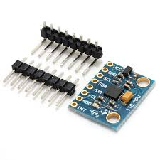

## Gyroscope Accelerometer (MPU6050)



## Description
The MPU6050 is a widely used 6-axis Inertial Measurement Unit (IMU) sensor that integrates a 3-axis accelerometer and a 3-axis gyroscope on a single chip. Developed by InvenSense, the MPU6050 is designed to measure acceleration, rotation, and motion for various applications, including robotics, drones, gaming, and mobile devices. The sensor is known for its high performance, low power consumption, and digital motion processing capabilities, which make it a popular choice for motion-sensing applications.

Key Features

	•	6 Degrees of Freedom (DoF): Combines a 3-axis accelerometer and a 3-axis gyroscope.
	•	Digital Output: I²C interface for communication with a microcontroller.
	•	Built-in Digital Motion Processor (DMP): Reduces the computational load on the host microcontroller by processing sensor data internally.
	•	Accelerometer Range: Configurable from ±2g to ±16g.
	•	Gyroscope Range: Configurable from ±250°/s to ±2000°/s.
	•	Temperature Sensor: Integrated temperature sensor for temperature compensation.
	•	Motion Interrupts: Supports interrupts for free-fall, motion detection, and tap sensing.
	•	16-bit ADCs: High-resolution output data for both accelerometer and gyroscope.
	•	Low Power Consumption: Optimized for battery-powered applications.
	•	Small Package: 4 mm x 4 mm QFN package.

Sensor Capabilities

1. 3-Axis Accelerometer

The accelerometer measures the linear acceleration along the X, Y, and Z axes. It detects movement and orientation changes by measuring the forces acting on the sensor in three dimensions.

	•	Measurement Range: Configurable from ±2g, ±4g, ±8g, ±16g.
	•	Resolution: 16-bit output for high precision.
	•	Sensitivity: Varies based on the selected range, with higher sensitivity for smaller ranges.
	•	Applications: Motion tracking, tilt sensing, and vibration monitoring.

2. 3-Axis Gyroscope

The gyroscope measures angular velocity (rotation speed) around the X, Y, and Z axes, enabling the detection of rotational motion and changes in orientation.

	•	Measurement Range: Configurable from ±250°/s, ±500°/s, ±1000°/s, ±2000°/s.
	•	Resolution: 16-bit output for precise measurement.
	•	Applications: Rotation detection, balancing systems (e.g., for drones or self-balancing robots), and gesture recognition.

3. Temperature Sensor

The MPU6050 includes an integrated temperature sensor to compensate for temperature-induced errors in the accelerometer and gyroscope measurements.

	•	Temperature Range: The internal temperature sensor has a range of -40°C to +85°C.

Digital Motion Processor (DMP)

The DMP is an integrated motion processor that can perform complex calculations such as sensor fusion (combining accelerometer and gyroscope data) to provide motion-related outputs like orientation (pitch, roll, and yaw) and step counting. The DMP significantly reduces the processing burden on the host microcontroller by handling tasks such as filtering, calibration, and motion recognition internally.

Power Modes

The MPU6050 is designed with several power-saving modes to extend battery life in mobile applications:

	•	Sleep Mode: Puts the sensor in a low-power state when not in use.
	•	Cycle Mode: Allows the sensor to periodically wake up, take measurements, and return to sleep, further reducing power consumption.
	•	Standby Mode: Deactivates either the accelerometer or gyroscope while keeping the other active, saving power in situations where only one of the sensors is needed.

Communication Protocols

The MPU6050 communicates with microcontrollers through an I²C interface. It supports both standard (100 kHz) and fast mode (400 kHz) I²C communication, allowing it to interface with a wide range of devices. The sensor also includes an optional SPI interface in certain versions.

	•	I²C Address: The MPU6050 has a default I²C address of 0x68, but can be changed to 0x69 by adjusting the logic level of the AD0 pin.

Pin Configuration

The MPU6050 has the following pins for communication and power:

	1.	VCC: Power supply (2.375V to 3.46V, typically 3.3V).
	2.	GND: Ground pin.
	3.	SCL: I²C clock input (serial clock line).
	4.	SDA: I²C data input/output (serial data line).
	5.	XDA: Auxiliary I²C data line (used for connecting additional sensors).
	6.	XCL: Auxiliary I²C clock line.
	7.	AD0: I²C address select pin (can be set to logic high or low to change I²C address).
	8.	INT: Interrupt pin (used to signal motion detection or data availability to the host controller).

Interrupts and FIFO

	•	Interrupt Functionality: The MPU6050 supports programmable interrupt outputs on the INT pin for detecting specific motion events such as:
	•	Motion Detection: Triggers when movement is detected.
	•	Free-Fall Detection: Signals when a free-fall event occurs.
	•	Tap Detection: Detects single or double taps.
	•	FIFO Buffer: The sensor includes a 1024-byte FIFO buffer that allows the storage of accelerometer and gyroscope data, reducing the need for continuous polling by the microcontroller and improving power efficiency.

Data Rates

The output data rate (ODR) for both the accelerometer and gyroscope can be configured to optimize performance or power consumption:

	•	Accelerometer ODR: Adjustable from 1 kHz to lower rates by using the low-power mode.
	•	Gyroscope ODR: Adjustable up to 8 kHz for applications requiring high-speed data.

Applications

The MPU6050 is used in a wide range of applications that require motion detection, orientation sensing, and gesture recognition:

	1.	Drones and Robotics: Used to control balance, stability, and navigation.
	2.	Gaming Devices and VR: Motion tracking for game controllers and virtual reality headsets.
	3.	Mobile Devices: Screen orientation, gesture recognition, and step counting in smartphones and wearables.
	4.	Self-Balancing Systems: Used in two-wheel balancing robots and vehicles to detect tilt and rotation.
	5.	Fitness and Health Devices: Tracks activities like walking, running, and climbing by detecting motion and orientation.
	6.	Image Stabilization: Helps stabilize camera movement in smartphones, drones, and action cameras.

Sample Code for Arduino

Here’s an example of how to use the MPU6050 with an Arduino to read accelerometer and gyroscope data:

```cpp
#include <Wire.h>
#include <MPU6050.h>

MPU6050 mpu;

void setup() {
  Serial.begin(115200);
  Wire.begin();
  
  // Initialize the MPU6050
  mpu.initialize();
  
  // Check if the sensor is connected
  if (mpu.testConnection()) {
    Serial.println("MPU6050 connected successfully!");
  } else {
    Serial.println("MPU6050 connection failed!");
    while (1); // Stop the program if the sensor is not detected
  }
}

void loop() {
  // Variables to store accelerometer and gyroscope data
  int16_t ax, ay, az;
  int16_t gx, gy, gz;

  // Read the accelerometer and gyroscope values
  mpu.getMotion6(&ax, &ay, &az, &gx, &gy, &gz);

  // Print accelerometer data (in raw values)
  Serial.print("Accel X: "); Serial.print(ax);
  Serial.print(" | Accel Y: "); Serial.print(ay);
  Serial.print(" | Accel Z: "); Serial.println(az);

  // Print gyroscope data (in raw values)
  Serial.print("Gyro X: "); Serial.print(gx);
  Serial.print(" | Gyro Y: "); Serial.print(gy);
  Serial.print(" | Gyro Z: "); Serial.println(gz);

  delay(500); // Wait for half a second before taking the next reading
}
```

In this code:

	•	Wire.begin() initializes I²C communication.
	•	The MPU6050 library is used to interface with the sensor and retrieve motion data.
	•	Accelerometer and gyroscope data is read and printed to the Serial Monitor.

Advantages

	•	High Precision: 16-bit output resolution for both accelerometer and gyroscope provides accurate motion data.
	•	Built-in DMP: Offloads motion processing tasks from the host microcontroller, improving efficiency.
	•	Power Efficiency: Optimized for low-power applications with various power-saving modes.
	•	Widely Supported: Numerous libraries and sample code are available, making it easy to integrate into Arduino, Raspberry Pi, and other platforms.

Limitations

	•	No Magnetometer: The MPU6050 lacks a magnetometer, which is required for full 9-axis motion sensing (for this, the MPU9250 or MPU9150 is recommended).
	•	Limited Temperature Range: While suitable for most applications, extreme environments might require temperature compensation or additional sensors.
	•	I²C Bus Noise Sensitivity: Care should be taken in noisy environments or when using long I²C cables

## Order
<a href="https://nl.aliexpress.com/item/4000052683444.html">https://nl.aliexpress.com/item/1005006385279953.html</a>


## Wiring to Raspberry Pi Pico


## Installation libraries
Copy next files to the Raspberry Pi Pico

```bash
pip3 install micropython-bmi160
```

## Example code
```python


```


## more information
https://micropython-bmi160.readthedocs.io/en/latest/index.html


