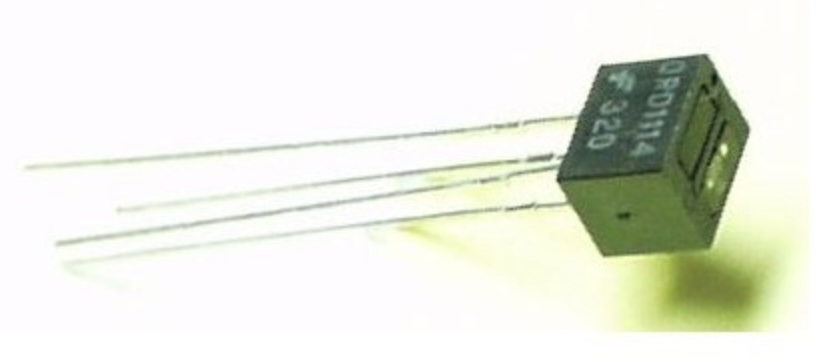
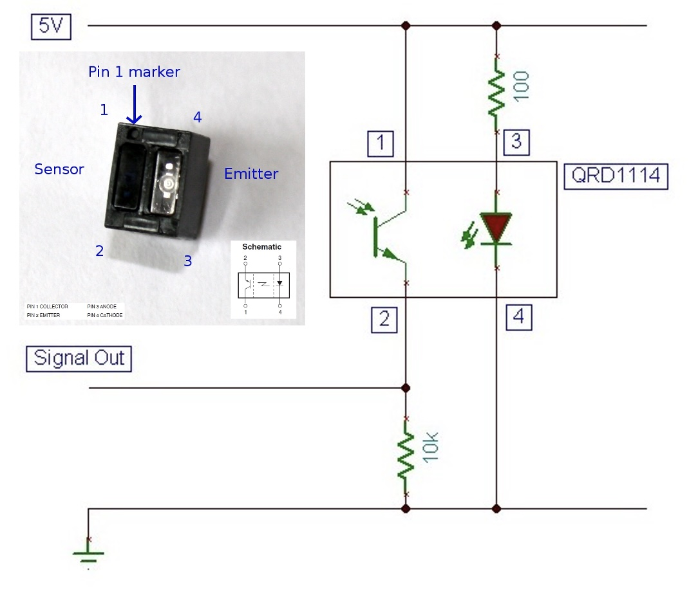
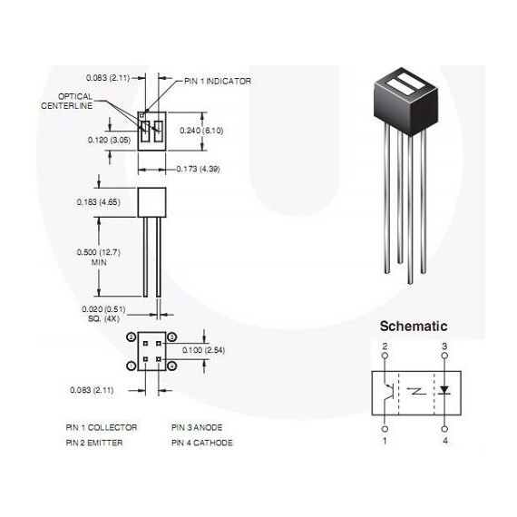

## QRD1114 - Infrared Sensor



## Description
# 📷 QRD1114 Reflective Optical Sensor with Raspberry Pi Pico (MicroPython)

## 🔍 Overview

The **QRD1114** is a reflective optical sensor that combines:
- An **infrared (IR) LED** (emitter)
- A **phototransistor** (receiver)

It is designed to detect the presence of nearby objects based on the **amount of infrared light reflected** back to the sensor.

---

## ⚙️ How It Works

- The IR LED emits light forward.
- If an object is nearby (especially a **light or white object**), the IR light reflects back.
- The phototransistor detects this reflected IR light.
- The more light reflected, the more the phototransistor conducts → this changes the output voltage.

---

## 📦 QRD1114 Pinout

| Pin | Function                  | Connect To                |
|-----|---------------------------|---------------------------|
| 1   | IR LED Anode (+)          | 3.3V via 220Ω resistor     |
| 2   | IR LED Cathode (−)        | GND                       |
| 3   | Phototransistor Collector | GP26 (ADC0) or GPIO (with pull-up) |
| 4   | Phototransistor Emitter   | GND                       |

---

## 🛠️ Wiring Diagram (Analog Read with Pico)
🔧 Wiring to Raspberry Pi Pico (digital readout)

QRD1114 Pin	Connect to Pico
Pin 1 (IR LED Anode)	3.3V (via 220Ω resistor)
Pin 2 (IR LED Cathode)	GND
Pin 3 (Phototransistor Collector)	GPIO (e.g., GP26 / ADC0)
Pin 4 (Phototransistor Emitter)	GND

You can also wire it to a digital GPIO input with a pull-up resistor (~10kΩ), depending on your circuit.

🔍 Notes & Tips
	•	White/light objects reflect more IR → higher signal
	•	Black/dark objects absorb IR → lower signal
	•	Great for:
	•	Line-following robots
	•	Proximity detection
	•	Edge detection
The closer and whiter the object, the higher the voltage usually.
⸻

# QRD1113 vs QRD1114 Comparison & Setup

## 📦 Overview

Both **QRD1113** and **QRD1114** are reflective optical sensors, useful for detecting nearby objects or line tracking. They include an infrared LED and a phototransistor aimed in the same direction.

---

## 🔍 Key Differences

| Feature              | QRD1113                            | QRD1114                            |
|----------------------|-------------------------------------|-------------------------------------|
| Phototransistor Type | **Darlington pair** (high gain)     | **Standard phototransistor**        |
| Sensitivity          | Higher                              | Lower                               |
| Response Time        | Slower                              | Faster                              |
| Output Current       | Higher                              | Lower                               |
| Use Case             | Low-light or weak reflection sensing| High-speed detection applications    |

---

## 🛠️ Wiring (Digital Mode Example)

| QRD111x Pin | Connect To             |
|-------------|------------------------|
| Pin 1 (LED+) | 3.3V via 220Ω resistor |
| Pin 2 (LED−) | GND                    |
| Pin 3 (Collector) | GPIO (e.g. GP15) with 10kΩ pull-up to 3.3V |
| Pin 4 (Emitter) | GND                |

---



## 💻 MicroPython Code (Digital Read)

```python
from machine import Pin
import time

sensor = Pin(15, Pin.IN, Pin.PULL_UP)

while True:
    if sensor.value() == 0:
        print("Object detected!")
    else:
        print("No object")
    time.sleep(0.2)

## Order
<a href="https://nl.aliexpress.com/item/1005007924902999.html">https://nl.aliexpress.com/item/1005007924902999.html</a>


## Wiring to Raspberry Pi Pico


## Installation libraries
Copy next files to the Raspberry Pi Pico

```bash

```

## Example code
```python

from machine import ADC, Pin
import time

THRESHOLD = 30000  # adjust based on testing

# Set up ADC (Analog to Digital Converter)
#sensor = ADC(Pin(26))  # GP26 = ADC0
sensor = Pin(26, Pin.IN)

def read_sensor():
    #value = sensor.read_u16()  # 16-bit value (0-65535)
    value = sensor.value() * 65535
    voltage = value * 3.3 / 65535
    return value, voltage

while True:
    value, volt = read_sensor()
    print(f"Sensor reading: {value} (Voltage: {volt:.2f}V)")
    if value >= THRESHOLD:
        print("Object detected!")
    else:
        print("No object")
    time.sleep(0.2)

⸻
```


