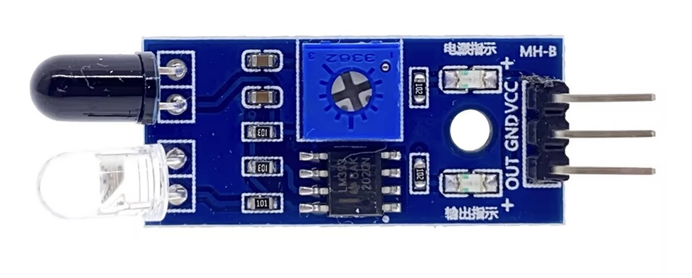

## TCRT5000 - Infrared Sensor



## Description
The TCRT5000 is a reflective infrared (IR) sensor that integrates an IR emitter (photodiode) and an IR receiver (phototransistor) within a single package. This configuration enables the sensor to detect objects and measure proximity by emitting IR light and detecting the reflected signal from nearby surfaces.

Key Features:
	•	Integrated Emitter and Receiver: Combines an IR LED and a phototransistor, facilitating compact design and efficient object detection.
	•	Peak Operating Distance: Optimized for a typical sensing distance of approximately 2.5 mm, with an effective range between 0.2 mm and 15 mm.
	•	Daylight Blocking Filter: Incorporates a filter to minimize interference from ambient visible light, enhancing detection accuracy.
	•	Emitter Wavelength: Operates at an IR wavelength of 950 nm, suitable for various sensing applications.
	•	Operating Voltage: Compatible with 5V systems, making it suitable for integration with microcontrollers like Arduino.
	•	Output: Provides both analog and digital outputs, allowing for flexible interfacing based on application requirements.

Pin Configuration:

The TCRT5000 sensor features four pins:
	1.	Anode (A): Positive terminal of the IR emitter (photodiode).
	2.	Cathode (K): Negative terminal of the IR emitter.
	3.	Collector (C): Collector terminal of the phototransistor (IR receiver).
	4.	Emitter (E): Emitter terminal of the phototransistor.

Applications:

The TCRT5000 is widely used in:
	•	Proximity Detection: Sensing the presence of objects within a short range.
	•	Line Following Robots: Differentiating between reflective (white) and non-reflective (black) surfaces to navigate paths.
	•	Obstacle Detection: Identifying obstacles in robotic and automation systems.
	•	Encoder Systems: Detecting rotational or linear position by reading reflective markers.

Operation Principle:

The sensor operates by emitting IR light through its photodiode. When this light encounters an object, it reflects back and is detected by the phototransistor. The amount of reflected IR light influences the phototransistor’s conductivity, which can be measured as a voltage change. This change is then processed to determine the presence or distance of an object.

Considerations:

While the TCRT5000 is effective for short-range detection, it can be susceptible to interference from ambient light sources. Implementing proper shielding and calibration can mitigate these effects. Additionally, the sensor’s performance may vary with different surface colors and textures, as reflective properties influence the amount of IR light returned to the receiver.

For detailed specifications and application guidelines, refer to the TCRT5000 datasheet by Vishay Intertechnology.

## Order
<a href="https://nl.aliexpress.com/item/1005006385279953.html">https://nl.aliexpress.com/item/1005006385279953.html</a>


## Wiring to Raspberry Pi Pico


## Installation libraries
Copy next files to the Raspberry Pi Pico

```bash

```

## Example code
```python


```


