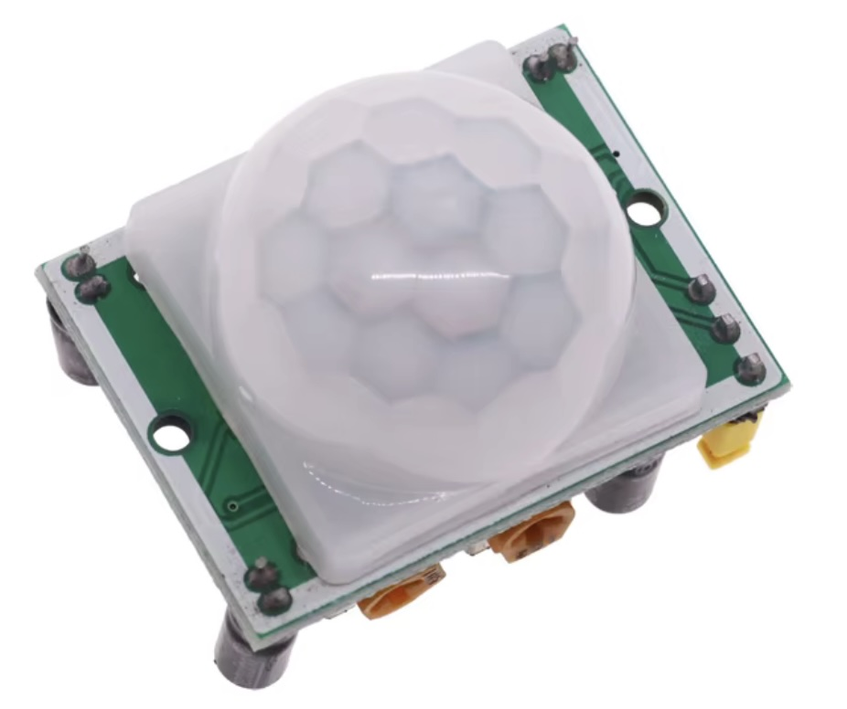

## PIR Module (HC-SR501)




## Description
The HC-SR501 is a widely used passive infrared (PIR) motion sensor module designed for detecting motion by sensing changes in infrared radiation. It is commonly used in security systems, lighting control applications, and automation projects. The HC-SR501 is favored for its low cost, ease of use, and effectiveness in a variety of settings.

Key Features

	•	PIR Technology: Utilizes passive infrared sensing technology to detect motion based on body heat emitted by humans or animals.
	•	Adjustable Sensitivity and Delay Time: Comes with potentiometers to adjust the sensitivity of detection and the duration for which the output signal remains active after motion is detected.
	•	Wide Detection Range: Typically detects motion within a range of 5 to 12 meters (16 to 39 feet) at an angle of about 120 degrees.
	•	Low Power Consumption: Operates on low power, making it suitable for battery-powered devices and energy-efficient applications.
	•	Simple Interface: Provides a straightforward interface with only a few pins for power, ground, and output.
	•	Compact Size: Small and lightweight, allowing easy integration into various projects.

Specifications

	•	Operating Voltage: Typically operates between 5V and 20V, with 5V being common for most applications.
	•	Output Type: The output is a digital signal (HIGH or LOW), indicating whether motion is detected.
	•	Detection Angle: Approximately 120 degrees.
	•	Detection Distance: Effective range is usually between 5 to 12 meters (adjustable based on the environment).
	•	Delay Time: Output can be set to remain active for a period ranging from about 0.3 seconds to 5 minutes after detecting motion.
	•	Sensitivity Adjustment: Allows users to adjust the sensitivity of detection through an onboard potentiometer.

Pin Configuration

The HC-SR501 typically has three pins:

	1.	VCC: Power supply pin (usually 5V to 20V).
	2.	GND: Ground pin.
	3.	OUT: Digital output pin that goes HIGH when motion is detected and LOW when no motion is detected.

Working Principle

The HC-SR501 operates by detecting changes in infrared radiation within its field of view. The PIR sensor consists of two pyroelectric elements that measure infrared radiation emitted by objects in its range:

	1.	Detection: When a warm body (such as a human or animal) moves within the sensor’s range, the change in infrared radiation is detected. The sensor outputs a HIGH signal on the OUT pin.
	2.	Output Timing: The duration for which the OUT pin remains HIGH can be adjusted using the onboard delay potentiometer. After the set delay time, the output will return to LOW.
	3.	Sensitivity Adjustment: The sensitivity of the sensor can be adjusted using another potentiometer to fine-tune how sensitive the sensor is to motion.

Applications

The HC-SR501 is used in a variety of applications, including:

	1.	Security Systems: Detecting intruders in residential or commercial spaces.
	2.	Automatic Lighting Control: Activating lights when motion is detected in hallways, staircases, or parking areas.
	3.	Home Automation: Integrating with smart home systems for motion-triggered actions.
	4.	Robotics: Used in robotic applications for obstacle detection and avoidance.
	5.	Energy-Saving Solutions: Automatically turning off devices or lighting when no motion is detected.

Example Code for Arduino

Here’s a simple example of how to use the HC-SR501 with an Arduino:
```cpp
const int sensorPin = 2; // Pin connected to the OUT pin of HC-SR501
int sensorState = 0;      // Variable to store the state of the sensor

void setup() {
  pinMode(sensorPin, INPUT); // Set the sensor pin as input
  Serial.begin(9600);        // Start serial communication
}

void loop() {
  // Read the state of the PIR sensor
  sensorState = digitalRead(sensorPin);
  
  if (sensorState == HIGH) {  // Motion detected
    Serial.println("Motion detected!");
    delay(1000); // Wait for a second to avoid multiple detections
  } else {
    Serial.println("No motion.");
  }
  
  delay(500); // Short delay for stability
}
```

In this code:

	•	The sensorPin variable is defined for the pin connected to the HC-SR501 output.
	•	The program reads the state of the PIR sensor and prints messages to the Serial Monitor based on motion detection.

Advantages

	•	Cost-Effective: Affordable and accessible for both hobbyists and professionals.
	•	Easy to Use: Simple interface with only three pins makes it easy to integrate into projects.
	•	Low Power Consumption: Suitable for battery-operated and energy-efficient applications.
	•	Adjustable Parameters: Users can fine-tune the sensitivity and output duration according to their needs.

Limitations

	•	Environmental Factors: Performance can be affected by temperature fluctuations, humidity, or the presence of obstacles that may block the infrared signals.
	•	Limited Detection Range: The effective detection range is limited and may vary based on the environment.
	•	False Positives/Negatives: The sensor may trigger false alarms if subjected to sudden changes in temperature or moving objects that are not warm-bodied (like pets).

Conclusion

The HC-SR501 PIR motion sensor module is a versatile and effective tool for detecting motion in a variety of applications. Its ease of use, low power consumption, and adjustable parameters make it a popular choice for hobbyists and professionals alike. Whether used in security systems, lighting automation, or robotics, the HC-SR501 provides reliable motion detection and enhances the functionality of various electronic projects.

## Order
<a href="https://nl.aliexpress.com/item/1005006227628663.html">https://nl.aliexpress.com/item/1005006227628663.htm</a>


## Wiring to Raspberry Pi Pico


## Installation libraries
Copy next files to the Raspberry Pi Pico

```bash

```

## Example code
```python


```


