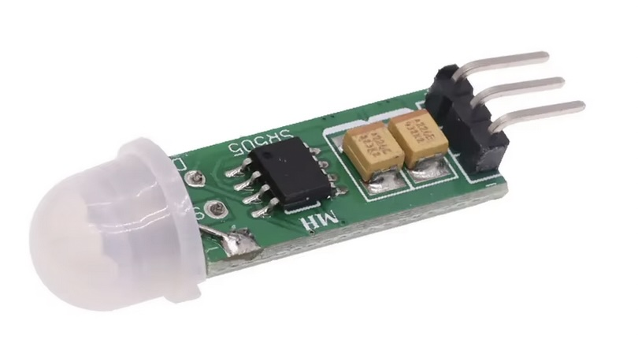
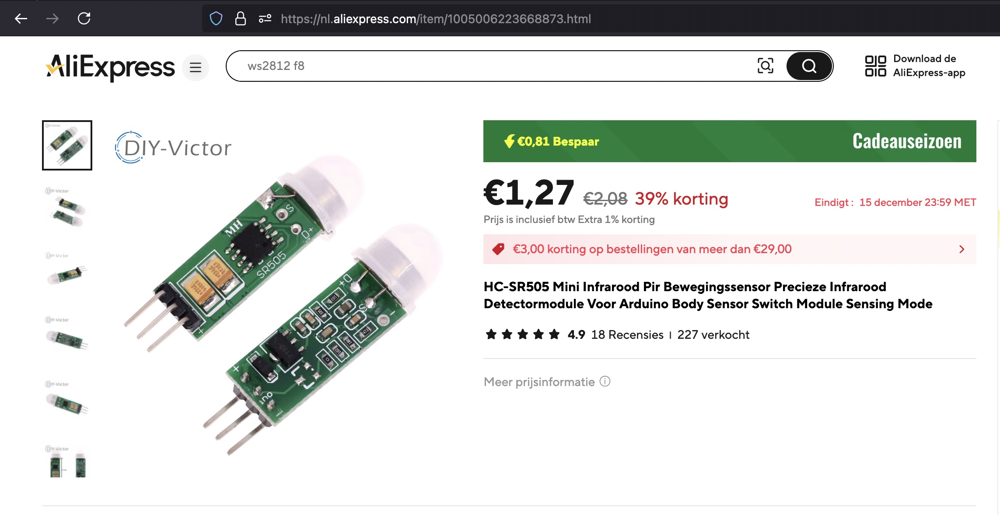

## PIR Module (SR505)




## Description
The SR505 Ultrasonic Distance Sensor is a module used for measuring distances using sound waves. It can be integrated with a Raspberry Pi Pico running MicroPython, enabling a range of applications like robotics, obstacle detection, and environmental mapping.

Here’s a detailed description and a guide to using the SR505 with the Pico and MicroPython:

Specifications of SR505 Ultrasonic Sensor

	•	Type: Ultrasonic distance sensor.
	•	Operating Voltage: 5V.
	•	Operating Current: ~15mA.
	•	Measuring Range: Typically 2cm to 4m (may vary based on model).
	•	Accuracy: ±0.3cm (subject to conditions).
	•	Trigger Pin: Sends a short pulse to initiate measurement.
	•	Echo Pin: Outputs a pulse whose duration corresponds to the measured distance.

Pinout

	1.	VCC: Connect to 5V power source.
	2.	GND: Connect to ground.
	3.	TRIG: Trigger pin to initiate a measurement.
	4.	ECHO: Outputs the time taken for the ultrasonic wave to return.

Wiring with Raspberry Pi Pico

	1.	VCC → Pico 5V pin.
	2.	GND → Pico GND pin.
	3.	TRIG → Any GPIO pin (e.g., GPIO15).
	4.	ECHO → Any GPIO pin (e.g., GPIO14).

Working Principle

	1.	The sensor sends out ultrasonic waves via the trigger pin (TRIG).
	2.	These waves bounce off the nearest object and return to the sensor.
	3.	The sensor’s echo pin (ECHO) generates a pulse whose duration corresponds to the time taken for the round trip.
	4.	Using the formula , the distance is calculated.

	•	Speed of sound in air: ~343 m/s (adjust based on temperature and conditions).

MicroPython Code

Below is a simple MicroPython script to interface with the SR505 sensor using a Raspberry Pi Pico.

Key Features

	•	Accuracy: The distance measured depends on environmental factors (e.g., temperature, humidity).
	•	Timeout Handling: The time_pulse_us function handles cases where no object is detected within range.

Applications

	•	Obstacle Avoidance: In robotics, to detect obstacles and navigate.
	•	Level Measurement: For liquid or solid level monitoring.
	•	Intruder Detection: Use as part of a security system.

Tips for Accurate Measurement

	1.	Ensure the sensor is stable and mounted securely.
	2.	Avoid interference from other ultrasonic sensors.
	3.	Consider environmental factors like temperature and humidity for calibration.


## Order
<a href="https://nl.aliexpress.com/item/1005006227628663.html">https://nl.aliexpress.com/item/1005006227628663.htm</a>



## Wiring to Raspberry Pi Pico


## Installation libraries
Copy next files to the Raspberry Pi Pico

```bash

```

## Example code
```python
from machine import Pin, time_pulse_us
import time

# Pin configuration
TRIG_PIN = 15  # Trigger pin connected to GPIO15
ECHO_PIN = 14  # Echo pin connected to GPIO14

# Initialize pins
trig = Pin(TRIG_PIN, Pin.OUT)
echo = Pin(ECHO_PIN, Pin.IN)

def measure_distance():
    # Send a 10us pulse to trigger
    trig.low()
    time.sleep_us(2)
    trig.high()
    time.sleep_us(10)
    trig.low()

    # Measure the duration of the echo pulse
    duration = time_pulse_us(echo, 1, 30000)  # Timeout after 30ms (~5m range)

    if duration < 0:
        return None  # No object detected

    # Calculate distance (duration in microseconds, sound speed in cm/us)
    distance = (duration / 2) * 0.0343
    return distance

# Main loop
while True:
    dist = measure_distance()
    if dist is not None:
        print("Distance: {:.2f} cm".format(dist))
    else:
        print("Out of range or no object detected.")
    time.sleep(1)
```


