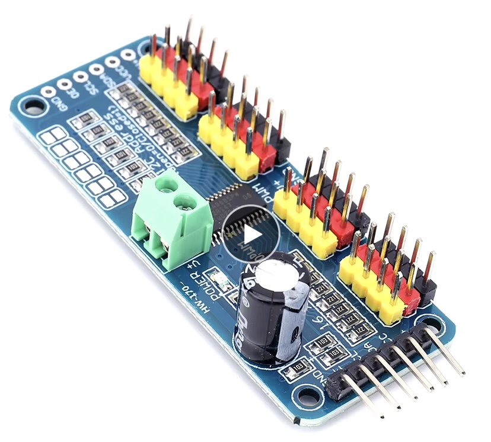
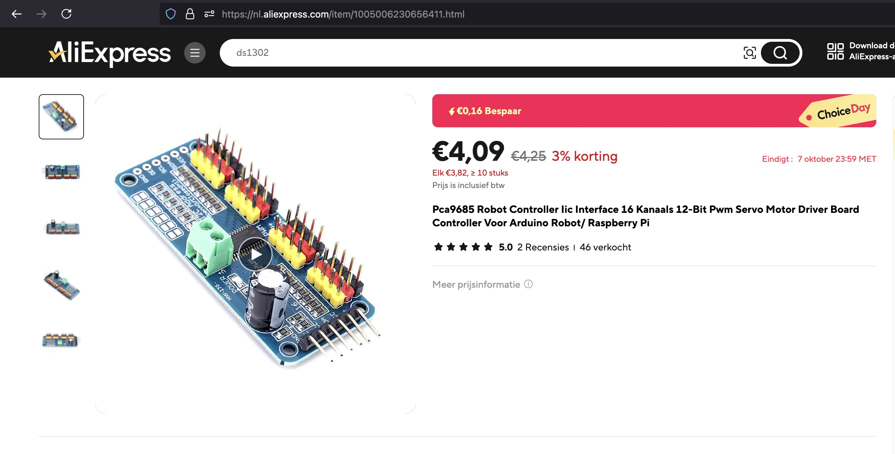

## PWM driver (PCA9685)

## Description
The **PCA9685** is a 16-channel, 12-bit PWM (Pulse Width Modulation) controller designed by NXP. It’s widely used for controlling devices like **servos**, **LEDs**, and **motors** in various electronics and robotics applications. The PCA9685 communicates via the **I2C interface**, making it easy to control multiple PWM outputs with just two wires (SDA and SCL) from a microcontroller like Arduino, ESP32, or Raspberry Pi.

### Key Features:
1. **16 Channels**:
   - The PCA9685 can control up to **16 PWM outputs** simultaneously, making it ideal for projects that need to control multiple devices like servo motors or LEDs.
   
2. **12-bit Resolution**:
   - Each PWM channel has **12-bit resolution**, allowing for **4096 discrete levels** of duty cycle control. This provides smooth and precise control over connected devices, such as adjusting LED brightness or servo position.

3. **I2C Communication**:
   - The controller communicates with microcontrollers via the **I2C protocol**, using two pins: SDA (data) and SCL (clock).
   - **Addressable**: You can configure the I2C address using jumpers, allowing for up to 62 PCA9685 devices on a single I2C bus (for a total of 992 PWM outputs).

4. **Independent Frequency Control**:
   - The PCA9685 can operate at a **programmable PWM frequency** up to 1.6 kHz. This makes it versatile for applications that require different PWM frequencies, such as controlling motors and servos simultaneously.

5. **External Clock Input**:
   - The module supports the use of an **external clock** if higher precision or synchronized clock signals are required.

6. **Low Power Consumption**:
   - It’s designed for efficient power use, and it operates at a **low voltage range** (typically 2.3V to 5.5V), making it suitable for battery-powered projects.
   
### Pinouts:
The PCA9685 comes in a 28-pin package (typically a DIP or SOIC module) with the following key pins:

- **VCC**: Power supply (2.3V to 5.5V for logic and I2C communication).
- **GND**: Ground.
- **SDA**: I2C data line.
- **SCL**: I2C clock line.
- **OE (Output Enable)**: Enables or disables all PWM outputs; can be used for emergency shutdown.
- **PWM output pins** (0-15): These are the 16 output channels for controlling external devices.

### Advantages:
1. **Ease of Use**: With I2C control, only two wires are needed to manage all 16 PWM channels, significantly simplifying the wiring for multi-channel projects.
2. **High Precision**: The 12-bit resolution offers fine control over the duty cycle, which is crucial for smooth transitions in applications like dimming LEDs or controlling servo motors.
3. **Multiple Devices**: Up to 62 PCA9685 modules can be daisy-chained on the same I2C bus, enabling control of large numbers of devices.
4. **Internal Oscillator**: The chip includes an internal 25 MHz oscillator, so no external components are required for timing, though you can also use an external clock for better precision.

### Applications:
- **Servo Motor Control**: The PCA9685 is frequently used in robotics projects where multiple servo motors need precise and independent control.
- **LED Dimming**: It’s ideal for controlling large arrays of LEDs or RGB LEDs, offering smooth brightness transitions and dimming effects.
- **Motor Control**: The PWM signals can also be used to control DC motors or stepper motors in various automation and robotics applications.
- **Light Shows**: The high number of channels and smooth dimming make it perfect for driving lighting setups in art installations or stage lighting.
- **Home Automation**: Can be used to control lights, fans, or other PWM-controlled devices in smart home projects.
  
### How It Works:
The PCA9685 works by generating **PWM signals** (a series of on-off pulses). The length of time the signal stays "on" versus "off" is called the **duty cycle**. By varying the duty cycle, the PCA9685 can control things like:
- **LED brightness** (low duty cycle = dim, high duty cycle = bright).
- **Servo motor position** (short pulse = 0°, long pulse = 180°).
  
Each of the 16 channels can be set independently, and the user can configure the PWM frequency and the specific on/off timing for each output channel.

### Limitations:
- **PWM Frequency Limitation**: While the PCA9685 supports frequencies up to 1.6 kHz, this may not be sufficient for some high-speed applications like motor control at higher RPMs.
- **External Clock Precision**: For very high precision timing applications, an external clock source may be necessary, as the internal oscillator can drift slightly.

### Comparison with Similar Devices:
- **TLC5940**: The TLC5940 is another PWM driver with 16 channels, but it uses **SPI** communication, has a fixed frequency, and is often more complex to implement compared to the PCA9685’s simple I2C interface.
- **PCA9635**: Similar to the PCA9685 but with fewer channels (8-channel) and lower resolution (8-bit), making the PCA9685 superior for applications requiring higher precision.

In summary, the **PCA9685** is an incredibly versatile and easy-to-use 16-channel PWM driver, perfect for controlling servos, LEDs, motors, or other devices in projects that require precise, multi-channel control. It’s widely favored in the maker and robotics community for its flexibility and simplicity.

## specs

## Order
<a href="https://nl.aliexpress.com/item/1005006230656411.html">https://nl.aliexpress.com/item/1005006230656411.html</a>

## Wiring to Raspberry Pi Pico

## installation libraries

No python libraries needed to install

## Connecting for example to Raspberry Pico

