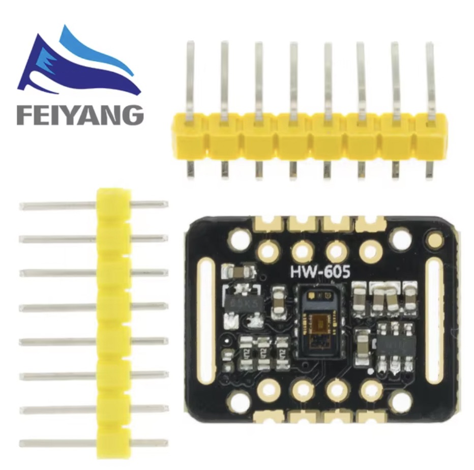
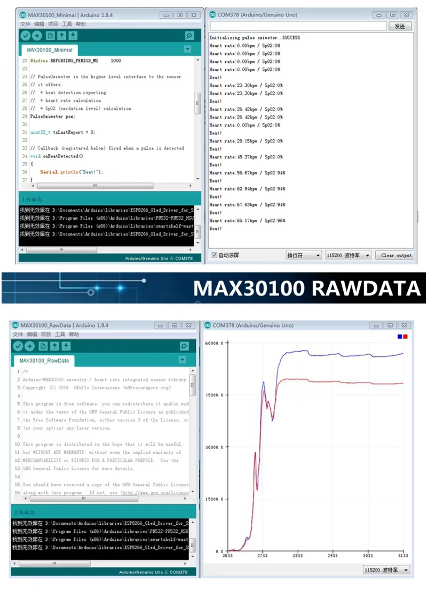
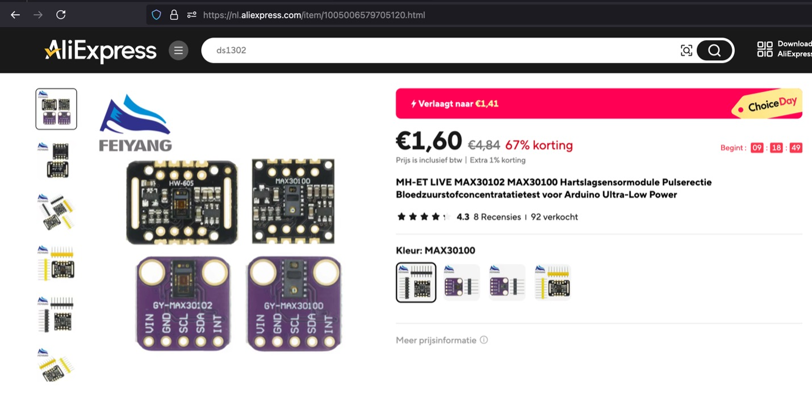

## Pulse Sensor (MAX30102)

## Description
The MH-ET LIVE MAX30102 is a small optical sensor module designed to measure heart rate, blood oxygen levels (SpO2), and pulse oximetry. It’s commonly used in health monitoring and fitness tracking applications. The module combines the MAX30102 sensor with necessary components to make it easily usable with microcontrollers, such as Arduino, ESP32, or Raspberry Pi.

Key Components:

	•	MAX30102 Sensor:
	•	An integrated pulse oximeter and heart-rate monitor sensor from Maxim Integrated.
	•	Uses photoplethysmography (PPG) to measure heart rate and blood oxygen by emitting light (both red and infrared) into the skin and measuring the light that is reflected back.
	•	The absorption of light changes with the pulse, allowing it to detect heart rate and oxygen saturation.
	•	I2C Communication:
	•	Communicates with a microcontroller via the I2C interface, using two wires: SDA (data) and SCL (clock).
	•	Onboard LEDs:
	•	Red and infrared LEDs are used to sense oxygen levels and heart rate by measuring how much light is absorbed by blood.
	•	Integrated Circuit for Processing:
	•	The module comes with an integrated analog-to-digital converter and processing circuitry, which simplifies interfacing with microcontrollers.

Pinouts:

	•	VIN: Power supply, typically 1.8V to 3.3V (sometimes up to 5V with proper regulation).
	•	GND: Ground.
	•	SDA: Serial Data Line for I2C communication.
	•	SCL: Serial Clock Line for I2C communication.
	•	INT: Interrupt pin (optional) to signal events to the microcontroller.

Features:

	1.	Heart Rate Monitoring: Detects the heart rate in real-time using optical methods.
	2.	Blood Oxygen Level (SpO2): Measures the percentage of oxygen saturation in the blood.
	3.	Low Power Consumption: Suitable for battery-powered devices, with various power-saving modes.
	4.	I2C Communication: Easy to interface with microcontroller platforms using just two pins (SDA and SCL).
	5.	High Sensitivity: Detects even slight changes in blood flow, making it accurate for biometric readings.
	6.	Built-in Noise Reduction: Designed to minimize noise from motion, making it more reliable for wearable applications.

Applications:

	•	Fitness trackers and smartwatches.
	•	Health monitoring devices.
	•	DIY medical devices.
	•	Sleep monitoring systems.
	•	Embedded systems requiring biometric data collection.

The MH-ET LIVE MAX30102 module is compact, easy to integrate, and ideal for wearable and portable health monitoring solutions. With its I2C interface and low power requirements, it’s a versatile choice for developers interested in biometric sensing.

## specs

## Order
<a href="https://nl.aliexpress.com/item/1005006579705120.html">https://nl.aliexpress.com/item/1005006579705120.html</a>

## Wiring to Raspberry Pi Pico

## installation libraries

No python libraries needed to install

## more information

<a href="https://docs.sunfounder.com/projects/umsk/en/latest/04_pi_pico/pico_lesson14_max30102.html"> https://docs.sunfounder.com/projects/umsk/en/latest/04_pi_pico/pico_lesson14_max30102.html<h>