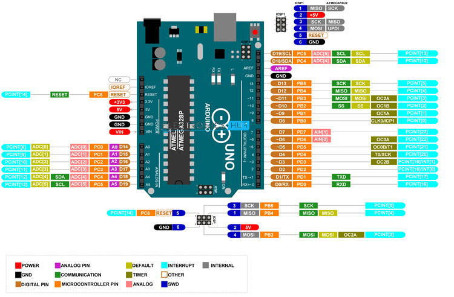
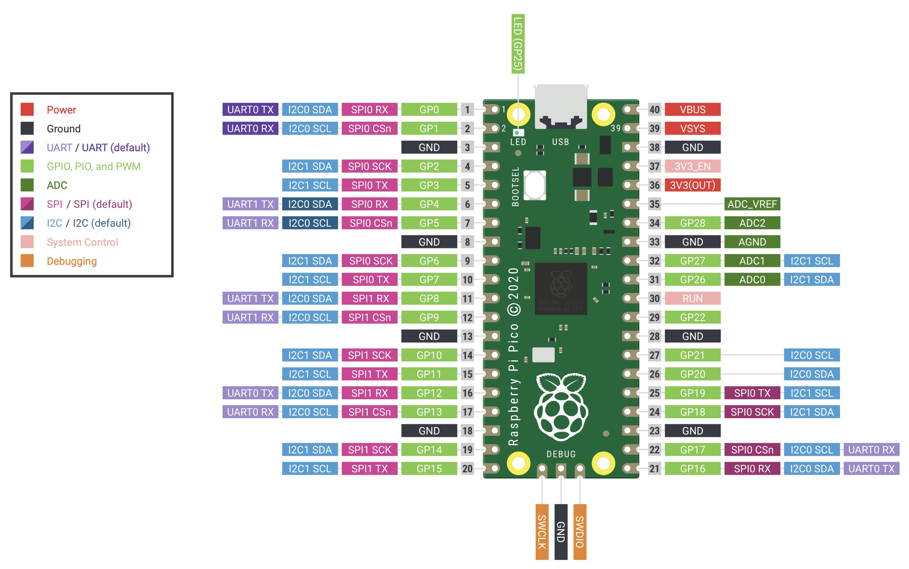

# This site..
Electronic components at SmartLab daVinci College, Dordrecht
<a href="Kasten/README.md"> more info...</a> 

# ADC / DAC

|:vomiting_face: :grinning: |Kast|AK  | Picture | Component|
|:--:|:---:|:---:|:---:|:---:|
|:grinning:     |A3||  |ADC (ADS1115) 
<a href="ADC_DAC/ADC (ADS1115)/README.md"> more info...</a>|
|:vomiting_face:|A3||    |DAC (MCP4725) 
<a href="ADC_DAC/DAC (MCP4725)/README.md"> more info...</a>|

# Clock
|:vomiting_face: :grinning:|Kast|AK|Component| Picture | 
|:--:|:---:|:---:|:---:|:---:|
|:grinning:     |A3|| |Realtime Clock module (DS1302) 
 <a href="Clock/Realtime Clock module (DS1302)/README.md"> more info...</a> 
|:vomiting_face:|A3|| |Realtime Clock module (DS1307 or HW111) 
 <a href="Clock/Realtime Clock module (DS1307 or HW111)/README.md"> more info...</a> 
|:vomiting_face:|A3|| |Realtime Clock module (DS3231 or HW084) 
 <a href="Clock/Realtime Clock module (DS3231 or HW084)/README.md"> more info...</a> 
|:vomiting_face:|A3|| |Realtime Clock module (PCF8563)         
 <a href="Clock/Realtime Clock module (PCF8563)/README.md"> more info...</a> 

# Communication
|:vomiting_face: :grinning: |Kast|AK  | Picture | Component| 
|:--:|:---:|:---:|:---:|:---:|
|:grinning:     |A3||   |Bluetooth Transceiver (HC-05)
<a href="Communication/Bluetooth Transceiver (HC-05)/README.md"> more info...</a> |  

# Electronic Components
Components in the electronic circuit not programmable or readable to a microComputer / microController

|:vomiting_face: :grinning: |Kast|AK|  Picture | Component  |
|:--:|:---:|:---:|:---:|:---:|
|:vomiting_face:|B3||| Breadboard voeding converter (OT150-B75)
 <a href="Components/Breadboard voeding converter (OT150-B75)/README.md"> more info...</a>    |
|:vomiting_face:|A1|| |Diode (1N4007)
 <a href="Components/Diode (1N4007)/README.md"> more info...</a>    | 
|:vomiting_face:|A1|| |Diode (1N4148)
 <a href="Components/Diode (1N4148)/README.md"> more info...</a>    | 
|:grinning:     |C2|| |Header Pins
 <a href="Components/Header pin/README.md"> more info...</a>    |
|:grinning:     |A1|| |LED 5mm
 <a href="Components/LED 5mm/README.md"> more info...</a>    | 
|:grinning:     |A1|| |LED RGB 5mm
 <a href="Components/LED RGB 5mm/README.md"> more info...</a>    | 
|:grinning:     |A1|| |LED Neopixel 5mm
 <a href="Components/LED Neopixel 5mm/README.md"> more info...</a>    | 
|:grinning:     |A3|| |LevelShifter (HW221)
 <a href="Components/LevelShifter (HW221)/README.md"> more info...</a>    | 
|:vomiting_face:|A1||  |  Optocoupler (4N35)
<a href="Components/Optocoupler (4N35)/README.md"> more info...</a>| 
|:vomiting_face:|B3||  |  Power Jack (DC005)
<a href="Components/Power Jack (DC005)/README.md"> more info...</a>| 
|:vomiting_face:|  |||Transistor (BD135)
 <a href="Components/Transistor (BD135)/README.md"> more info...</a>   | 
|:vomiting_face:|  |||Transistor (BD136)
 <a href="Components/Transistor (BD136)/README.md"> more info...</a>   | 
|:vomiting_face:|B1||  |Voltage regulator (7805, 7809, 7812)
<a href="Components/Voltage regulator (7805)/README.md"> more info...</a>|  
|:vomiting_face:|B1||  |Voltage regulator (MT3608)
<a href="Components/Voltage regulator (MT3608)/README.md"> more info...</a>|  

# Display
Different kind of displays and presentation controlled by a microComputer/ microController

|:vomiting_face: :grinning: |Kast|AK| Picture | Component  |
|:--:|:---:|:---:|:---:|:---:|
|:vomiting_face:|A2||  |LED 7-Segment (HT16K33)
<a href="Display/LED 7-Segment (HT16K33)/README.md"> more info...</a>|  
|:vomiting_face:|A1||  |LED RGB (WS2812) 
<a href="Display/LED RGB (WS2812)/README.md"> more info...</a>| 
|:grinning:     |A4||  |  LCD + i2c (Lcd1602) 
 <a href="Display/LCD + i2c (Lcd1602)/README.md"> more info...</a>           |  
|:grinning:     |A5|| |Matrix (Max7219)  
<a href="Display/Matrix (Max7219)/README.md"> more info...</a> | 
|:vomiting_face:|A5|| |  Neopixel (WS2812)
<a href="Display/Neopixel (WS2812)/README.md"> more info...</a> |  
|:vomiting_face:|A2|| |  Oled (SSD1306)
<a href="Display/Oled (SSD1306)/README.md"> more info...</a> | 

# Enviroment

|:vomiting_face: :grinning: |Kast|AK|  Picture | Component  |
|:--:|:---:|:---:|:---:|:---:|
|:vomiting_face:|||  |ColorSensor (GY-31 TCS230 TCS3200) 
<a href="Environment/ColorSensor (GY-31 TCS230 TCS3200)/README.md"> more info...</a>|  
|:vomiting_face:|A4||  |  Sound Sensor (ST1146)
<a href="Environment/Sound Sensor (ST1146)/README.md"> more info...</a>|  
|:vomiting_face:||||Temperature (TC74) 
 <a href="Environment/Temperature (TC74)/README.md"> more info...</a> | 
|:grinning:     |A3|||Temperature Humidity (DHT11) 
 <a href="Environment/Temperature Humidity (DHT11)/README.md"> more info...</a> | 
|:grinning:     |A3|||Temperature Humidity (DHT22) 
 <a href="Environment/Temperature Humidity (DHT22)/README.md"> more info...</a> | 
|:grinning:     ||||Temperature Humidity Pressure (BME280) 
 <a href="Environment/Temperature Humidity Pressure (BME280)/README.md"> more info...</a> | 
|:vomiting_face:||||Temperature Humidity Pressure (Si7021) 
 <a href="Environment/Temperature Humidity Pressure (SI7021)/README.md"> more info...</a> | 

# Memory
|:vomiting_face: :grinning: |Kast|AK|  Picture | Component  |
|:--:|:---:|:---:|:---:|:---:|
|:grinning:     ||| |Micro SD Card Adapter 
 <a href="Memory/Micro SD Card Adapter/README.md"> more info...</a>       |  

# Motor
|:vomiting_face: :grinning: |Kast|AK|  Picture | Component  |
|:--:|:---:|:---:|:---:|:---:|
|:vomiting_face:|D7|||Servo Motor (SG90)
 <a href="Motor/Servo Motor (SG90)/README.md"> more info...</a> | 
|:vomiting_face:|D1|| |Servo Motor Driver Board (PCA9685) 
 <a href="Motor/Servo Motor Driver Board (PCA9685)/README.md"> more info...</a> | 

# Movement

|:vomiting_face: :grinning: |Kast|AK|  Picture | Component  |
|:--:|:---:|:---:|:---:|:---:|
|:vomiting_face:||| |Distance Time-of-Flight (VL53L0X) 
 <a href="Movement/Distance Time-of-Flight (VL53L0X)/README.md"> more info...</a> |
|:vomiting_face:|A4|||Distance Ultrasonic sensor (HC-SR04) 
 <a href="Movement/Distance Ultrasonic sensor (HC-SR04)/README.md"> more info...</a> | 
|:vomiting_face:||| |  Gyroscope Accelerometer (BMI160)
<a href="Movement/Gyroscope Accelerometer (BMI160)/README.md"> more info...</a> |  
|:vomiting_face:||| |  Gyroscope Accelerometer (MPU6050)
<a href="Movement/Gyroscope Accelerometer (MPU6050)/README.md"> more info...</a> |  
|:vomiting_face:|||    |Infrared Sensor (TCRT5000)
<a href="Movement/Infrared Sensor (TCRT5000)/README.md"> more info...</a> |  
|:vomiting_face:||| |Magnetometer (MLX90393) 
 <a href="Movement/Magnetometer (MLX90393)/README.md"> more info...</a>|  
|:vomiting_face:|D7||   |PIR Module (HC-SR501)
<a href="Movement/PIR Module (HC-SR501)/README.md"> more info...</a>|  

# Switch
|:vomiting_face: :grinning:|Kast|AK| Picture | Component  |
|:--:|:---:|:---:|:---:|:---:|
|:grinning:     |A3|||RFID Module (RC522) 
 <a href="Switches/RFID Module (RC522)/README.md"> more info...</a> | 
|:vomiting_face:|B2||  |  Switch Button
<a href="Switches/Switch Button/README.md"> more info...</a>|  
|:vomiting_face:|A3||  |  Switch Capacitieve Touch Button (HW139)
<a href="Switches/Switch Capacitieve Touch Button (HW139)/README.md"> more info...</a>|  
|:grinning:     |A4|||Keypad 3x4
 <a href="Switches/Keypad 3x4/README.md"> more info...</a> | 
|:vomiting_face:|A4|||Keypad 4x4
 <a href="Switches/Keypad 4x4/README.md"> more info...</a> | 
|:vomiting_face:|A4|||Keypad Membrame
 <a href="Switches/Keypad Membrame/README.md"> more info...</a> | 
|:vomiting_face:|A6|||Switch Rotery (RS1010)
 <a href="Switches/Switch Rotery (RS1010)/README.md"> more info...</a> | 

# microController / microComputer

|:vomiting_face: :grinning: |Kast|AK|  Picture | Component  |
|:--:|:---:|:---:|:---:|:---:|
|:vomiting_face:|A7|| |Raspberry-Pi
 <a href="microController/Raspberry-Pi/README.md"> more info...</a> 
|:vomiting_face:|A7|| |Arduino-UNO 
 <a href="microController/Arduino-UNO/README.md"> more info...</a>
|:vomiting_face:|A7|| |Raspberry Pi Pico 
 <a href="microController/Raspberry-Pico/README.md"> more info...</a> 
|:vomiting_face:|A7|| |WeMos 
 <a href="microController/WeMos/README.md"> more info...</a>

# Measuring equipment

|:vomiting_face: :grinning: |Kast|AK|  Picture | Component  |
|:--:|:---:|:---:|:---:|:---:|
|:vomiting_face:||| |USB-Tester (FNB58)
 <a href="Measuring equipment/USB-Tester (FNB58)/README.md"> more info...</a> 

