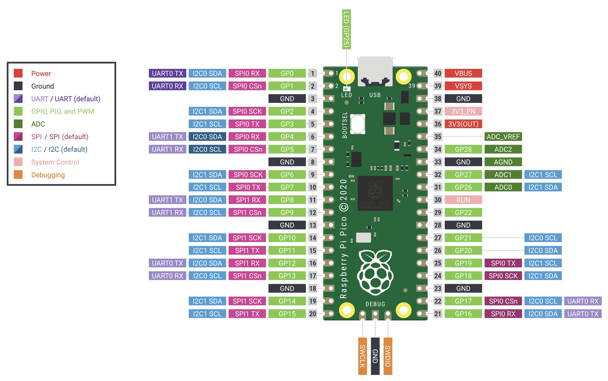
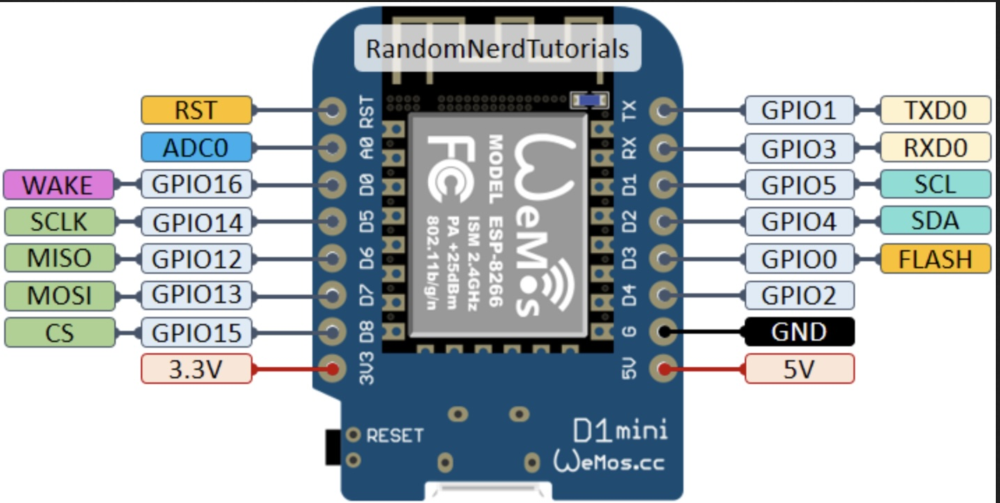

# Elektronische Componenten

|:vomiting_face: :grinning: | Component  | Picture | 
|:--:|:---:|:---:|
|:grinning:| ADC (ADS1115) 
<a href="ADC (ADS1115)/README.md"> more info...</a>|    |
|:vomiting_face:| Bluetooth Transceiver (HC-05)
<a href="Bluetooth Transceiver (HC-05)/README.md"> more info...</a>|    |  
|:vomiting_face:| ColorSensor (GY-31 TCS230 TCS3200) 
<a href="ColorSensor (GY-31 TCS230 TCS3200)/README.md"> more info...</a>|    |  
|:vomiting_face:| DAC (MCP4725) 
<a href="DAC (MCP4725)/README.md"> more info...</a>|    |
|:vomiting_face:| DC-DC Step-Up Converter (MT3608) 
<a href="DC-DC Step-Up Converter (MT3608)/README.md"> more info...</a>|    |
|:grinning:| Display LCD + i2c (Lcd1602) 
 <a href="Display LCD + i2c (Lcd1602)/README.md"> more info...</a>           |    |  
|:vomiting_face:| Display Matrix (Max7219)  
<a href="Display Matrix (Max7219)/README.md"> more info...</a> |   |
|:vomiting_face:| Display Neopixel (WS2812)
<a href="Display Neopixel (WS2812)/README.md"> more info...</a> |   |  
|:vomiting_face:| Display Oled (SSD1306)
<a href="Display Oled (SSD1306)/README.md"> more info...</a> |   |  
|:vomiting_face:| Distance Time-of-Flight (VL53L0X) 
 <a href="Distance Time-of-Flight (VL53L0X)/README.md"> more info...</a> | |
|:vomiting_face:| Distance Ultrasonic sensor (HC-SR04) 
 <a href="Distance Ultrasonic sensor (HC-SR04)/README.md"> more info...</a> | |
|:vomiting_face:|Gyroscope Accelerometer (BMI160)
<a href="Gyroscope Accelerometer (BMI160)/README.md"> more info...</a> |   |  
|:vomiting_face:| Infrared Sensor (HW201)
<a href="Infrared Sensor (HW201)/README.md"> more info...</a> |   |  
|:vomiting_face:| LED 7-Segment (HT16K33)
<a href="LED 7-Segment (HT16K33)/README.md"> more info...</a>|    |
|:vomiting_face:| LED RGB (WS2812) 
<a href="LED RGB (WS2812)/README.md"> more info...</a>|    |
||   |   |  
|:grinning:| LevelShifter (HW221) 
 <a href="LevelShifter (HW221)/README.md"> more info...</a>         |   |
|:vomiting_face:| Magnetometer (MLX90393) 
 <a href="Magnetometer (MLX90393)/README.md"> more info...</a>   |   |
|:vomiting_face:| Micro SD Card Adapter 
 <a href="Micro SD Card Adapter/README.md"> more info...</a>       |   |
|:vomiting_face:| PIR Module (HC-SR501)
<a href="PIR Module (HC-SR501)/README.md"> more info...</a>|    |  
|:vomiting_face:| Power Jack (PJ-002A)
<a href="Power Jack (PJ-002A)/README.md"> more info...</a>|    |  
|:vomiting_face:| Pulse Sensor (MAX30102) 
 <a href="Pulse Sensor (MAX30102)/README.md"> more info...</a>   |  |
|:vomiting_face:| Realtime Clock module (DS1302) 
 <a href="Realtime Clock module (DS1302)/README.md"> more info...</a> | 
|:vomiting_face:| Realtime Clock module (DS1307 or HW111) 
 <a href="Realtime Clock module (DS1307 or HW111)/README.md"> more info...</a> | 
|:vomiting_face:| Realtime Clock module (DS3231 or HW084) 
 <a href="Realtime Clock module (DS3231 or HW084)/README.md"> more info...</a> | 
|:vomiting_face:| Realtime Clock module (PCF8563)         
 <a href="Realtime Clock module (PCF8563)/README.md"> more info...</a> | 
|:vomiting_face:| RFID Module (RC522) 
 <a href="RFID Module (RC522)/README.md"> more info...</a> | |
|:vomiting_face:|Servo Motor (SG90)
 <a href="Servo Motor (SG90)/README.md"> more info...</a> | |
|:vomiting_face:| Servo Motor Driver Board (PCA9685) 
 <a href="Servo Motor Driver Board (PCA9685)/README.md"> more info...</a> |  |
|:vomiting_face:|Switch Button
<a href="Switch Button/README.md"> more info...</a>|    |  
|:vomiting_face:|Switch Capacitieve Touch Button (HW139)
<a href="Switch Capacitieve Touch Button (HW139)/README.md"> more info...</a>|    |  
|:vomiting_face:|Switch Keypad Hard
 <a href="Switch Keypad Hard/README.md"> more info...</a> | |
|:vomiting_face:|Switch Keypad Membraam
 <a href="Switch Keypad Membraam/README.md"> more info...</a> | |
|:vomiting_face:|Switch Rotery (RS1010)
 <a href="Switch Rotery (RS1010)/README.md"> more info...</a> | |
|:vomiting_face:| Temperature (TC74) 
 <a href="Temperature (TC74)/README.md"> more info...</a> | |
|:grinning:| Temperature Humidity (DHT11) 
 <a href="Temperature_Humidity (DHT11)/README.md"> more info...</a> | |
|:grinning:| Temperature Humidity (DHT22) 
 <a href="Temperature_Humidity (DHT22)/README.md"> more info...</a> | |
|:vomiting_face:| Temperature Humidity Pressure (BME280) 
 <a href="Temperature_Humidity_Pressure (BME280)/README.md"> more info...</a> | |
|:vomiting_face:|Transistor (BD135)
 <a href="Transistor (BD135)/README.md"> more info...</a> | |
|:vomiting_face:|Transistor (BD136)
 <a href="Transistor (BD136)/README.md"> more info...</a> | |

# microController

|:vomiting_face: :grinning: | Component  | Picture | 
|:--:|:---:|:---:|
|:vomiting_face:| microController Arduino-UNO 
 <a href="microController_Arduino-UNO/README.md"> more info...</a> | |
|:vomiting_face:| microController Raspberry Pi Pico 
 <a href="microController_Raspberry-Pi-Pico/README.md"> more info...</a> | |
|:vomiting_face:| microController WeMos 
 <a href="microController_WeMos/README.md"> more info...</a> | |

