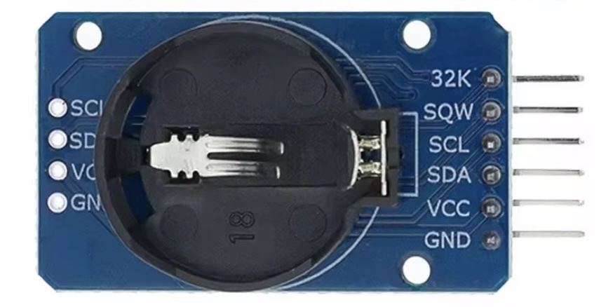

## Realtime Clock module (DS3231 or HW084)




## Description


## Order
<a href="https://nl.aliexpress.com/item/1005006160604822.html">https://nl.aliexpress.com/item/1005006160604822.htm</a>


## Wiring to Raspberry Pi Pico


## Installation libraries
Copy next files to the Raspberry Pi Pico

```bash

```

## Example code
```python


```


